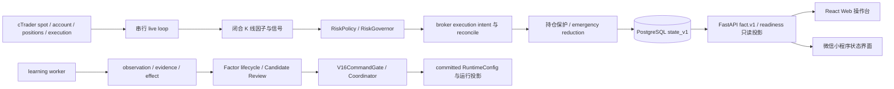

# 量化交易

面向 cTrader 的生产型自治量化交易系统。当前默认交易标的是 `XAUUSD`，主周期为 `M5`；系统把实时执行、风险控制、因子研究、学习证据和受控治理放在同一条可审计、可回放、fail-closed 的工程链路中。

> 这份 README 用于 GitHub 项目导览，不替代运行态审计。服务、PostgreSQL `state_v1`、`runtime_kv`、日志和 broker 的当前事实，优先于文档快照或 Git 历史。

## 当前状态

截至 2026-08-12 的发布状态快照：

- P0 保护现场已完成；P2 canonical risk、P3 证据/记忆/effect、P4 V16 因果调度已完成。
- P1 的代码与历史污染修复已完成，但仍处于 `runtime acceptance`：还需要真实 post-repair broker deal、重启 replay 和完整持仓生命周期证据。
- P5 架构收敛持续进行；每个批次都要删除被替代的 writer、重算、fallback 和无意义 wrapper。
- P6 Demo 观察/毕业仍被前置正确性和真实运行证据阻塞。
- 最新服务器快照记录 live loop 由 operator 手动停止、当前无持仓，readiness 保持 `no_new_risk`；这不是 live 自治已毕业的状态。
- Safety v2 仍为 `shadow/observing`；generation、execution outcome、governance enforce 和 PG job queue 等后续发布开关没有因单测或 readiness 自动推进。

详细阶段、运行姿态和未满足证据见 [分期修复发布状态](docs/phased-repair-rollout-status.md)。

## 系统主链



生产执行路径保持单一方向：闭合 bar → 因子计算与归一化 → runtime selection → 组合分数 → Context/Execution Gate → `RiskPolicyService` → broker。学习和自治治理可以产生候选与证据，但不能绕过审核、V16、Coordinator 和 effect observation 直接写交易、因子权重或 RuntimeConfig。

## 核心能力

| 领域 | 当前能力 |
| --- | --- |
| 实时交易 | cTrader spot、账户、持仓、execution 接入；串行 live loop；订单意图、执行结果、重启恢复和 reconcile 链路 |
| 风控与安全 | Safety 硬事实、风险 sizing、Kelly/暴露/前向 VaR-CVaR、事件缩放、持仓保护、emergency close/reduce/tighten、incident control |
| 因子引擎 | 内置技术因子、因子角色与方向、运行时选择、健康度、生命周期、factor card 和因子 lineage |
| 自主学习 | 独立 learning worker；样本、污染隔离、counterfactual、review、application/effect 和 evolution ledger |
| 治理 | Candidate Review → `V16CommandGate` → `GovernanceMutationCoordinator` → committed projection；支持 shadow/canary/observation 边界和幂等 watermark |
| 研究与回放 | 闭合 bar 的回放和诊断工具；replay 复用 live 的纯计算，但固定为 `diagnostic_only`，不拥有 live 授权 |
| 操作界面 | FastAPI 后端、React/Vite Web 完整操作台、微信小程序简洁状态界面；客户端消费 endpoint-specific `fact.v1` |

## 三层生产权力

同一事实只有一个生产计算者和一个写入者；其他模块只能消费或投影。

| 层 | 唯一职责 | 明确不负责 |
| --- | --- | --- |
| Safety | broker/account/positions/spot、unknown execution、保护状态、本地 latch 和必须立即禁止新增风险的硬事实 | 不计算 alpha、VaR/CVaR 或最终仓位 |
| Readiness | 只读判断 canonical 事实是否存在、新鲜、可用，并投影 blocker | 不重算风险、不写控制状态、不清 latch、不切发布开关 |
| Risk sizing | 使用冻结输入计算 exposure、VaR/CVaR、stress、concentration 和最终 candidate volume | 不拥有进程健康、发布开关或前端展示判断 |

`health=正常`、worker `ready`、readiness `ready`、单次 effect 或测试通过，都不能单独授权 live 自治。未知、预热、过期和错误状态保持 `unknown/warming_up/stale/error`，不会被默认零值或兼容值掩盖。

## 数据与事实源

- PostgreSQL `state_v1`：运行态、恢复状态、学习审计、evolution、治理 mutation、RuntimeConfig overlay/snapshot 和 canonical projections。
- `data/bars_monthly/bars_YYYY_MM.duckdb`：按月保存的 K 线；`data/bars.duckdb` 仅作为当前月份兼容链接。
- `data/external_data.duckdb`：COT、ETF、CB gold、宏观和外部日数据；外部因子必须遵守 `release_at` / PIT 约束。
- `data/events.duckdb`：经济事件日历与事件缩放输入。
- `.env`、运行数据、日志、数据库和模型产物不进入 Git；凭据只从环境变量加载。

以下路径已退役，禁止恢复：SQLite `data/state.db` 运行态主库、历史 tick 采集、L2 collector、MT5 并行执行、旧 Web Console/H5 web-view，以及旧 cloud deploy/docker-compose 路线。

## 代码结构

```text
backend/          FastAPI、API、WebSocket、运行时生命周期、治理与服务
execution/        cTrader broker adapter、execution intent 与执行合同
risk/             RiskPolicy、RiskGovernor 和风险纯计算
alpha/            因子、组合、选择、健康度与生命周期适配
research/         学习、证据、评估、回放和治理研究
config/           YAML 基础配置与 RuntimeConfig 读取边界
migrations/       PostgreSQL state_v1 的 forward-only migrations
web_frontend/     React/Vite Web 操作台
miniprogram_v2/   微信小程序状态界面与本地 uCharts
scripts/          worker、状态只读查询、迁移和验收工具
tests/            后端、风险、执行、治理、学习、前端合同测试
docs/             当前事实源、合同、SOP、阶段和验收矩阵
```

## 文档入口

重新进入项目时按下面顺序读取：

1. [AGENTS.md](AGENTS.md)：工作区协作、数据和平台边界；
2. [docs/README.md](docs/README.md)：唯一文档入口、当前阶段和文档路由；
3. [docs/system-source-of-truth.md](docs/system-source-of-truth.md)：权威事实源和生产权力边界；
4. [docs/legacy-debt-register.md](docs/legacy-debt-register.md)：仍在迁移、隔离或回归的旧路径；
5. [docs/change-impact-checklist.md](docs/change-impact-checklist.md)：修改前后的 authority、删除清单和验收要求。

按领域继续读取：

- [API fact 合同](docs/api-fact-contract.md)
- [学习证据合同](docs/learning-evidence-contract.md)
- [持仓监督器合同](docs/position-supervisor-contract.md)
- [参数模板合同](docs/parameter-template-contract.md)
- [服务器后端 SOP](docs/server-backend-sop.md)
- [分期修复验收矩阵](docs/phased-repair-acceptance-matrix.md)

## 开源协作与安全

- [贡献指南](CONTRIBUTING.md)
- [安全政策](SECURITY.md)
- [Apache License 2.0](LICENSE)

请勿提交 broker/API 凭证、`.env`、运行数据、日志、数据库、真实账户信息或模型产物。真实账户操作必须遵循当前发布门、风险合同、服务器 SOP 和 operator 审批。

## 本地验证

后端、数据库和运行态验证以 Linux 服务器 SOP 为准；以下是常用的最小检查示例：

```bash
# Python 编译与针对性测试
.venv/bin/python -m py_compile backend/app.py backend/services/live_loop_runner.py
.venv/bin/pytest tests/test_v16_brain_orchestrator.py tests/test_live_service_bar_dedup.py

# Web 合同、类型检查和生产构建
cd web_frontend
npm run typecheck
npm test
npm run build
cd ..

# 文档与变更格式
git diff --check
```

涉及 PostgreSQL schema 时，先运行迁移检查；涉及运行态排查时使用只读入口：

```bash
.venv/bin/python scripts/state_query.py --sql "SELECT key, updated_at FROM runtime_kv ORDER BY updated_at DESC LIMIT 20"
```

不要用 `sqlite3 data/state.db` 推断当前运行态，也不要把前端构建或单测结果当作 broker 生命周期证明。服务启动、日志、数据库、Caddy、公网接口和受控重启流程见 [server-backend-sop.md](docs/server-backend-sop.md)。

## 开发与变更原则

- 先读事实源和旧债，再确认 canonical authority、被替代路径、删除清单和不新增项。
- 一个事实一个计算者，一个状态一个 writer；API、readiness、replay 和 frontend 只读投影。
- 新治理候选必须经过 PIT、walk-forward、成本、真实交易和 effect 证据；不能由 RL/LLM/在线 bandit 或批量搜索直接写生产。
- 每批先跑针对性测试；canonical 路径通过但旧路径未删除，批次仍不能标记完成。
- 运行态故障按“先日志 → 再接口 → 再代码 → 最后重启”处理；生产发布前保留 fail-closed 边界。

本项目不承诺收益。任何真实账户操作都必须遵循当前发布门、风险合同、服务器 SOP 和 operator 审批。
