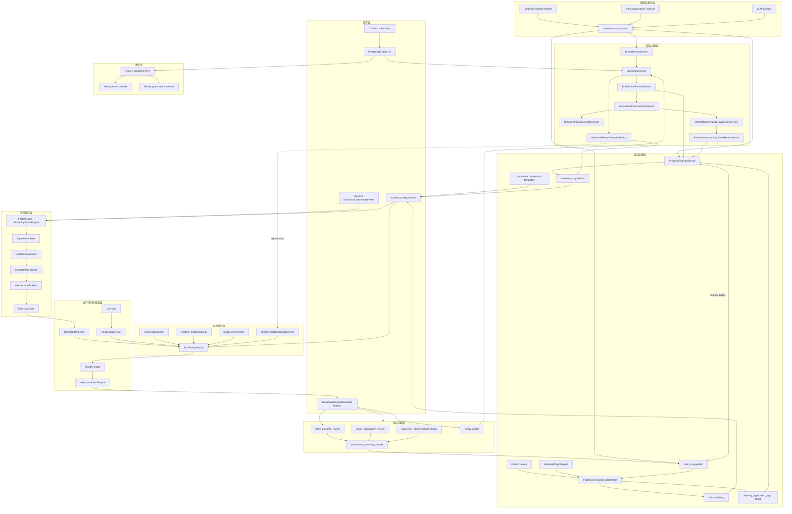

# Autonomous Governance Architecture

> Status: active
> Last verified: 2026-07-07
> Scope: governance architecture for live trading, risk, learning, models, autonomous governance, autonomous brain, and operator surfaces.

本文回答一个问题：当前系统这么多规则、模型、学习器和自治大脑，到底如何治理，谁在链路中的哪个位置，能做什么，不能做什么。

相关权威文档：

- [system-source-of-truth.md](system-source-of-truth.md): 事实源和权力边界。
- [system-operation-map.md](system-operation-map.md): 当前真实运行链路。
- [rule-driven-intelligence-inventory.md](rule-driven-intelligence-inventory.md): 智能单元、审计数据和精度口径总账。
- [change-impact-checklist.md](change-impact-checklist.md): 改动前后的影响面检查。

## 1. Governance Thesis

当前系统的正确治理口径是：

```text
并行采证
  -> 统一建议
  -> 串行裁决
  -> 单一路径执行
  -> 后验学习
  -> 受控配置变更
```

这意味着：

- 因子、规则、数学模型、LLM、仓位监督器、自主学习和自治大脑可以并行产生证据或建议。
- 交易、平仓、减仓、模板切换、参数切换、因子调权、incident mode 变更必须进入受控后端边界。
- live 执行路径必须唯一，不能出现多个智能体直接触达 broker。
- 自治大脑不是另一个交易员，而是元治理层：它治理系统内部建议者的可靠性、证据质量、候选动作和风险边界。

硬边界：

| 边界 | 唯一入口 | 说明 |
|---|---|---|
| 交易动作裁决 | `RiskPolicyService.evaluate(...)` | open、close、reduce、tighten、incident、replay job、模板切换等动作统一裁决 |
| 权重治理 | `DecisionPolicy` | 因子权重写入和限制口径 |
| runtime 配置写入 | `RuntimeConfigMutationService` -> `runtime_config_overlay` / `runtime_config_snapshot` | overlay 是启动恢复事实源，snapshot 是审计和回滚证据 |
| broker 执行 | cTrader bridge + live execution pipeline | cTrader 是 live broker 状态和成交事实源 |
| 学习样本 | `autonomous_learning_sample` + evidence contract | 不能从模型输出倒推真实标签 |
| 模型能力 | `model_permissions` + `RiskPolicyService` model stage gate | shadow/advisory 默认不能 live trading |
| 智能体权责合同 | `AgentAuthorityRegistryService` -> readiness `agent_authority` | 统一登记 source agent、allowed writes、control surfaces、required gates、authority state 和 forbidden actions；未知来源只能 review-only，LLM 永远 advisory-only |
| 智能体质量/简报反馈 | `AgentScorecardService` + `AgentBriefingContextService` -> readiness `agent_scorecard` / `agent_briefing` / `agent_chain_health` | 只读统计 agent 提案、候选、应用、效果、合同违规、治理覆盖率和交易复盘反馈，并生成统一战况简报；可收紧证据要求和审查严格度，但不改变权限、不执行动作 |
| 统一建议总线 | `ProposalRegistryService` -> `proposal_registry` | 归一化、展示、来源可靠性、证据新鲜度、冲突检测和审查；主汇总只统计当前可行动提案，历史/shadow/needs_evidence 噪音保留在 raw 字段；不审批、不应用 |
| 实盘自治解锁 | `LiveAutonomyService` -> `live_autonomy_unlock_event` + runtime overlay/snapshot | 一次性人工解锁/撤销能力开关，持续输出 operational posture，不下单、不绕过风控 |

## 2. Governance Topology



读图规则：

- 横向看，系统有多条并行证据链。
- 纵向看，真实动作必须穿过风控、决策和配置写入口。
- 虚线表示候选、审查或收紧路径，不表示直接执行权限。

## 3. Layer 1: 事实层

链路位置：

```text
外部世界 / broker / 市场数据 / state store
  -> 所有决策、风控、学习和治理的输入事实
```

主要模块：

| 模块 | 代码/数据锚点 | 行为 | 输出 |
|---|---|---|---|
| cTrader broker facts | cTrader bridge、deals、positions | 提供 live broker 状态、成交、账户、持仓 | broker 回执、position/deal facts |
| K 线月库 | `data/bars_monthly/bars_YYYY_MM.duckdb` | 保存 bars 主数据 | bars / bar window |
| tick 月库 | `data/ticks_monthly/ticks_YYYY_MM.duckdb` | 保存 tick 数据 | tick facts |
| L2 月库 | `data/l2_monthly/l2_YYYY_MM.duckdb` | 研究采集和可选风控输入 | depth facts |
| 外部研究库 | `data/external_data.duckdb` | COT/ETF/FRED/宏观 PIT 数据 | external factor inputs |
| 事件库 | `data/events.duckdb` | 经济事件日历 | event sizing inputs |
| PostgreSQL state | `state_v1` | 运行审计、学习、治理、配置事实主库 | ledgers、samples、snapshots、brain tables |
| runtime overlay | `runtime_config_overlay` | 自治配置启动恢复事实源 | active runtime patch |
| runtime snapshot | `runtime_config_snapshot` | 审计和回滚证据 | snapshot hash / rollback point |

允许行为：

- 记录事实、审计、快照和后验结果。
- 给上层提供可追溯输入。
- 用 `scripts/state_query.py` 做只读排查。

禁止行为：

- 业务代码新增生产路径写入 `data/state.db`。
- 用外部研究数据替代 broker 实时行情和成交事实。
- 把 snapshot 当作启动恢复事实源。
- 从模型输出反推真实成交、真实标签或 broker 状态。

## 4. Layer 2: 运行配置与控制层

链路位置：

```text
settings.yaml base
  -> runtime_config_overlay
  -> in-memory RuntimeConfig
  -> runtime_config_snapshot / readiness / live loop / worker
```

主要模块：

| 模块 | 代码锚点 | 行为 | 输出 |
|---|---|---|---|
| `RuntimeConfigStartupService` | `backend/services/runtime_config_startup.py` | 启动时恢复 overlay 并写 startup snapshot | effective runtime config |
| `RuntimeConfigMutationService` | `backend/services/config_service.py` | 统一配置 mutation、snapshot 和审计 | overlay patch / snapshot |
| `RuntimeConfigOverlayService` | `backend/services/runtime_config_overlay.py` | 读写 runtime overlay，清洗可持久化字段 | persisted overlay |
| `ParameterTemplateService` | `backend/services/parameter_templates.py` | 同步 active 参数模板到 runtime config | template-derived patch |
| supervisor template service | `backend/services/position_supervisor_templates.py` | 恢复、列出、应用 supervisor 模板 | active supervisor template |
| incident controls | `backend/services/incident_controls.py` | 读写 incident mode，执行收紧/放松控制 | runtime incident mode |

允许行为：

- 对受支持 runtime 字段做受控 patch。
- 写 overlay 与 snapshot。
- 给 live loop 和 worker 提供一致配置。
- 用 incident mode 收紧系统行为。

禁止行为：

- 自治动作只改内存、不写 overlay。
- 手写 state 表绕过 mutation service。
- 通过 snapshot-only 方式假装配置已生效。
- 在没有 `RiskPolicyService` verdict 的情况下切 supervisor 模板或 incident mode。

## 5. Layer 3: 决策候选层

链路位置：

```text
事实层
  -> 因子帧
  -> 信号归一化
  -> 组合评分
  -> 上下文调整
  -> gate
  -> 交易候选
```

主要模块：

| 模块 | 代码锚点 | 行为 | 输出 |
|---|---|---|---|
| `FactorFrameBuilder` | `data/factor_frame.py` | 构建 PIT bars + external + events 因子帧 | factor frame |
| `StreamingFactorEngine` | `alpha/*` | 实时计算因子值 | factor values |
| `SignalNormalizer` | `alpha/signal_normalizer.py` | 归一化信号 | normalized signal |
| `PortfolioCompositor` | `alpha/portfolio_compositor.py` | 只用 live enabled alpha 生成方向评分 | `CompositeSignal` |
| `ContextPolicyService` | `backend/services/context_policy.py` | context 只改变 threshold / sizing | context policy effect |
| `LiveDecisionPipeline` | `backend/services/live_decision_pipeline.py` | 单 tick 决策编排 | `LiveDecisionFrame` |
| `ExecutionGate` | `alpha/execution_gate.py` | 信号阈值、冷却和 legacy gate 判断 | `GateResult` |

允许行为：

- 产生方向、分数、阈值、冷却、上下文影响和候选交易。
- 写 decision ledger 所需 payload。
- 给风控层提供候选输入。

禁止行为：

- 读取账户风险后自己放行。
- 调用 broker。
- 改 runtime overlay。
- 将 context 因子伪装成方向票。
- 用事件过滤绕过 `RiskPolicyService`。

## 6. Layer 4: 风控授权层

链路位置：

```text
交易候选 / 治理候选 / 模型阶段候选 / incident 候选
  -> RiskPolicyService
  -> allowed / blocked / controls
```

主要模块：

| 模块 | 代码锚点 | 行为 | 输出 |
|---|---|---|---|
| `RiskPolicyService` | `risk/policy_service.py` | 动作级统一裁决 | `RiskVerdict` |
| `RiskGovernor` | `risk/governor.py` | 账户、回撤、次数、运行态硬风控 | allow/block |
| `RiskLimitSnapshot` | `risk/runtime_policy.py` | 风险阈值统一输入词汇 | risk limit snapshot |
| `RuntimeHealthSnapshot` | `risk/runtime_policy.py` | loop、bridge、data lag、disk、L2 等运行态输入 | runtime health snapshot |
| model stage gate | `backend/services/model_permissions.py` | 模型能力和阶段权限 | permission audit |
| incident mode gate | `runtime_incident_mode` | normal/shadow_only/no_new_risk/only_close/frozen | stricter runtime posture |
| live autonomy budget gate | `live_autonomous` + unlock state + `RiskPolicyService.evaluate("live_autonomy_budget")` | live 自治预算和解锁检查 | 阻断新增风险 / 允许降风险 |

允许行为：

- 统一裁决 open/close/reduce/tighten/replay/template/model/governance/incident action。
- fail closed。
- 返回 machine-readable reason、severity、controls 和 audit payload。
- 接收 demo learning trade cap，但仍执行断连、stale market、日亏损、仓位和熔断限制。
- 在 `live_autonomous` 下，未解锁或预算触顶时阻断 open/update/promote 等新增风险动作，并保留 close/reduce/tighten/rollback 降风险路径。

禁止行为：

- 生成 alpha。
- 直接写因子权重。
- 直接触达 broker。
- 由调用方自行复制硬风控逻辑。

## 7. Layer 5: 执行与持仓控制层

链路位置：

```text
RiskPolicy allowed
  -> broker order / amend / reduce / close
  -> lifecycle ledger
  -> post-fill protection / recovery / review
```

主要模块：

| 模块 | 代码锚点 | 行为 | 输出 |
|---|---|---|---|
| live loop | `backend/services/live_service.py` | 组织 tick、position、execution 生命周期 | live runtime state |
| open-trade candidate sizing | `backend/services/live_service.py` / `live_risk_sizing.py` | 准备最终 requested volume | candidate snapshot |
| open-trade pipeline | `backend/services/live_service.py` | risk verdict、market session block、submit order、post-fill audit | open/skip/order_failed ledger |
| cTrader bridge | `execution/*` / bridge services | 真实 broker 通信 | order/deal/position facts |
| `PositionSupervisor` | `backend/services/position_supervisor.py` | 持仓期间建议 hold/tighten/reduce/close | supervisor trace |
| lifecycle recorder | live ledger helpers | 写订单和仓位生命周期 | order/position lifecycle |

允许行为：

- 执行已授权 broker 动作。
- 写 fill、SL/TP、close reason、lifecycle、trade trace。
- 在持仓期间持续询问 supervisor 并再次交给风控裁决。

禁止行为：

- 绕过 `RiskPolicyService` 平仓、减仓或收紧。
- 在执行层重新实现策略方向判断。
- 让 LLM、shadow model 或 brain service 直接发单。

## 8. Layer 6: 学习证据层

链路位置：

```text
ledger / lifecycle / trace / replay
  -> review
  -> evidence contract
  -> learning sample
  -> suggestion / effect
```

主要模块：

| 模块 | 代码/数据锚点 | 行为 | 输出 |
|---|---|---|---|
| trade outcome review | `trade_outcome_review` | 成熟平仓后复盘结果 | realized pnl、duration、outcome |
| factor contribution review | `factor_contribution_review` | 因子贡献和责任归因 | factor attribution |
| supervisor counterfactual | `supervisor_counterfactual_review` | 评估持仓监督行为反事实 | counterfactual evidence |
| autonomous learning materializer | `backend/services/autonomous_learning.py` | 物化学习样本和建议 | `autonomous_learning_sample` / suggestions |
| evidence contract | `learning-evidence-contract.md` / `research/features/evidence_contract.py` | 定义 label、integrity、causal level、allowed uses | train_weight / allowed uses |
| replay harness | `backend/services/replay_harness.py` | 只读回放与 live ledger 对齐 | `replay_report` |
| application effect | `learning_application_effect` | 后验效果和回滚依据 | delta reward / observed trades |

允许行为：

- 把真实交易、反事实、replay 和审计证据变成学习样本。
- 根据样本生成参数、模板、因子和持仓监督建议。
- 输出后验效果，供回滚和强化判断。

禁止行为：

- 用 pending/missing/degraded 样本伪装强监督。
- 为了样本数量补造不可还原的实时上下文。
- 直接改 runtime config 或权重。
- 用 replay 替代 live risk verdict。

## 9. Layer 7: 自治治理与配置变更层

链路位置：

```text
学习证据 / Catalog / shadow model / replay
  -> policy suggestion / governance run
  -> RiskPolicyService / DecisionPolicy / RuntimeConfigMutationService
  -> overlay / snapshot / application log / effect
```

主要模块：

| 模块 | 代码/数据锚点 | 行为 | 输出 |
|---|---|---|---|
| Factor Catalog | `backend/services/factor_catalog.py` | 聚合因子事实、权重、健康、shadow、learning | realtime catalog / snapshot |
| `FactorGovernanceOrchestrator` | `backend/runtime/factor_governance_orchestrator.py` | 因子治理主循环 | evolution decision |
| `AdaptiveWeightEngine` | `alpha/adaptive_weight_engine.py` | 权重建议 | factor weight patch candidate |
| `DecisionPolicy` | `alpha/decision_policy.py` | 权重写入裁决 | approved/rejected weight decision |
| `RuleEvolutionGovernor` | `research/learning/governor.py` | 经验建议应用、拒绝、回滚 | application log |
| `policy_suggestion` | PostgreSQL | 统一旧治理建议/审计队列 | proposed/applied/rolled_back/etc. |
| parameter templates | `backend/services/parameter_templates.py` | 参数模板建议和激活 | runtime patch |
| supervisor templates | `backend/services/position_supervisor_templates.py` | 持仓监督模板建议和激活 | active supervisor template |

允许行为：

- 在证据、限频和 rollback 条件满足时推进配置治理。
- 权重相关动作走 `DecisionPolicy`。
- 模板和 runtime patch 走 `RiskPolicyService` + `RuntimeConfigMutationService`。
- 写 `evolution_run`、`evolution_decision`、`learning_application_log`、`learning_application_effect`。

禁止行为：

- 在 Orchestrator 或 learning service 内裸写 runtime config。
- 直接调用 broker。
- 让小样本建议进入强治理。
- 绕过 rollback JSON 或 snapshot。

## 10. Layer 8: 模型与建议层

链路位置：

```text
学习样本 / review / shadow queue
  -> shadow/advisory inference
  -> audit / suggestion evidence
  -> governance review
```

主要模块：

| 模块 | 代码锚点 | 行为 | 输出 |
|---|---|---|---|
| open quality LightGBM | `research/open_quality_lightgbm.py` | 评估开仓质量 | shadow audit |
| position quality LightGBM | `research/position_quality_lightgbm.py` | 评估持仓质量 | shadow audit |
| factor governance LightGBM | `research/factor_governance_lightgbm.py` | 因子弱化建议 | advisory/shadow evidence |
| meta model LightGBM | `research/meta_model_lightgbm.py` | 全局姿态评分 | meta shadow report |
| meta governance sidecar | `backend/services/meta_governance.py` | 全局 observe/block/review 建议 | meta suggestion |
| shadow/canary runner | `research/model_shadow_queue.py` / `research/model_canary.py` | shadow 和 canary 审计 | model audit |
| LLM advisory | `research/llm_advisory.py` | 解释、总结、候选审查辅助 | advisory audit |
| model permissions | `backend/services/model_permissions.py` | 模型能力权限 | permission status |

允许行为：

- 给治理层和自治大脑提供证据、解释、异常提示、候选审查。
- 只写 shadow/advisory/canary audit。
- 在权限允许时进入下一阶段验证。

禁止行为：

- 默认进入 live trading。
- 直接下单、平仓、改硬风控、改权重或改 runtime overlay。
- 让 LLM 结果改变 review status 或授权状态。

## 11. Layer 9: 自治大脑与元治理层

链路位置：

```text
系统事实 / memory / replay / governance / model audit
  -> world model
  -> hypotheses
  -> action plans
  -> posterior eval
  -> low/medium impact governance candidates
  -> guardrails
```

主要模块：

| 模块 | 代码/数据锚点 | 行为 | 输出 |
|---|---|---|---|
| `BrainStateService` | `backend/services/brain_state.py` / `brain_state_snapshot` | 读取事实源，形成 world model、hypotheses、Critic | read-only brain state |
| `BrainMemoryService` | `backend/services/brain_memory.py` / `brain_memory` | 检索历史经验、失败记忆、反证 | memory items |
| `BrainActionPlannerService` | `backend/services/brain_action_planner.py` / `brain_action_plan` | 生成 shadow action plan | record-only plan |
| `BrainActionPlanEvaluatorService` | `backend/services/brain_action_evaluator.py` / `brain_action_plan_eval` | 用后验证据比较 plan | eval verdict |
| `BrainLowImpactExecutorService` | `backend/services/brain_low_impact_executor.py` / `brain_low_impact_execution` | 显式执行低影响白名单动作 | replay job execution audit |
| `BrainMediumImpactGovernanceService` | `backend/services/brain_medium_impact_governance.py` / `brain_governance_candidate` | 生成隔离治理候选 | medium-impact candidate |
| `BrainGovernanceCandidateReviewService` | `backend/services/brain_governance_candidate_review.py` | 审查候选证据、冲突面和 bridge 可行性 | candidate review |
| `BrainLiveReadyGuardrailService` | `backend/services/brain_live_ready_guardrail.py` | 实盘前护栏评估和 tightening-only 收紧 | guardrail audit / incident tighten |
| `ProposalRegistryService` | `backend/services/proposal_registry.py` / `proposal_registry` | 归一化各来源 proposal、计算 source reliability/evidence freshness、检测 control-surface conflict、记录 review | unified proposal read model |
| `LiveAutonomyService` | `backend/services/live_autonomy.py` / `live_autonomy_unlock_event` | 评估 readiness/proposal/evidence freshness/risk 条件，输出 operational posture，执行一次性人工 unlock/revoke | live_autonomous overlay mutation audit |

允许行为：

- 读取现有事实，生成认知状态、记忆、假设、计划和审查。
- 触发 read-only replay job，前提是通过 `RiskPolicyService.evaluate("run_replay_job")`。
- 生成隔离治理候选。
- 在显式允许并通过风控时收紧 incident mode。
- 把不同来源建议归一到 Proposal Registry，给出 route recommendation。
- 在人工确认且所有后端证据门通过后，把 `autonomy_mode` 切到 `live_autonomous`；撤销时回到 `live_candidate`。

禁止行为：

- 直接下单。
- 直接应用因子权重。
- 直接切参数或 supervisor 模板。
- 直接写学习样本。
- 放宽 incident mode。
- 取代 `RiskPolicyService`、`DecisionPolicy` 或 runtime overlay 写入口。
- 把 LLM advisory 或 registry review 直接转换成 approved/applied。
- 在 `live_autonomous` 下绕过预算、release rollback、replay freshness 或 broker/local alignment。

自治大脑的正确定位：

```text
不是：
  更聪明的交易执行智能体

而是：
  评估所有建议者表现的元治理层
  决定哪些建议值得进入既有治理通道
  发现风险变差时只能收紧或请求人工审查
```

## 12. Layer 10: 操作面与前端层

链路位置：

```text
受控后端 API
  -> Web operator console / mini-program
  -> 展示、触发、审计
```

主要模块：

| 模块 | 锚点 | 行为 | 输出 |
|---|---|---|---|
| FastAPI controlled APIs | `backend/api/*` | 暴露受控查询和动作入口 | JSON contracts |
| Web operator console | `web_frontend` | 完整操作台 | runtime / learning / governance / brain views |
| mini-program | `miniprogram_v2` | 轻量状态面 | mobile status |
| Caddy | server runtime | TLS 和反代 | public entry |

允许行为：

- 展示后端事实。
- 触发受控 API。
- 展示 action boundary、evidence refs、risk verdict、application status。

禁止行为：

- 前端重算策略或风控。
- 前端自行决定因子角色。
- 前端绕过后端 API 改权重、模板、incident mode 或交易状态。

命名建议：

| 历史名 | 推荐产品名 | 含义 |
|---|---|---|
| V15 cockpit | 运行控制台 | runtime、replay、risk、learning、release、incident |
| V16 brain | 自治大脑 | world model、memory、plans、evals、guardrails |
| Governance | 治理中心 | suggestions、candidates、applications、rollback |
| Replay | 回放实验室 | bar window、factor frame、gate/risk recompute、trade preview |
| Risk | 风控中心 | limits、incident mode、risk verdict、runtime health |

## 13. Current Cooperation Model

| 单元 | 运行位置 | 运行方式 | 是否并行 | 是否有执行权 | 协作方式 |
|---|---|---|---|---|---|
| live loop | `quant-backend.service` | tick / broker state 驱动 | 是 | 有，但只执行风控允许动作 | 写 ledger、调用 RiskPolicy、触达 cTrader |
| position supervisor | backend live loop | 持仓期间周期评估 | 是 | 没有直接执行权 | 输出建议，再进 RiskPolicy |
| learning worker | `quant-learning-worker.service` | 定时/backfill | 是 | 无 broker 执行权 | 写 samples、suggestions、effects |
| factor governance | learning worker | 定时 governance cron | 是 | 有配置治理权，但受限 | 走 RiskPolicy、DecisionPolicy、overlay |
| AWE | backend live attribution pipeline | 权重建议 | 是 | 仅可经共享实验准入、DecisionPolicy、RiskPolicy 和 mutation boundary 写权 | 每次生效必须写 application/effect；有 active 同 scope 实验时等待证据 |
| LightGBM models | research/worker | shadow/advisory | 是 | 无直接执行权 | 写 shadow audit |
| LLM advisory | research/service | 显式调用或审查 | 是 | 无授权权 | 写 advisory audit |
| replay harness | API/brain/manual | 显式或计划触发 | 是 | 无交易执行权 | 写 replay_report |
| autonomy health | readiness/worker | 周期汇总 | 是 | 只能作为收紧证据 | 写 health snapshot / enforcement evidence |
| autonomous brain | API/services | 读取/计划/审查/低影响动作 | 是 | 低影响白名单和收紧-only | 写 brain ledgers，候选回旧治理链 |
| Web console | Caddy/API | 人机操作面 | 是 | 无本地执行权 | 触发受控 API |

结论：

```text
运行上：多个服务和智能体并行。
权力上：交易、配置、权重和 incident 变更串行进入统一后端边界。
```

## 14. Control Surface Matrix

| 动作 | 发起者可能是谁 | 必经入口 | 写入事实 | 是否能自动执行 |
|---|---|---|---|---|
| 开仓 | live decision pipeline | `RiskPolicyService.evaluate("open_trade")` -> open pipeline -> cTrader | decision ledger、order lifecycle、position lifecycle | demo autonomous 下可自动，但仍受风控 |
| 平仓 | supervisor / broker sync / operator | `RiskPolicyService.evaluate("close_position")` -> cTrader | close ledger、position lifecycle、trade review | 受控自动 |
| 减仓 | supervisor | `RiskPolicyService.evaluate("reduce_position")` -> cTrader | supervisor trace、position lifecycle | 受控自动 |
| 收紧保护 | supervisor / guardrail | `RiskPolicyService.evaluate(...)` -> amend | supervisor trace、lifecycle | 受控自动 |
| 因子权重变更 | AWE / FactorGovernanceOrchestrator / brain candidate bridge | `LearningExperimentAdmissionService` + `DecisionPolicy` + governance audit | evolution decision、overlay/snapshot、application/effect、catalog snapshot | 单 scope 单实验、materiality 门下受限自动 |
| 参数模板切换 | learning / governance / operator | `RiskPolicyService.evaluate("switch_parameter_template")` + `RuntimeConfigMutationService` | policy_suggestion、overlay/snapshot、application log | demo autonomous 白名单内可自动 |
| supervisor 模板切换 | supervisor learning / autonomous learning / operator | `RiskPolicyService.evaluate("switch_position_supervisor_template")` + `RuntimeConfigMutationService` | policy_suggestion、overlay/snapshot、application log/effect | demo autonomous 白名单内可自动 |
| incident mode 收紧 | autonomy health / brain guardrail / operator | `RiskPolicyService.evaluate("set_incident_control")` + incident control service | runtime incident mode、overlay/snapshot、enforcement event | tightening-only 可自动或显式 |
| incident mode 放松 | operator | `RiskPolicyService.evaluate("set_incident_control")` + confirm thaw | overlay/snapshot | 不应由 brain 自动放松 |
| replay job | operator / brain P3 | `RiskPolicyService.evaluate("run_replay_job")` | replay_report、brain_low_impact_execution | 低影响白名单内可执行 |
| governance candidate submit | operator / brain bridge | candidate review + bridge compatibility + old governance queue | brain candidate、policy_suggestion | 当前应显式触发 |
| 模型阶段推进 | model promotion pipeline | model permissions + RiskPolicy model gate | model_permission_audit、shadow/canary audit | shadow/advisory；live trading blocked |
| release / approval | operator/release service | release_control APIs | release_run、release_approval_event | 审计，不直接改交易 |
| proposal review | operator / brain meta-governance | Proposal Registry review-only API | proposal_registry.review_json | 不审批、不应用、不改来源状态 |
| live_autonomous unlock/revoke | operator + LiveAutonomyService | readiness + proposal conflicts + RiskPolicy budget + RuntimeConfigMutationService | live_autonomy_unlock_event、overlay/snapshot | 一次性人工解锁；撤销回 `live_candidate` |

## 15. Proposal Lifecycle Registry

当前已有多个建议事实：

- `policy_suggestion`
- `brain_governance_candidate`
- `brain_action_plan`
- `learning_application_log`
- `evolution_decision`
- shadow/advisory model audit
- LLM advisory audit

当前已落地 `AgentAuthorityRegistryService` 作为智能体权责合同，`AgentScorecardService` 作为只读质量反馈，`AgentBriefingContextService` 作为多智能体共享战况简报，`ProposalRegistryService` / `proposal_registry` 作为统一读模型。Proposal Registry 不迁移旧表、不删除旧队列，也不负责授权；它把旧表和 shadow/advisory audit 显式映射到统一 proposal envelope，并由权责合同生成 `required_gate`、`authority_state` 和边界说明。scorecard/briefing 可以把低可靠来源路由到 `needs_evidence` 或提高 candidate review 严格度，但高分只能提高审查优先级，不能扩大权限、改权重或下单。新增建议类模块必须先登记 source agent 权责，再至少能表达这些字段：

| 字段 | 含义 |
|---|---|
| `proposal_id` | 建议唯一标识 |
| `source_agent` | 来源智能体或服务 |
| `source_ref_type` / `source_ref_id` | 来源表和来源行 id，便于回溯原始事实 |
| `proposal_type` | factor_weight / parameter_template / supervisor_template / context_policy / incident / replay / model_stage |
| `control_surface` | 建议影响的控制面，用于冲突检测 |
| `target_scope` | 影响的对象，例如 factor、template、position policy、runtime mode |
| `impact_level` | observe / shadow / low / medium / high |
| `confidence` | 来源置信度，不等于授权 |
| `evidence_refs` | replay、sample、review、shadow audit、memory 等证据 |
| `counter_evidence_refs` | 反证、失败记忆或冲突 evidence |
| `required_gate` | RiskPolicyService / DecisionPolicy / manual bridge / release |
| `risk_verdict` | 已有风控裁决或 preview，不等于最终授权 |
| `decision_policy_preview` | 权重/治理类建议的 DecisionPolicy 预览 |
| `expected_effect` | 预期改善指标 |
| `risk_notes` | 已知风险和限制 |
| `rollback_plan` | 可执行 rollback 或 downgrade 信息 |
| `status` | proposed / reviewing / blocked / approved / applied / observing / rolled_back / superseded |
| `authority_state` | advisory_only / review_only / pending_governance / governed_apply 等授权状态 |
| `source_reliability` / `evidence_freshness` | 来源可信度和证据新鲜度，只供排序、审查和 degraded 判断 |
| `boundary` | 明确是否影响交易、是否写 overlay、是否需要人工 |

这个 envelope 的治理意义：

- 让所有智能体从“各说各话”变成“同一语法提交建议”。
- 让所有智能体先经过同一份权责合同，再进入提案总线。
- 让自治大脑可以比较不同来源的建议质量。
- 让 scorecard 和 briefing 成为候选审查、LLM prompt 和反证要求的共享上下文。
- 让交易结果通过 `trade_outcome_review -> experience_memory.agent_attribution -> agent_scorecard` 回流到参与过判断的 agent。
- 让 Proposal Registry 暴露重复提案组和冲突控制面组，先做审查去噪，再进入受控 apply。
- 让 demo apply stepper 在 `evolution_run` 中记录 selected reason、后验观察表和 rollback refs，方便 nursery 从错误里形成可追踪经验。
- 让前端按影响级别和控制面展示，而不是按历史版本名展示。
- 让 live autonomy unlock 能检查高危未解决冲突，而不把冲突判断散落在多个智能体里。

当前边界：

- `review` 只能记录 `review_json`，不能写 `approved/applied/auto_approved`。
- LLM advisory 永远是 `authority_state=advisory_only`。
- `source_reliability`、`agent_reliability_gate`、`briefing` 和 `evidence_freshness` 是审查排序、证据要求和 degraded 判断输入，不是授权。
- `agent_generation_context` 必须随 governance candidate lineage 写入，记录生成时的 authority verdict、scorecard、近期负反馈和 review rules；它只服务审查、复盘和反证，不扩大权限。
- readiness `candidate_generation_context_coverage` 持续审计候选是否带 required context；缺新 context 是 degraded，历史旧候选只标 legacy。
- `factor_pruning_governance.bridge_ready_candidates` 虽然可在 `demo_nursery` 下限速桥接，但每个候选必须先通过 `BrainGovernanceCandidateReviewService.review_candidate`；低可靠来源、负反馈或合同违规会阻断自动桥接并写入 review 审计。
- `/api/ops/brain/governance-candidates/{candidate_id}/submit` 和底层 `BrainGovernanceCandidateService.submit_candidate_to_policy_suggestion()` 都必须看到最新单候选 review 且 `bridge_ready=true`；preview 仍只判断材料是否可桥接，避免和 review 流程互相依赖。
- readiness `candidate_bridge_review_coverage` 持续审计已桥接的 `policy_suggestion` 是否有 `candidate_review_required_before_submit` review 合同；缺新 review 是 degraded，历史旧桥接只标 legacy。
- readiness `proposal_generation_context_coverage` 持续审计 `policy_suggestion` evidence/lineage 是否携带 `agent_generation_context`；显式 required 缺失会 degraded，历史旧提案只标 legacy，Proposal Registry 不因此审批、拒绝或应用提案。
- `BrainGovernanceCandidateService` 桥接 `policy_suggestion` 时必须把 `agent_generation_context` 写到 evidence 顶层和 lineage；兼容旧 `agent_context` 读取，但新事实以 `agent_generation_context` 为标准字段。
- `ProposalRegistryService.repair_missing_generation_context()` 只用于仍需审查/执行的旧缺口，写入的是当前 review context，并显式标记 `repair_current_context`；这不是原始生成上下文，不能作为扩大权限或跳过审查的依据。
- 原生 `policy_suggestion` 写入路径复用 `attach_policy_suggestion_agent_context()` 补齐 `source_agent`、`authority_verdict`、`agent_context` 和 `agent_context_required`，避免新建议继续退化成 legacy-only 审计样本。
- 旧 `policy_suggestion` 缺 `source_agent` 时复用 `infer_policy_suggestion_source_agent()`；LightGBM shadow/advisory evidence 统一归因到 `lightgbm_shadow_models`，Proposal Registry、Agent Authority 和 Scorecard 不得把它默认记到 `autonomous_learning`。
- readiness `autonomous_blueprint` / `v16.autonomous_blueprint` 是最终大纲的只读对齐状态，汇总 demo nursery、多智能体权责、提案/候选上下文、候选审查、记忆反馈、执行边界和 live-ready guardrails；它只暴露 blockers，不执行、不审批、不改 runtime。
- registry route 是建议路由，不是执行授权；实际执行仍回到 `RiskPolicyService`、`DecisionPolicy`、runtime overlay/snapshot 和 release/replay 证据。
- registry status 的 `top_duplicate_groups` / `conflict_groups` 是去噪和审查入口，不改变原提案状态、不替代 conflict resolver。
- demo apply stepper 的 `execution_context.posterior_monitor` / `rollback_refs` 是审计索引，不会自动回滚；后验处理仍由 `learning_application_effect`、trade lesson memory、scorecard 和既有 rollback 链路完成。
- `live_autonomy_unlock_event` 的 budget breach 可以进入 registry 并路由到 `tighten_incident`；live 开仓路径若被 `RiskPolicyService` 判定为 `live_autonomy_budget_breach`，会通过 `RuntimeIncidentControlService` 自动请求 `no_new_risk`，不会直接写 overlay。

## 16. Conflict Handling

冲突定义：

- 两个建议同时修改同一 control surface。
- 一个建议想放大风险，另一个 guardrail 要收紧。
- 模型建议和规则建议方向相反。
- 学习建议想替换模板，但 RiskPolicy 阻断。
- replay 后验证据和 live 后验效果相互矛盾。

冲突处理顺序：

1. broker 和 PostgreSQL 审计事实优先。
2. `RiskPolicyService` 的安全裁决优先于所有建议。
3. `DecisionPolicy` 的权重裁决优先于 AWE/model/brain 权重建议。
4. runtime overlay 优先于 snapshot 作为运行恢复事实。
5. replay 是审计证据，不替代 live verdict。
6. LLM 只能解释和建议，不改变授权状态。
7. 正向建议和负向 guardrail 冲突时，默认选择收紧或观察。

## 17. Adding A New Agent Or Model

新增任何会判断、建议、拦截、调权、改模板或生成治理候选的模块，必须先声明：

| 问题 | 必须回答 |
|---|---|
| 它属于哪一层 | 事实、决策、风控、执行、学习、治理、模型、大脑、前端 |
| 输入事实是什么 | 数据库表、broker fact、API、snapshot、memory |
| 输出是什么 | signal、verdict、proposal、audit、config patch、broker action |
| 是否影响交易 | affects_trading true/false |
| impact level | observe/shadow/low/medium/high |
| 必经 gate | RiskPolicyService、DecisionPolicy、model permissions、manual bridge、release |
| 审计表是什么 | 必须可追溯 |
| 回滚或降级方式 | rollback_json、snapshot、incident tighten、manual review |
| 前端如何展示 | 只展示事实和受控动作，不重算 |

没有这张声明的新模块，不应进入 live 或治理主链。

## 18. Roadmap To Reduce Complexity

### G0: Governance Map Baseline

目标：

- 固化本文档。
- 让所有新改动引用同一治理分层。
- 前端和文档不再用历史版本名表达能力边界。

交付物：

- 本文档。
- 文档索引和事实源索引引用本文档。

### G1: Control Surface Matrix From Code

目标：

- 把 `RiskPolicyService.evaluate(...)` action matrix、`DecisionPolicy` 权限和 runtime overlay 可写字段导出为只读文档/API。

收益：

- 防止新增 action 绕过统一风控。
- 让前端能展示“这个按钮为什么能点/不能点”。

### G2: Unified Proposal Registry

状态：first implementation complete

目标：

- 不立即删除旧表，而是把 `policy_suggestion`、`brain_governance_candidate`、`brain_action_plan`、model advisory、learning application 映射到统一 proposal envelope。

已落地：

- `ProposalRegistryService` / `proposal_registry`
- `/api/ops/autonomy/proposals*`
- control surface conflict detection
- review-only API
- LLM advisory-only guardrail
- Web Meta Governance page 展示

收益：

- 大脑可以真正比较建议来源。
- 操作台可以按 impact/control surface 展示。

### G3: Three Pipeline Operator UI

目标：

- Web 端按三条主流水线重组：
  - 交易流水线
  - 学习流水线
  - 治理流水线

收益：

- 用户能一眼看懂为什么开单、为什么被拦、学到了什么、谁批准了什么。

### G4: Brain As Meta-Governor

目标：

- 自治大脑不直接交易，只对建议者做可靠性评分、冲突检测、evidence gap 识别和 route recommendation。

收益：

- 保留大模型/数学模型/规则系统各自优势。
- 避免“再加一个仲裁智能体”导致系统更乱。

### G5: Legacy Lane Retirement

目标：

- 在统一 proposal 和控制面稳定后，删除或降级旧并行入口。

清理候选：

- 旧版本命名入口。
- 重复风控解释。
- snapshot-only 配置理解。
- 旧 SQLite state 认知残留。
- 重复建议状态口径。

## 19. Update Rule

以下情况必须更新本文：

- 新增或删除智能体、模型、治理服务。
- 新增 `RiskPolicyService.evaluate(...)` action。
- 新增 `DecisionPolicy` 或 runtime overlay 写入路径。
- 修改 live 决策、风控、执行、学习、模板治理或 brain 服务边界。
- 前端重命名主操作页或改变操作面能力边界。
- 把 shadow/advisory 模型推进到更高影响级别。

本文只定义治理结构和权力边界；具体事实源仍以 [system-source-of-truth.md](system-source-of-truth.md) 为准，真实运行顺序仍以 [system-operation-map.md](system-operation-map.md) 为准，智能单元数量和审计字段仍以 [rule-driven-intelligence-inventory.md](rule-driven-intelligence-inventory.md) 为准。
