# 生产自治修复与架构收敛总方案

> Status: implementation active — P0 complete, P1 runtime acceptance active, P2 complete
> Last verified: 2026-07-26
> Scope: cTrader 成交事实、live 风控、学习证据、经验记忆、V16 调度、专员闭环、治理复杂度、数据库膨胀、发布与生产自治毕业条件
> Source of truth: 本文是修复规划，不覆盖 `docs/system-source-of-truth.md`、`docs/autonomous-governance-architecture.md`、稳定 contract 或当前运行事实
> Decision record: 2026-07-24 — `D03-B / D04-B / D08-B / D09-B`，其余 `D01-D20` 选择 `A`

## 0. 文档用途和授权边界

本文把 2026-07-24 全项目代码图、关键源码、运行态和 PostgreSQL 审查结论转化为可执行修复路线。

2026-07-24 operator 已授权按本文分阶段实施修复；该授权不包含：

- 清除 `no_new_risk`；
- 切换 Safety、Generation、Execution Outcome、Governance 或 PostgreSQL Job Queue 静态开关；
- 扩大 V16、LLM 或其他智能体权限；
- 进入 `live_autonomous`。

涉及风险偏好、历史数据处置、智能体权限、数据保留和自治毕业标准的选择统一列在第 13 节。D01-D20 已全部由 operator 确认。代码和数据修复按阶段验收继续；D17-A 的唯一污染 mutation 已回滚，D19-A/D20-A 已按“不猜报价、污染证据终态失效、只重建干净反事实”的最小方案执行。

### 0.1 当前实施记录

- incident：`AUTONOMY-REPAIR-20260724-01`
- 运行姿态：`no_new_risk`，治理扩张暂停，close/reduce/tighten/rollback 和只读观察继续
- P0 基线/备份：`data/migration_backups/AUTONOMY-REPAIR-20260724-01/`
- 当前发现：1,150 条 `ctrader_deals.exec_price` 全部受 `executionPrice / moneyDigits` 错误缩放影响；RuntimeConfig overlay 同时出现 `committed_mutation_unverified`，安全锁已保留 `governance_authority` cause
- P1 成交事实：broker 40 日只读重拉覆盖库内 1,150/1,150 deal，价格比值全部精确为 100，commission 差异为 0；repair run `drepair_d8acd1c6b73246ffa30f29ccc7941488` 已更正全部 deal，并隔离 10,800 条直接关联学习样本
- P1 派生证据：repair run `drepair_d3d0aa43fb604200b13e336867769d15` 已完成。D19-A 保留 12 条无法权威恢复的 close quote 审计原值并隔离；D20-A 归档 61 条旧 counterfactual，终态失效 48 条污染记录，仅按原 ID 重建 13 条干净记录。历史 canonical 污染 CF 289/289 已终态失效，CF 与 learning sample 治理泄漏均为 0；18 条可消费污染 suggestion 已失效，10 条旧 application 已 superseded，现行 `0.6389 / 0.75` 仅作为 D17-A 保守控制保留
- D17-A：污染扩张 mutation `gmut_e7cba57522aa44fd8d36d4d370cd1f08` 已由 risk-tightening rollback mutation `gmut_deddadacb3b849d2bd5da975c53530cd` 原子回滚；live entry-quality 控制已恢复为 `min_abs_signal_score=0.6389 / strong_signal_override=0.75`
- P2 第一批：未新增常驻 `RiskMetricsService`；复用并收缩 `backend/risk` 四个纯计算器，增加薄 `risk_metrics_snapshot.v2` 投影和一张按 account/date 唯一的 `risk_daily_equity` 表。旧四个重复 root risk 模块、live 内联统计和 API 平行重算已删除；schema v12 已应用。
- P2 D16-A：硬闸已改为同一冻结 `forward_var_input.v1` 上的 closed M5 bar return distribution，并在 `build_open_trade_risk_context_payload()` 内对最终 candidate API volume、合约尺寸、方向、当前持仓 notional 和 fresh account equity 计算前瞻历史 VaR/CVaR；95% 为既有硬闸输入，99% 只做 shadow 双算，没有新增阈值。live 与 parity replay 复用同一冻结/投影函数，Policy verdict 审计保存 candidate notional 与 95%/99% 结果；readiness 只读消费 `runtime_kv[risk_metrics_snapshot.v2]`，不再平行重算。
- P2 前端收口：`OverviewPage`、`TradingPage`、`RiskPage`、`V15CockpitPage`
  统一通过 `decodeCanonicalRiskSnapshot()` 只读
  `risk.summary.v2.snapshot[risk_metrics_snapshot.v2]`，并按独立
  `risk.inputs.v1` / `system.runtime-health.v1` fact 判断新鲜度。已删除
  `var_95/value/limit/max_single_weight/max_sector_weight/stress_var` 等旧字段消费；
  known 空仓零敞口继续显示为真实零，unknown/warming_up/error 不补零。
  Web 测试、类型检查和生产构建通过，Caddy 公网已加载新 bundle。
- P2 生产验证：backend/learning worker 已用最终源码重启为 PID `1724515` /
  `1724518`；生产 schema 当前/最新均为 v12。fresh broker account/positions 和
  500 个 closed M5 returns 已发布 `risk_metrics_snapshot.v2`：空仓当前
  VaR/CVaR 为事实上的已知零，horizon=`one_closed_bar`，95%/99% 均为 `known`；
  Kelly 继续使用 181 条去重、无系统污染的 closed review。只读 readiness
  projection 为 `ok=true/var_status=known`。
- Schema：`state_v1` 当前为 v12；v11 新增 deal price contract 字段和通用 `data_repair_run/data_repair_item`，v12 的 `risk_daily_equity` 保留为审计结构，未增加运行时 correction overlay
- P1 新成交合同：deal raw price、money amount、relative price 已拆分；同持仓
  entry/deal 数量级不一致会 quarantine。金额权威与价格权威已解耦，unknown price
  只继续 session/risk 恢复，不进入价格 ledger、归因、复盘、经验或治理。
- P1 故障矩阵：Execution Outcome 已加入 broker-close price-integrity，现为
  9 类/21 个固定 nodeid 且逐项要求显式 `PASSED`；全量回归为
  `2452 passed, 9 skipped`。
- P1/P2 当前运行验收：backend/learning worker 已加载最终源码并分别运行于
  PID `1724515` / `1724518`；cTrader connected、system health 1.00、空仓、
  启动期 unknown execution 已由 1 自主恢复为 0；release 仍受 replay evidence
  阻断，`no_new_risk_latched` 保持。
  尚无 post-repair 新 broker deal 或完整持仓 lifecycle，P1 不宣告完成。
- P2 已完成代码、live/replay/readiness/API/frontend、schema/OpenAPI、针对性测试、
  服务和公网静态产物验收；本批未进入 P3，`no_new_risk` 与五项静态开关保持原值。
- 实施原则：优先修正单一错误点、复用现有治理和数据链；新抽象、永久兼容层及新增阈值必须证明不可由现有合同承担

### 0.2 D19-A / D20-A 验收记录

2026-07-24 本批验收结果：

- 代码合同与相关回归：180 passed；
- 全量非 PostgreSQL 回归：2,418 passed，10 deselected；
- PostgreSQL schema/store：24 passed，3 skipped；显式 `postgres_integration`：1 passed，9 skipped，跳过项均因独立 job-queue DSN 未配置；
- execution outcome fault matrix：15 passed；
- Python 编译与 `git diff --check`：通过；
- 生产 PostgreSQL 对账：D19 12 条保持原 quote 并 quarantine；D20 61 条旧 CF 已归档，48 条污染 CF 已失效，13 条干净 CF 已重建；canonical 污染 CF 289/289 已失效，治理泄漏为 0；
- backend/learning worker 已受控重启并加载本批代码；`no_new_risk` 保持，未推进任何静态发布开关。P1 仍保持 active，等待新的 broker deal/完整平仓生命周期观察和 P1 其余验收，不进入 P2。

## 1. 执行摘要

当前系统不是需要推倒重写的系统。以下基础方向应保留：

- closed-bar 决策输入；
- cTrader 单一 broker 执行事实源；
- broker mutation 串行所有权；
- open 最终 fail-closed admission；
- close/reduce/tighten 不受审计库故障阻断；
- broker-confirmed SL/TP 与 fresh projection；
- PostgreSQL `state_v1` 作为运行态和学习审计主库；
- V16 只判断、排序和委派，专员及既有 Governor 才能执行治理动作；
- Coordinator 原子提交 mutation、overlay、snapshot、application/effect 和 V16 finalize；
- 所有扩张动作必须可追溯、可回滚、单次消费。

当前不能解除新增风险限制，也不能声明生产级无人自治，原因分为五类：

| 类别 | 已确认问题 | 当前风险 |
| --- | --- | --- |
| broker 事实 | deal `executionPrice` 被错误按 `moneyDigits` 再缩放 | 平仓价格、复盘、经验、学习和治理样本污染 |
| 风险计算 | v2 tick 正常返回 `wait_seconds`，risk updater 不可达；CVaR 字段生产/消费不一致 | VaR/Kelly/Stress/Concentration 缺失或假安全 |
| 因果闭环 | V16 在全局 review/counterfactual 集合上分别取最大值，没有按同一交易关联 | 不同仓位的 entry 与 supervisor 后验被拼成同一结论 |
| 调度闭环 | readiness 把已过期 `available/claimed` 命令计为 actionable；专员 scope/effect 映射不一致 | 假健康、队首阻塞、命令无法领取或无法形成效果 |
| 架构负担 | 高频大快照、重复评估/审查、多套闸门、重复风险栈、巨型 façade 和零生产引用模块 | 数据库膨胀、定位困难、治理自锁、维护成本高于收益 |

修复总顺序固定为：

```text
P0 保护现场与冻结扩张
  -> P1 修正 broker 成交价格并隔离污染
  -> P2 重建真实风险指标平面
  -> P3 重建证据、记忆和效果归因
  -> P4 修复 V16 因果调度与专员闭环
  -> P5 收敛闸门、配置、快照和冗余模块
  -> P6 分阶段恢复 Demo 并积累自治毕业证据
```

P0-P4 是正确性修复。P5 是架构优化，不能反过来阻塞 P0-P4。P6 是生产观察期，测试通过不能替代真实 broker 和策略效果证据。

## 2. 审查基线

### 2.1 当前真实主链

```text
cTrader spot/account/positions + closed bars
  -> StreamingFactorEngine
  -> SignalNormalizer
  -> PortfolioCompositor
  -> ContextPolicy / ExecutionGate
  -> RiskPolicy / final open admission
  -> cTrader order + fresh SL/TP projection
  -> position supervisor / deal sync
  -> trade review / counterfactual
  -> learning sample / experience memory
  -> V16 state / plan / evaluation / command
  -> fixed specialist service
  -> Governor / Coordinator
  -> RuntimeConfig overlay / effect monitor
```

### 2.2 当前运行结论

审查时服务和连接健康不等于开放新增风险。权威 readiness 曾同时显示：

- `ready_for_live_execution=false`
- `ready_for_live_alpha=false`
- `loop_accepting_new_risk=false`
- `no_new_risk_latched`

静态发布仍处于迁移阶段：

- Safety v2: `shadow`
- Generation v2: disabled
- Execution Outcome v2: disabled
- Governance Coordinator: `dual_record`
- PostgreSQL Job Queue v2: disabled

本文不把某一次快照写成永久事实。每次实施和发布前必须重新读取持久化 readiness、latch causes、process-loaded flags 和 broker reconciliation。

### 2.3 已确认的数据质量影响

现有错误 deal price 已经沿下列方向传播：

```text
ctrader deal
  -> deal sync / recovered close
  -> trade_outcome_review
  -> factor_contribution_review / supervisor counterfactual
  -> experience_memory / brain_memory
  -> autonomous_learning_sample / pattern stats
  -> policy suggestion / learning effect
  -> V16 plan/eval/candidate/command
```

污染不能仅靠修正新代码解决。历史行必须经过 lineage 识别、资格重算、隔离和可重建数据的版本化重算。

### 2.4 文档事实漂移

当前 `legacy-debt-register.md` 和自治架构文档把以下能力描述为已收口：

- entry 与 supervisor 后验按因果范围分离；
- 过期/失效 V16 命令不会进入 actionable readiness；
- experience prior 具有 regime 约束；
- 重复候选/审查已幂等收敛。

代码和运行数据表明这些合同至少有部分未真正满足。修复阶段必须把相关旧债重新标记为 `regressed` 或 `partially_fixed`；只有代码、数据回填、测试和运行观察全部通过后才能再次标为 `fixed`。

`phased-repair-rollout-status.md` 和 `phased-repair-acceptance-matrix.md` 的运行快照停留在 2026-07-19。它们可以继续作为当时的发布证据，但不能代替本计划实施时的现况复核。开始 P0 后应在旧文档顶部增加 dated evidence/superseded 说明，不删除历史证明。

### 2.5 当前存储膨胀基线

当前 PostgreSQL 膨胀主要来自重复的大型 JSON/TOAST payload，而不是仅靠 vacuum 可以清除的 dead tuples：

| 表/类型 | 审查规模 | 主要问题 |
| --- | ---: | --- |
| `evolution_events` | 约 2.30GB / 47,636 行 | full learning-cycle payload 平均数 MB |
| `brain_state_snapshot` | 约 1.99GB / 5,615 行 | 24小时约 701 个近 1MB 快照 |
| `factor_catalog_snapshot` | 约 1.06GB / 1,782 行 | 24小时约 96 个 6MB 级全量目录 |
| `decision_factor_snapshot` | 约 1.04GB / 4,010,149 行 | 高频逐因子事实缺少冷热分区 |
| `brain_action_plan_eval` | 约 0.99GB / 51,904 行 | 典型每天约 4,800 个重复大评估 |
| `runtime_config_snapshot` | 约 101MB / 7,992 行 | 相同 config payload 被不同 source 反复复制 |

典型一天仅 brain/catalog/evolution/eval 四类逻辑 JSON 就可超过 2GB。`VACUUM FULL` 既不能修复写入模型，也不允许在 live 运行中作为常规手段。P5 必须先完成语义去重、current/history 分离和冷热归档，再做普通 vacuum/analyze。

## 3. 目标架构

```mermaid
flowchart LR
    Broker["cTrader broker facts"] --> Normalize["Broker Fact Normalizer"]
    Normalize --> Lifecycle["Deal / Position Lifecycle"]
    Lifecycle --> EvidenceGate["Evidence Integrity Gate"]
    EvidenceGate -->|clean lineage| Review["Trade Review + Counterfactual"]
    EvidenceGate -->|contaminated or unknown| Quarantine["Evidence Quarantine"]
    Review --> CanonicalMemory["Canonical Memory Revisions"]
    Review --> Effects["Application Effect Windows"]
    CanonicalMemory -. read-only evidence .-> LLMResearch["LLM research specialist"]
    LLMResearch -. shadow/advisory only .-> ProposalRegistry["Proposal Registry advisory view"]
    ProposalRegistry -. review input .-> V16
    CanonicalMemory --> V16["V16 causal-group arbitration"]
    Effects --> V16
    V16 --> Command["Evidence-bound single-use command"]
    Command --> Specialist["Deterministic specialist service"]
    Specialist --> Coordinator["Governance Mutation Coordinator"]
    Coordinator --> Runtime["RuntimeConfig / domain projection"]
    Runtime --> Effects

    Broker --> RiskFacts["Risk Fact Builder"]
    Lifecycle --> RiskFacts
    RiskFacts --> RiskSnapshot["RiskMetricsSnapshot v2"]
    RiskSnapshot --> RiskPolicy["RiskPolicy / final admission"]
    RiskPolicy --> Coordinator
```



目标架构只保留三类权力层：

1. **不可合并的安全事实门**：broker/account/positions/spot 新鲜度、unknown execution、SL/TP、emergency、硬损失限制。
2. **发布与进程能力门**：静态开关、schema、service、process-loaded hash、fault-matrix 和 shadow continuity。
3. **自治扩张裁决**：证据资格、V16 命令、专员执行、Coordinator mutation、effect observation。

`ExpansionDecision` 只能作为上述事实的统一只读结论，不能成为第四套新闸门或新的写入口。

## 4. 不可协商的修复原则

以下属于正确性和安全合同，不等待偏好选择：

1. `executionPrice` 与 money 字段必须分别按 protobuf 语义处理；价格不得套用货币精度缩放。
2. 未知、缺失、过期的风险事实不能默认成 `0` 或 safe。
3. V16 后验必须先按同一 broker account、position/trade 和 review lineage 分组，再在组内按 causal scope 仲裁。
4. 一条 V16 扩张命令只能被一个目标专员领取并最终绑定一个 committed mutation。
5. claim、release 或 recovery 不能刷新 `authority_issued_at`。
6. 污染、缺 lineage、无法重建的样本只能用于 audit/explainability，治理权重必须为零。
7. 原始证据和 correction manifest 保留；不得通过无审计的原地覆盖让历史错误消失。
8. raw memory 不能直接改权重或授权执行；只有 terminal、bounded、可比的 effect 才能形成 experience prior。
9. 风险收紧、close、reduce、tighten、rollback 不得被治理扩张链阻断。
10. 前端只展示后端事实和触发既有 API，不重算风险、因果、记忆或授权状态。

## 5. P0：保护现场与冻结扩张

### 5.1 目标

在修复期间防止新增污染和错误治理继续扩大，同时保持 broker 安全监督、平仓能力、只读观察和证据采集。

### 5.2 动作

| ID | 动作 | 产物 |
| --- | --- | --- |
| P0-01 | 重新读取服务、readiness、latch causes、positions、unresolved intents、overlay/mutation hash | 带时间戳的只读基线 |
| P0-02 | 保持 `no_new_risk`；暂停风险扩张 mutation，允许 close/reduce/tighten/rollback | 修复窗口运行姿态 |
| P0-03 | 对 `state_v1` 做一致性备份并记录 schema version、表行数和校验摘要 | backup manifest |
| P0-04 | 保存受影响 deal/review/memory/sample/effect/mutation 的行级导出与 SHA-256 lineage 清单，不先改数据 | contamination cohort v1 |
| P0-05 | 把被错误标为 fixed 的旧债临时改为 `regressed`/`partially_fixed` | 文档事实一致 |
| P0-06 | 为后续修复建立 incident ID，所有 correction/backfill/mutation 绑定该 ID | repair incident ledger |

### 5.3 验收

- broker 仓位明确、account/positions fresh；
- unresolved execution intent 数量已知；
- 当前 overlay 与 committed mutation/hash 关系已知；
- backup 可恢复且校验通过；
- 污染 cohort 可重复生成；
- 没有删除、覆盖或重新授权历史样本。
- deal 数、distinct position 数、gross/swap/commission/net 总额和 session PnL 已记录为修复不变量。

### 5.4 回滚

P0 不做业务数据变更。若备份或 lineage 生成失败，保持 `no_new_risk` 并停止进入 P1。

## 6. P1：broker 成交事实与历史污染修复

### 6.1 代码修复

主要影响面：

- `execution/ctrader_bridge.py`
- `execution/deal_sync.py`
- `backend/services/live_position_lifecycle.py`
- recovered-close / restart replay 路径
- cTrader protobuf fixture 与 execution outcome fault matrix

必须实现：

1. `d.executionPrice` 按价格原值读取。
2. commission、gross profit、swap、balance 等 money 字段继续按各自 `moneyDigits` 转换。
3. 将 deal price、money amount 和 relative integer price 拆成三个明确 parser；trendbar/spot 的 relative-price 语义不得复用 deal parser。
4. 新增 broker fact contract 测试，固定验证：
   - price 不随 `moneyDigits` 改变；
   - money 字段随 `moneyDigits` 改变；
   - `closePositionDetail.entryPrice` 与 deal price 单位一致；
   - buy/sell、volume、timestamp 不受修复影响。
5. 加入符号感知的 price plausibility：
   - 优先与同 deal/position/quote/bar 上下文比较；
   - 使用 symbol digits、tick size 和相对偏差；
   - 不使用 `XAU price < 1000` 这类随时间失效的硬编码。
6. 新成交若 price semantics 未知，标记 fact unknown 并阻断其进入成熟复盘，不猜测修正值。

平仓金额权威和价格权威必须分离：

- broker deal/close detail 可以继续提供 realized PnL、commission、swap 等金额事实；
- price quality 失败时，session PnL 与风险缩减恢复可以继续；
- review、MFE/MAE、counterfactual、experience 和治理资格必须被污染门阻断。

### 6.2 数据修复

推荐使用“通用 repair ledger + 事务内精确更正 + 派生数据重建”，而不是永久增加运行时 correction overlay：

1. 通过 forward-only additive migration 增加通用 `data_repair_run` / `data_repair_item`，至少包含：
   - `incident_id`
   - `repair_run_id`
   - `table_name / primary_key / field_path`
   - `before_value / after_value`
   - `source`
   - `source_payload_hash`
   - `status / corrected_at / rolled_back_at`
   - `correction_version`
2. `ctrader_deals` additive 字段保留 raw value、price contract、quality 和 repair run ID。
3. 先应用 migration、检查 schema，再部署要求新 schema 的代码。
4. 从 broker deal、close detail 和已有原始上下文恢复真实价格。
5. 无法从权威事实恢复的交易不填猜测值，只进入 quarantine。
6. 在单事务内按 `deal_id` 精确更新 canonical deal，写 correction manifest。
7. 根据 lineage 将下游行分为：
   - `rebuildable`
   - `quarantine_only`
   - `unaffected`
8. 先把污染样本的 `governance_eligible=false`、effective weight 置零，再重建。
9. 重建使用新 contract/version；旧派生行保留审计引用，但不能继续成为 current projection。
10. 现有 backfill 的 `ON CONFLICT DO NOTHING` 不能修正旧行；需要默认 dry-run、显式 `--apply` 的专用 repair script。
11. 对污染证据驱动的已应用 mutation 生成逐项审查表，不做批量自动反向修改：
    - 风险扩张：继续冻结，逐 mutation 决定回滚或等待干净证据；
    - 风险收紧：可保持生效，但 effect 重新进入观察，不把污染效果当成功证据。

### 6.3 验收

- 新 protobuf fixture 全部通过；
- 随机抽样 corrected deals 与 broker/close detail 在 symbol tick tolerance 内一致；
- 新拉取 deal 与 broker 原始字段在半个 symbol tick 内一致；
- correction manifest 行数、更新行数和 cohort 行数可对账；
- 修复前后每个 position 及全局 realized PnL、commission、swap 完全一致；
- 所有污染样本治理权重为零；
- 不存在污染 sample 仍生成新 policy suggestion/V16 delegate；
- restart replay 不再产生数量级错误的 close price；
- full test、execution fault matrix 和独立只读 broker reconciliation 通过。

### 6.4 回滚

- 代码回滚到上一 release；
- 数据按 correction manifest 反向恢复；
- 重新物化的派生行标记 superseded，不物理删除审计；
- 保持 `no_new_risk`。

错误价格解析本身不能作为“回滚目标”重新启用；若新实现失败，必须保持价格 unknown/quarantine。

## 7. P2：风险指标平面重建

### 7.1 问题边界

不能简单把 `update_risk_metrics()` 移到 `wait_seconds` 之前。现有 updater 把高频 equity 样本当收益序列，会把几分钟数据伪装成 VaR 窗口。修复必须同时解决“调度不可达”和“统计口径错误”。

### 7.2 目标服务

新增或收敛一个独立 `RiskMetricsService`，由明确时钟/事件驱动：

| 指标 | 权威输入 | 更新事件 | 用途 |
| --- | --- | --- | --- |
| hard exposure | fresh broker positions/account | 每个 safety tick | 最终开仓准入 |
| session loss/drawdown | broker equity + session boundary | fresh account reconcile | 硬风控 |
| trade outcome series | clean matured closed trades | deal close/review mature | Kelly 与策略质量 |
| daily portfolio return | 日终或明确 session close equity | 每个交易日一次 | VaR/CVaR |
| stress loss | fresh positions + canonical scenarios | position/config change | 风险准入/展示 |
| concentration | position risk/notional + factor exposure | position/factor change | 风险准入/展示 |

`live_loop_runner` 只注入 fresh facts，不再拥有统计窗口或一分钟/日级调度。

### 7.3 Schema 合同

统一 `risk_metrics_snapshot.v2`：

- `status`: `known / warming_up / unknown / stale / error`
- `as_of`
- `source_window_start/end`
- `sample_count`
- `distinct_position_count`
- `method / alpha / horizon`
- `var_usd / cvar_usd`
- `var_fraction / cvar_fraction`
- `var_pct`
- `cvar_pct`
- `kelly_fraction_raw`
- `kelly_fraction_bounded`
- `stress_loss_pct`
- `concentration_pct`
- `input_fingerprint`
- `account_reconcile_id / positions_reconcile_id`
- `bar_cursor / deal_cursor`
- `config_hash`
- `blockers`

生产者、RiskPolicy、API、readiness 和前端必须使用同一 typed model。前瞻风险输入固定为 `forward_var_input.v1`：只含已闭合 bar 的 return distribution、symbol/timeframe、source window 和 fingerprint；candidate projection 必须使用 sizing 链最终 API volume。禁止生产 `cvar`、消费 `cvar_pct` 的平行字段。`var_pct/cvar_pct` 统一表示百分点，例如 `2.4` 表示 2.4%；同时保留 fraction 字段，禁止 `0.02` 与 `2.0` 双口径。

### 7.4 Warm-up 语义

- 样本不足必须显示 `warming_up`，不能返回零风险。
- hard exposure、session loss、drawdown 和 broker freshness 始终生效。
- VaR/CVaR 样本不足时是否完全阻断开仓，按第 13 节风险策略选择执行。
- Kelly 在独立 clean closed trades 不足时使用固定保守 sizing，不允许把五秒 equity 样本当交易。
- broker 最小下单量超过风险预算时必须拒绝，不能向上取整突破预算。

### 7.5 代码收敛

- 选择一套 canonical risk calculation 实现；
- `backend/risk/`、live、API、paper 和 replay 通过适配器复用同一纯计算内核；
- `risk/var.py`、`risk/kelly.py`、`risk/concentration.py`、`risk/stress_test.py` 不再保留另一套漂移实现；
- live 与 parity replay 使用同一 SL/TP/risk geometry contract；
- 风险 API 不再展示与 RiskPolicy 不同的 legacy 阈值。

### 7.6 验收

- 正常 v2 tick 下 snapshot 按规定 cadence 更新；
- 60秒、5秒或 reconnect 对相同 closed-bar window 产生相同冻结输入 fingerprint；
- `unknown/stale/warming_up` 不会通过默认零值放行；
- CVaR 人工构造超限样本能稳定触发对应 blocker；
- Kelly 只计算独立、干净、成熟交易；
- concentration 使用真实 position/factor exposure；
- 单品种 XAU 的资产集中度不冒充有效分散指标；硬风控使用 position count、direction、volume、margin，factor concentration 只用于 alpha 治理；
- stress 基于 position notional、direction、contract size 和价格冲击，不再对 equity 曲线直接套“黄金跌20%”；
- live/replay/API 对同一输入输出相同风险口径；
- fault injection 覆盖 account stale、missing samples、NaN、outlier、session rollover 和 process restart。

## 8. P3：学习证据、记忆和效果归因修复

### 8.1 Canonical evidence identity

每条可影响训练或治理的事实必须具有稳定 lineage：

```text
broker_account_id
position_id
deal_id / close_event_id
review_id
causal_scope
symbol
timeframe
entry_regime
evidence_contract_version
source_hash
```

任何关键字段缺失都只能 audit，不得通过兼容默认升级为 executable governance。

### 8.2 记忆模型

将“同一交易多条互相冲突的 append memory”改为“原始来源追加 + canonical memory revision”：

- 原始 review、trace、counterfactual 保持 append-only；
- canonical key 推荐为：

```text
hash(
  broker_account_id,
  position_id,
  review_id,
  causal_scope,
  memory_type,
  contract_version
)
```

- 同 key 只允许一个 active revision；
- 后续纠正通过 `supersedes_memory_id` 建新 revision；
- 不同 causal scope 可以共存，entry 结论不能覆盖 supervisor 结论；
- recommendation 冲突必须显式记录 `conflict_status`，不能把两条都作为 current advice。

当前三个写入者必须收敛为一个 `ExperienceMemoryWriter`：

- `ExperienceBuilder` 只构造候选，不直接写库；
- live lesson memory 与 learning backfill 复用同一 canonical upsert；
- `append_source` 只保留 provenance，不参与 canonical identity；
- `brain_memory` 是可重建检索投影，不是新的事实源。

### 8.3 检索和使用

检索优先级固定为：

1. exact symbol + timeframe + regime + causal scope；
2. exact symbol + compatible timeframe + regime；
3. 只有在达到最小覆盖时才允许跨 regime，并显式降权；
4. 缺 symbol/timeframe/regime 的旧记忆仅用于审计和反证；
5. 每次正向记忆检索必须同时返回 counter-evidence；
6. raw memory 永远不能直接产生可执行权重。

第一阶段推荐使用 PostgreSQL metadata filter + 现有文本检索。只有在 canonical memory 覆盖率、去重率和离线检索基准通过后，才评估 pgvector，避免先增加另一套同步与运维负担。

### 8.4 Experience Prior

Experience Prior 只允许来自：

- terminal effect；
- mutation/config/domain hash 完整；
- effect 前后 observation window 可比；
- 独立 position 样本达到门槛；
- regime 精确或符合显式降级规则；
- 无污染、无并发同 scope application；
- multiplier 保持 `0.85..1.15` 硬边界。

memory 命中次数、原始胜率或单次盈利不能直接生成 prior。

### 8.5 效果窗口

- 每个 scope 同时只有一个 active effect；
- baseline 和 post window 都按独立 position 去重；
- 样本不足保持 observing，不自动判 success；
- 24小时不足继续观察，超过最大窗口仍不足则 `inconclusive`；
- risk-tightening 的安全效果与 alpha 收益效果分开评价；
- 并发 mutation 造成无法归因时关闭旧窗口并标 `confounded`，不能把后续收益归给旧动作。

新增或等价物化 `learning_application_exposure`，只有交易决策时某个 committed mutation 确实生效，才允许该交易进入 post cohort。因子效果还必须证明该因子以非零实际权重/贡献参与决策；supervisor 模板必须绑定当时 policy version/trace。仅按 mutation 前后时间窗口取交易不构成 exposure。

主要策略效果指标使用初始风险归一化的 `R multiple`，绝对 PnL、胜率和 entry/hold/exit quality 作为辅助指标。无法恢复初始风险的历史样本只能 advisory。

### 8.6 验收

- active canonical memory 无重复 key；
- current recommendation 冲突数为零，历史冲突仍可审计；
- executable samples 100% 具有完整 lineage/version/fingerprint；
- contaminated/partial/missing 的治理 effective weight 为零；
- 检索测试证明 symbol/timeframe/regime 过滤生效；
- prior 对不匹配 regime 不生效；
- correction cohort 重建前后行数、资格和 supersede 关系可对账；
- effect 的 raw/distinct/effective N 同时可见。

## 9. P4：V16 因果调度与专员闭环修复

### 9.1 后验仲裁

当前全局 `max(counterfactual)` 加 `latest(review)` 必须改为两步：

1. 先按 `causal_group_id` 关联同一交易：

```text
causal_group_id = hash(
  broker_account_id,
  position_id,
  terminal_close_event_id
)
```

2. 再在组内分别产生：
   - `entry_conclusion`
   - `supervisor_conclusion`
   - `execution_conclusion`
   - `data_quality_conclusion`

一个亏损交易可以同时证明 entry 不佳和 supervisor 过早干预，但它们必须绑定同一交易并生成两条不同 scope 的命令。不同交易之间永远不能拼接。

单笔交易只允许产生交易级修复/学习结论；factor/template/context 的全局治理必须使用 `subject_type=cohort` 和稳定 cohort fingerprint，不能把单笔交易直接升级为全局权重动作。

计划 ID 使用 `hypothesis + subject + scope + action + evidence_fingerprint` 确定性生成。没有明确 hypothesis/subject 时不生成泛化四类计划；证据不变时只更新 `last_seen_at`，不重复追加 plan/eval。

### 9.2 命令合同

`v16_brain_command.v2` 至少绑定：

- `command_id`
- `causal_group_id`
- `source_review_id`
- `source_counterfactual_id`
- `target_agent`
- `scope_type / scope_key`
- `action`
- `candidate_id`
- `posterior_fingerprint`
- `evidence_fingerprint`
- `authority_issued_at`
- `expires_at`
- `claim_status`
- `claim_token`
- `mutation_id`
- `config_hash`
- `domain_hash`
- `apply_count / max_apply_count`

observe 决策只保留 plan/eval，不先写 command 再取消。新增 `v16_command_attempt` 或同等审计，记录每次专员尝试的 agent、claim、输入/输出 fingerprint、retryability、mutation/config/domain hash 和 error code。

定义唯一 `is_actionable(command, now)` 谓词，由以下位置共同复用：

- V16 status/readiness；
- Demo Apply Stepper；
- 专员队列选择；
- `V16CommandGate.authorize/claim`；
- candidate/command closure 检查。

禁止每个模块独立判断 actionable。

现有 durable open-intent recovery 和 broker differential 应作为 Execution Outcome v2 的唯一恢复方向；不要再复制一套 compat market-open 恢复。unresolved open 期间禁止重发和开放新风险。

### 9.3 生命周期

```text
planned
  -> available
  -> claimed
  -> finalized

available -> cancelled_expired
available -> cancelled_superseded
claimed -> released_retryable
claimed -> failed_terminal
```

- 过期清理不修改 `authority_issued_at`；
- expired/superseded 不进入 actionable count；
- claimed lease 恢复不能延长授权 TTL；
- 队列按 target agent/scope 公平选择，过期队首不能阻塞后续命令；
- readiness 必须分别展示 available、claimed、expired、cancelled、failed 和 finalized。

### 9.4 专员执行结果合同

当前“智能体”继续按固定服务角色理解。每个专员必须返回统一结果：

- `accepted`
- `noop_already_current`
- `rejected_policy`
- `blocked_missing_evidence`
- `executed_committed`
- `rolled_back`
- `failed_retryable`
- `failed_terminal`

并绑定：

- command ID；
- consumed evidence fingerprint；
- policy verdict；
- mutation ID；
- application/effect ID；
- final config/domain hash；
- retry/rollback reason。

“命令被消费”不能等价于“任务成功”。只有 `executed_committed` 且 effect window 已建立，才算 command-to-specialist closure。

Operator 已选择 D04-B：在确定性治理专员之外增加一个 **LLM research specialist**。该角色必须先登记 Agent Authority，并严格限制为：

- 读取脱敏、带时点和 lineage 的研究/复盘事实；
- 生成 `shadow proposal`、counter-evidence 和研究假设；
- 通过既有白名单/RiskPolicy 请求只读 replay；
- 记录 model、prompt、输入 evidence refs、输出 fingerprint 和 advisory audit；
- 不 claim 扩张性 V16 mutation command；
- 不写 RuntimeConfig、因子权重、模板、学习标签或 executable governance；
- 不调用 broker，不批准候选，不改变 readiness 或 release verdict。

LLM research specialist 的输出只能进入 Proposal Registry 的 shadow/advisory 视图。若未来需要扩大权限，必须建立新的 operator decision 和独立合同，D04-B 本身不授权升级。

### 9.5 已知专项修复

- `position_supervisor_template` 使用共享 typed scope enum，删除局部 alias 猜测；
- Factor Governance 每个扩张周期必须能获得与其 scope/action 对应的 V16 delegate，observe 不生成可领取命令；
- Critic=`observe_only` 不能生成 medium-impact candidate；
- source reliability 只能提高证据要求或排序，不能形成“因为没有成功应用所以低分、因为低分又永远不能应用”的循环死锁；
- `not_attempted`、`blocked_by_command`、`executed_no_effect`、`effect_negative` 必须分开计分；
- candidate review 在 evidence fingerprint 不变时幂等，不因 `updated_at` 或 audit ID 重复写 review。
- `AgentAuthorityRegistry` 成为 scope→agent→required gates 的唯一能力表，planner、orchestrator、stepper、mutation 和 effect evaluator 不再维护各自路由字典。

### 9.6 验收

- 多交易混合 fixture 中跨交易关联数为零；
- 同一交易不同 causal scope 可独立下发两条命令；
- readiness actionable 与 Gate 实际可 claim 数完全一致；
- 过期队首不阻塞后续有效命令；
- 一条命令最多一个 committed mutation，失败事务不增加 apply count；
- autonomous learning、factor governance、position supervisor 三条 lane 均完成至少一次：

```text
posterior
  -> V16 command
  -> specialist claim
  -> policy verdict
  -> Coordinator commit
  -> application/effect
  -> readiness closure
```

- 所有 lane 的失败路径均能形成明确、可重试或终态 blocker。

## 10. P5：过度设计与维护面收敛

### 10.1 闸门收敛

保留独立 safety invariants，但统一输出一个只读 `ExpansionDecision`：

```text
ExpansionDecision
  = SafetyFacts
  + ReleaseCapability
  + AutonomousGovernanceVerdict
```

每个 blocker 必须具有：

- 唯一 code；
- owner；
- source fact；
- freshness；
- severity；
- blocks_actions；
- auto-recoverable；
- operator action；
- clear condition。

incident、latch、freeze、pause、V16、RiskPolicy 和 release flag 仍可保留自己的权力，但不能各自再推导一个互相矛盾的“最终 readiness”。

### 10.2 RuntimeConfig 收敛

保留一版兼容 façade，内部按领域形成 typed views：

- `ReleaseConfig`：静态 rollout flags，operator-only，发布配置加重启；
- `ExecutionSafetyConfig`：reconcile、unknown intent、SL/TP、heartbeat 等硬安全参数；
- `TradingPolicyConfig`：signal、sizing、risk、context；
- `LearningGovernanceConfig`：experiment、effect、V16、factor、supervisor；
- `ResearchJobConfig / ObservabilityConfig`：不进入交易授权 hash。

为每个字段建立 inventory：

- field path；
- type/default；
- runtime owner；
- production readers；
- writer authority；
- risk class；
- API/frontend exposure；
- tests；
- telemetry；
- deprecation state。

处置规则：

- 没有生产 reader：先 deprecated；
- 有 reader、无测试/telemetry：补合同后才能继续；
- 同义字段：选择一个 canonical field，旧字段只做一版迁移；
- static release flag 不进入 RuntimeConfig overlay；
- risk threshold、SL/TP geometry、live/replay/API 必须共享同一 typed snapshot。

建议收敛目标由第 13 节确认：

- active production fields 不超过 80；
- runtime mutable 不超过 30；
- autonomous mutable 不超过 15；
- 未知 extra key 从静默接受改为 validation failure；
- hash 从全配置单体 hash 拆为 domain hash + composite hash。

### 10.3 快照和数据库

高频表分为三类：

| 类别 | 示例 | 目标 |
| --- | --- | --- |
| current projection | latest readiness/current brain/current catalog | 单 key upsert，快速读取 |
| state-change ledger | mutation/command/application/effect | 只在语义变化时追加 |
| diagnostic observation | factor snapshots/evals/health | 分区、降采样、归档 |

必须实施：

- 同 fingerprint、同 source/run 的重复写幂等；
- readiness 不保存完整重复大对象，current 与 history 分离；
- plan 只评估新 evidence 或状态变化，不每轮重评固定最近 N 条；
- factor catalog current 与历史 diff 分离；
- 大表按月/时间分区或归档；
- 写入预算、表增长率和 retention 状态进入 readiness，但不成为新的交易闸门；
- vacuum/analyze/backup 与 archive job 独立于 live broker 进程。

推荐的具体写入模型：

- `brain_state_current` 每 source 只保留 current，历史只在 semantic hash 改变、delegate/action 或故障转移时追加；
- factor catalog 使用 normalized current + delta events，全量 checkpoint 只在每日、治理动作前后或 schema 变化时写；
- plan eval 对 `(plan_id, evidence_fingerprint)` 幂等；
- evolution event 主表只存摘要、artifact hash/ref，大 payload 进入压缩冷件；
- RuntimeConfig 使用 `config_blob(config_hash, payload)` 去重，snapshot event 只保存 metadata；
- `decision_factor_snapshot` 按月分区并提供带 hash manifest 的冷档。

### 10.4 调度收敛

学习 worker 只保留一个 canonical scheduler，将任务拆成：

- observation；
- research/materialization；
- effect reconciliation；
- mutation attempt。

Nursery、autonomous learning、factor governance 可以共享证据，但不能在同一小时重复运行完整全链。每个 cycle 使用稳定 cycle fingerprint，重复触发只返回 already processed。

### 10.5 零生产引用和重复模块

当前高置信候选包括：

- `execution/algos.py`
- `execution/oms.py`
- `alpha/backtest/vectorized.py`
- `alpha/evaluation/result.py`
- `strategy/scheduler.py`
- `strategy/retrain_scheduler.py`
- `strategy/portfolio.py`
- `risk/position.py`
- `risk/var.py`
- `risk/kelly.py`
- `risk/concentration.py`
- `risk/stress_test.py`
- V16 legacy re-export shims

处置流程：

1. 图调用扫描 + import scan；
2. 检查 CLI、systemd、cron、动态导入和外部操作文档；
3. 检查 schema/序列化数据中是否保存历史 fully-qualified class/function name；
4. 运行 CLI、systemd unit、import、startup 和关键测试 smoke；
5. 满足以上检查后，在独立、可回滚批次中直接删除；
6. 同步删除或迁移对应测试、config、docs、依赖和兼容入口；
7. 跑全量测试与实际服务 startup/readiness 验证。

Operator 已选择 D08-B，因此不设置30天 deprecation 观察期；但“立即删除”只表示完成上述入口检查后无需再等待，不允许仅凭静态零引用直接删除。重复风险计算栈必须先完成 P2 canonical calculator 和兼容 adapter，再删除旧实现；V16 shim 必须先完成调用方迁移。

### 10.6 `live_service.py` 收敛

不以机械 LOC 作为唯一目标，使用依赖边界验收：

- façade 只负责 composition、dependency injection 和兼容 API；
- broker mutation 只在 execution/lifecycle 专属模块；
- risk statistics 不在 live tick runner；
- learning materialization 不导入 broker/live façade；
- restart recovery、open protection、closed processing 各自有 typed request/result；
- 领域模块禁止反向导入 `live_service`；
- tests 直接验证领域模块，façade 只保留 wiring tests。

采用 strangler 分片迁移，禁止整体重写。建议完成指标为 façade 约不超过 2,500 行、module globals 不超过 20，且不再包含 SQL、策略阈值、统计窗口和大型状态机；最终验收仍以依赖边界为准，而不是为了 LOC 机械拆文件。

### 10.7 验收

- 同一动作只有一个最终 expansion verdict；
- RuntimeConfig 每个 active 字段都有 owner/reader/test；
- 高频表日增长率达到选择的预算；
- plan/review/snapshot 重复率显著下降且审计可重建；
- learning cycle 不重复执行完整链；
- dead-code 删除后全量测试、CLI/systemd/import smoke 通过；
- `live_service` 不再拥有统计、学习或新 broker state machine。

## 11. P6：分期恢复与自治毕业

### 11.1 恢复顺序

代码修复不改变既有静态发布顺序：

```text
safety_enforce
  -> generation_enable
  -> execution_outcome_enable
  -> governance_enforce
  -> pg_job_queue_enable
  -> pg_job_queue_verify
```

新增前置条件：

- P1 correction/quarantine 完成；
- P2 risk snapshot v2 为 known 或按选择的 warm-up policy 运行；
- P3 污染样本治理权重为零；
- P4 三条专员 lane 均有闭环证据；
- readiness 与 Gate actionable 完全一致；
- 无 cross-trade posterior；
- broker/local price 与 position lifecycle 对账通过。

每次只推进一个开关，完成受控重启、process-loaded flags、运行事实和新 target preflight 后才评估下一项。

`ReleaseControlService.start/finish_release()` 只记录审计，`phased_repair_release_gate` 只做只读预检；二者都不是部署器或自动回滚执行器。代码、配置、schema 和数据回滚必须由各自 runbook 执行，不能因为 release ledger 显示 finished 就推断部署已完成。

任何修改 Safety/Execution 相关源码的批次都会使旧 fault-matrix binding 失效，并从最后一次不安全/不连续 observation 后重新计算 24 小时 shadow 或完整持仓生命周期。2026-07-19 的 binding 不能复用为新代码证据。

Execution Outcome v2 只有在价格、污染数据、风险平面修复完成，并观察至少一个真实 Demo `open -> protection -> close -> deal sync -> review -> sample` 生命周期后，才进入既有阶段发布评估。

### 11.2 Demo 恢复

Demo 新风险恢复不等于生产自治毕业。恢复后的首阶段必须：

- 使用已选择的 D03-B profile：单笔风险预算 0.50%、单日损失 2.0%、最大回撤 8%、每日开仓上限 10；
- broker 最小下单量超过单笔预算时拒绝，不向上取整突破预算；
- 单 symbol、单方向暴露；
- LLM research specialist 仅允许 shadow proposal/read-only replay，禁止任何执行或治理 mutation 权限；
- governance mutation 每周期最多一个 scope；
- effect 未成熟时禁止同 scope 继续扩张；
- unknown execution、price mismatch、risk snapshot unknown 任一出现立即 latch；
- 所有新交易使用 corrected deal contract 和 evidence v2。

### 11.3 生产自治毕业

毕业门必须同时覆盖：

1. **运行可靠性**
   - 零 unresolved/unknown execution；
   - 零 cross-trade posterior；
   - 零重复 committed mutation；
   - readiness/actionable/Gate 一致；
   - Safety 和 execution fault matrices 当前代码绑定通过。
2. **数据质量**
   - executable sample lineage 覆盖率 100%；
   - contaminated governance weight 为零；
   - current memory 无重复/冲突；
   - risk metrics 无默认零或 stale 冒充 known。
3. **智能体闭环**
   - 三条专员 lane 都有成功、拒绝、过期和回滚证据；
   - command-to-effect closure 可追溯；
   - effect 不成熟时不重复扩张。
4. **策略证据**
   - 只使用修复后的独立 clean trades；
   - 至少覆盖多个 session/regime；
   - Profit Factor、expectancy、drawdown 和成本后收益达到第 13 节选择的标准；
   - 不能用 in-sample、污染历史或重复 memory 行凑样本数。
5. **回滚能力**
   - config/domain hash 可精确回滚；
   - rollback fault injection 通过；
   - operator revoke、no-new-risk、only-close 和 emergency 可用。

Operator 已选择 D09-B。除上述所有可靠性、数据、智能体和回滚条件外，策略毕业门固定为：

- 至少100笔修复后、独立、干净的 closed trades；
- 至少30个日历日真实 Demo 观察；
- 至少覆盖2个有效 market regimes；
- 成本后 Profit Factor ≥1.10；
- 最大回撤 ≤8%；
- 最近连续14天无 P0 级事件。

时间和样本条件取较晚满足者；任何 P0 事件都会重新计算14天无事故窗口。达到这些指标只代表可以进入受控小规模实盘/生产自治评估，不会自动切换静态 flag 或 `live_autonomous`。

## 12. 验证、发布和回滚总矩阵

### 12.1 每个修复批次固定顺序

```text
文档事实/旧债/影响面确认
  -> code graph impact trace
  -> targeted unit tests
  -> PostgreSQL isolated integration
  -> replay/parity/fault matrix
  -> full non-PG suite
  -> explicit PG suite
  -> migration check/apply on isolated schema
  -> git diff/check/compile/type checks
  -> controlled backend/worker restart
  -> health/readiness/process flags
  -> read-only broker reconciliation
  -> shadow observation
  -> release target preflight
```

### 12.2 必须新增的测试包

| 测试包 | 核心场景 |
| --- | --- |
| broker price contract | executionPrice/moneyDigits、close detail、symbol digits、restart replay |
| contamination lineage | deal→review→memory→sample→suggestion/effect/mutation |
| risk snapshot v2 | cadence、daily boundary、warm-up、stale/unknown、CVaR、Kelly、concentration |
| memory canonicalization | revision、dedupe、conflict、metadata filter、counter-evidence |
| V16 causal grouping | 多交易混合、同交易多 scope、缺 join key、late counterfactual |
| command lifecycle | TTL、claim、release、expiry、supersede、single finalize、head-of-line |
| specialist closure | 三 lane success/noop/reject/retry/rollback/effect |
| complexity regression | snapshot idempotency、review idempotency、cycle fingerprint、DB growth budget |

### 12.3 一票否决条件

出现以下任一情况，停止阶段推进并保持/恢复 `no_new_risk`：

- broker deal price 仍与权威事实量纲不一致；
- 污染样本重新获得治理资格；
- risk unknown/stale 被编码为零；
- CVaR/Kelly/Concentration 字段或单位再次漂移；
- 跨交易 posterior；
- 过期命令被 readiness 计为 actionable；
- 命令 apply count 与 committed mutation 不一致；
- 因审计/PG 失败阻断 close/reduce/tighten；
- 重复 broker mutation、双 generation 或 unknown execution；
- live/replay risk geometry 不一致；
- effect 未成熟但同 scope 再扩张。

### 12.4 四类回滚合同

| 类型 | 固定做法 |
| --- | --- |
| 代码 | 新 revert commit 或切回上一已验证 SHA；有仓时不做无人值守自动 git 回滚 |
| RuntimeConfig | 只使用当时 snapshot/rollback JSON 和 hash，不临场猜测旧值 |
| Schema | forward-only additive 修复；不依赖 destructive down migration |
| 数据 | correction manifest、新 revision、quarantine/supersede；原始证据不无审计覆盖 |

自动响应只负责 latch `no_new_risk`、停止阶段推进和保留风险缩减通道。实际代码部署回滚继续由 operator 执行。

## 13. 已确认的 operator 决策

2026-07-24，operator 确认：`D03-B / D04-B / D08-B / D09-B`，其余选择 `A`。下表中的“已选”是后续实现约束，不代表已经授权执行数据修复、删除代码、恢复风险或切换发布开关。

### D01：修复期间是否保持新增风险冻结

| 选项 | 内容 | 评价 |
| --- | --- | --- |
| A（已选） | P0-P3 完成并通过运行验收前保持 `no_new_risk`；安全监督、close/reduce/tighten 和只读学习继续 | 最能防止继续产生污染样本 |
| B | P1 新成交价格修复通过后，以 broker 最小量恢复 Demo；治理 mutation 继续冻结 | 更快获得新样本，但 P2 风险口径仍未完成 |
| C | 自定义恢复条件 | 需要明确允许的 action 和风险上限 |

### D02：历史污染数据处置

| 选项 | 内容 | 评价 |
| --- | --- | --- |
| A（已选） | correction manifest + 可恢复数据版本化重建；无法恢复者 quarantine；已应用 mutation 按 D17 单独处置 | 审计最完整，工作量中等 |
| B | 以确定日期为界，旧学习/记忆/效果全部降为 audit-only，从零重新积累 | 最简单可靠，但丢失可恢复经验 |
| C | 删除并全量重建所有派生学习数据 | 最彻底也最具破坏性，需要独立备份和停机窗 |

### D03：修复期 Demo 风险 profile

| 选项 | 单笔风险预算 | 单日损失 | 最大回撤 | 每日开仓上限 | 评价 |
| --- | ---: | ---: | ---: | ---: | --- |
| A（未选） | 0.25% | 1.0% | 5% | 5 | 修复与取证期 |
| B（已选） | 0.50% | 2.0% | 8% | 10 | 较快积累样本 |
| C | 自定义 | 自定义 | 自定义 | 自定义 | 需同时给出最大持仓和同向暴露 |

若 broker 最小量超过预算，A/B 都必须阻断该笔交易，不能向上取整突破预算。

### D04：目标“智能体”权限

| 选项 | 内容 | 评价 |
| --- | --- | --- |
| A（未选） | 专员保持确定性服务；V16/LLM 只做判断、研究、反证和委派，永不直写 broker/runtime | 最适合交易生产控制 |
| B（已选） | 增加 LLM research specialist，但只能写 shadow proposal 和 replay 任务 | 可增强研究能力，风险可控 |
| C | 允许 LLM 直接提交治理 mutation | 不推荐；在现有因果和记忆质量下风险过高 |

### D05：记忆检索技术

| 选项 | 内容 | 评价 |
| --- | --- | --- |
| A（已选） | 先完成 canonical memory、metadata filter 和检索基准；达到质量门后再决定 pgvector | 避免在脏数据上增加复杂度 |
| B | 本轮直接引入 PostgreSQL pgvector | 相似检索更强，但增加 migration、embedding、回填和版本治理 |

### D06：治理闸门收敛程度

| 选项 | 内容 | 评价 |
| --- | --- | --- |
| A（已选） | 收敛为 Safety / Release / Autonomy 三层，统一只读 `ExpansionDecision` | 降低冲突和假阻塞 |
| B | 保留现有全部门，只修正 status 一致性 | 改动小，但长期复杂度和维护成本保留 |

### D07：状态库保留策略

| 选项 | 内容 | 评价 |
| --- | --- | --- |
| A（已选） | canonical broker/trade/mutation ledger 热存365天、冷档长期；完整 snapshot 热存7天、小时 checkpoint 30天、日 checkpoint 365天；被 action/mutation/release 引用者冷档长期；synced outbox 30天，pending/error 保留到解决 | 兼顾审计和数据库体积 |
| B | 所有账本和 snapshot 永久保留在 PostgreSQL | 运维最简单，但膨胀会继续 |
| C | 自定义热存/冷存天数 | 需要给出备份、恢复和审计要求 |

### D08：零生产引用模块处置

| 选项 | 内容 | 评价 |
| --- | --- | --- |
| A（未选） | 标记 deprecated，增加30天零使用观察，再删除 | 能覆盖外部脚本和动态入口 |
| B（已选） | 图扫描、CLI/systemd/import smoke 通过后立即删除 | 收敛最快，外部调用风险较高 |
| C | 永久保留兼容模块 | 不推荐，会继续扩大维护面 |

### D09：生产自治毕业标准

| 选项 | clean trades | 观察时长 | regime | 策略门 | 评价 |
| --- | ---: | ---: | ---: | --- | --- |
| A（未选） | ≥200 | ≥60个日历日 | ≥3 | 成本后 PF ≥1.20，bootstrap 95% 下界 >1.0，最大回撤≤5%，连续30天无P0事件 | 生产级保守 |
| B（已选） | ≥100 | ≥30个日历日 | ≥2 | 成本后 PF ≥1.10，最大回撤≤8%，连续14天无P0事件 | Demo 到小规模实盘的平衡方案 |
| C | 自定义 | 自定义 | 自定义 | 自定义 | 必须同时定义成本、置信区间和事件清零规则 |

### D10：学习/记忆严格度组合

| 选项 | Regime 使用 | Effect 成熟 | Prior 上限 | 评价 |
| --- | --- | --- | --- | --- |
| A（已选） | 只有 exact symbol/timeframe/regime/direction 可影响权重，其余仅 advisory | Demo `8+8` 仅 advisory；Live 至少 `20+20` 独立仓位且95%区间不跨零 | 单 effect ±5%，同 factor 合计 ±10% | 当前数据质量下最稳妥 |
| B | 相邻 regime 可分层收缩 | 统一 `10+10` | 统一 ±5% | 更保守的影响幅度，但泛化假设更强 |
| C | 自定义 | 自定义 | 自定义 | 必须明确缺 regime、跨品种和置信区间规则 |

### D11：V16 命令有效期与重试

| 选项 | 内容 | 评价 |
| --- | --- | --- |
| A（已选） | 固定30分钟；仅基础设施错误最多重试3次，不能越过原 expiry | 与现有授权窗口兼容 |
| B | 15分钟、最多1次重试 | 更严格，可能降低闭环吞吐 |
| C | 60分钟、最多3次重试 | 证据陈旧风险更高 |

### D12：负效果自动回滚权限

| 选项 | 内容 | 评价 |
| --- | --- | --- |
| A（已选） | 负效果证据成熟时允许自动 risk-reducing rollback；正向 reinforce 必须获得新 V16 delegate | 符合单调风险原则 |
| B | 所有回滚也要求人工确认 | 控制更强，但风险恶化时响应慢 |
| C | 正负效果都自动执行 | 不推荐，会扩大自治权限 |

### D13：RuntimeConfig 与 façade 收敛方式

| 选项 | 内容 | 评价 |
| --- | --- | --- |
| A（已选） | domain views + 一版兼容 RuntimeConfig façade；接受 ≤80 active / ≤30 runtime mutable / ≤15 autonomous mutable；`live_service` 渐进 strangler | 风险和回滚面最可控 |
| B | 立即拆 schema 并整体重写 `live_service` | 周期短但发布风险极高 |
| C | 只修 bug，不做结构收敛 | 会保留当前维护成本 |

### D14：冷档位置

| 选项 | 内容 | 评价 |
| --- | --- | --- |
| A（已选） | 本机压缩冷档 + 每日离机备份 + SHA manifest | 当前最容易落地 |
| B | 直接接 S3/OSS 兼容对象存储 | 长期更稳健，但需要新凭据、生命周期和恢复演练 |
| C | 暂不冷档 | 与 D07-A 不兼容 |

### D15：静态发布开关权限

| 选项 | 内容 | 评价 |
| --- | --- | --- |
| A（已选） | 五项静态 rollout flags 永久 operator-only，任何智能体都不能自动推进 | 保持发布与交易自治分权 |
| B | Demo 满足全部门后允许系统自动推进下一静态 flag | 不推荐；把部署权交给运行时治理 |

### D16：VaR/CVaR 硬闸定义

| 选项 | 内容 | 评价 |
| --- | --- | --- |
| A（已选） | closed-bar return distribution + 当前及候选持仓 notional 的前瞻历史 VaR/CVaR；closed-trade 策略收益 VaR 另作学习指标 | 最接近开仓时真实资本风险 |
| B | 只使用 distinct closed trades 的策略收益 VaR | 能衡量策略尾部，但不能充分表达当前持仓风险 |
| C | VaR/CVaR 暂时只 advisory，不进入开仓硬闸 | 适合短期 shadow 比较，但不能宣称风险闭环完成 |

95% 与 99% 口径先 shadow 双算，阈值校准与代码正确性修复分开发布。

2026-07-26 实施状态：D16-A 代码、针对性回归、schema/OpenAPI 检查和生产重启验证已完成。95% 继续使用既有阈值，99% 只随 snapshot/Policy audit 发布 shadow 结果；未切换任何静态发布开关，未解除 D01-A。

### D17：污染证据驱动的已应用 mutation

| 选项 | 内容 | 评价 |
| --- | --- | --- |
| A（已选） | 输出逐 mutation lineage、方向和当前效果，由你逐项决定；期间扩张 mutation 保持冻结 | 避免误撤销有效的风险收紧 |
| B | 相关 mutation 全部回滚到干净 baseline | 最保守，但可能同时撤销有效收紧 |
| C | 全部保留，只切断未来污染证据 | 不推荐，无法证明当前控制无污染 |

2026-07-24 执行结果：lineage 只发现一条已提交的污染扩张 mutation。operator 选择 D17-A 回滚后，原 mutation、对应 suggestion、application 和 effect 均已终止；旧 suggestion 通过新的 committed domain-only mutation 恢复为唯一 live control。回滚未修改 RuntimeConfig，重复执行返回 `already_rolled_back`。

### D18：Execution Outcome v2 发布时间

| 选项 | 内容 | 评价 |
| --- | --- | --- |
| A（已选） | 完成 P1-P2、故障矩阵和完整 Demo 生命周期后，按 Safety→Generation→Execution 顺序发布 | 证据最完整 |
| B | 代码修复通过后立即推进 flag | 缺少真实恢复证据 |
| C | 长期保留 compat | 会继续保留 market-open unknown 的恢复缺口 |

### D19：12 条非 deal-exact 的缩放 close quote

这 12 条 `review_json.close_price` 明显仍处于旧缩放单位，但不等于同一
deal correction manifest 的精确 before value；其原语义是平仓行情快照，
不能在没有原始 quote artifact 时假装成 broker fill。

| 选项 | 内容 | 评价 |
| --- | --- | --- |
| A（已选） | 只修 `real_pnl.exec_price`，12 条 `close_price` 保持审计原值并 quarantine；不进入 CF、memory、sample 或治理 | 不猜值、代码最少、符合无法权威恢复即隔离 |
| B | 用对应 broker deal fill 覆盖 `close_price` | 可恢复 CF，但把 quote 语义改成 fill 语义 |

### D20：48 条“价格污染 + 既有系统污染”的 counterfactual

这 48 条 review 同时带 `signal_execution_delay` 等既有学习污染。无论选择
哪项，都不得恢复 governance eligibility。

| 选项 | 内容 | 评价 |
| --- | --- | --- |
| A（已选） | 归档旧 CF 后终态失效；仅重建另外 13 条无系统污染的实质受损 CF | 最小实现，不增加 repair bypass |
| B | 增加 review-id 定向 repair bypass，重算48条分析数学但强制 governance weight=0 | 审计分析更完整，但新增专用执行分支 |

## 14. 决策落地依赖和可并行工作

| 工作 | 已确认实施口径 |
| --- | --- |
| 代码合同测试、调用链补充验证 | 可按计划开展；本决策记录本身不授权开始实施 |
| P0 只读基线和污染 cohort 设计 | 按 P0 和 D01-A |
| P1 新成交价格代码修复设计 | 按 P1 |
| 历史数据 correction/backfill | D02-A：可恢复者版本化重建，无法恢复者 quarantine |
| 恢复任何 Demo 新风险 | D01-A：P0-P3 验收前不恢复；恢复后采用 D03-B |
| LLM/专员权限 | D04-B：新增只读 LLM research specialist，确定性专员权限不扩大 |
| Memory retrieval | D05-A：暂不引入 pgvector |
| 治理闸门 | D06-A：Safety / Release / Autonomy 三层收敛 |
| archive/retention | D07-A：冷热分层和长期 hash manifest |
| 删除零引用模块 | D08-B：入口检查和 smoke 通过后独立批次直接删除 |
| `live_autonomous` 毕业 | D09-B：100笔、30日、2 regimes、PF≥1.10、DD≤8%、14日无P0，且其余可靠性门全部通过 |
| Experience Prior 与 regime/effect policy | D10-A：exact context、严格成熟、单 effect ±5%/factor ±10% |
| V16 command v2 | D11-A：30分钟、基础设施错误最多3次且不续期 |
| 自动效果回滚 | D12-A：仅成熟负效果的 risk-reducing rollback 自动化 |
| RuntimeConfig/live façade | D13-A：domain views + 兼容 façade + strangler |
| 冷档基础设施 | D14-A：本机压缩冷档、每日离机备份、SHA manifest |
| 静态发布权限 | D15-A：永久 operator-only |
| VaR/CVaR hard gate | D16-A：closed-bar distribution + current/candidate notional |
| 污染 lineage 关联 mutation | D17-A：唯一污染 mutation 已逐项选择并完成原子回滚，恢复 `0.6389 / 0.75` |
| Execution Outcome v2 | D18-A：完成前置修复、矩阵和完整 Demo 生命周期后分阶段发布 |
| 非 deal-exact close quote | D19-A：保留审计原值并 quarantine |
| 双重污染 counterfactual | D20-A：终态失效，只重建干净 CF |

## 15. 预计实施批次

以下只表示工程量级，不包含等待真实交易样本的时间：

| 批次 | 内容 | 预计工程量 |
| --- | --- | --- |
| Batch 0 | P0 基线、备份、cohort、文档纠偏 | 0.5-1天 |
| Batch 1 | broker price contract + 新数据修复 | 1-2天 |
| Batch 2 | 历史 correction/quarantine/rebuild | 2-4天 |
| Batch 3 | risk snapshot v2 与风险栈收敛 | 3-5天 |
| Batch 4 | evidence/memory/effect v2 | 4-7天 |
| Batch 5 | V16 causal group、command lifecycle、三 lane 闭环 | 5-8天 |
| Batch 6 | gates/config/snapshot/dead code/live façade 分片收敛 | 2-4周，分小批发布 |
| Burn-in | Demo 取证和自治毕业观察 | 按 D09-B：至少30个日历日且100笔 clean trades，不能压缩成测试 |

每个 Batch 独立提交、独立回滚，禁止把成交价格、风险模型、V16 调度和大规模 dead-code 删除合并成一个不可回退发布。

## 16. 完成定义

本计划只有在以下条件全部满足后才能标记 `active/completed`：

- 第13节选择全部形成明确 operator decision record；
- P0-P5 每阶段都有代码、migration、测试、运行和回滚证据；
- 事实源、旧债、impact checklist、SOP 和 API/frontend contract 已同步；
- 污染数据处置可重放、可对账、可恢复；
- 当前 readiness 与实际 Gate 行为一致；
- 三条专员 lane 闭环，不再只证明单个成功案例；
- 数据库增长和重复写达到选择的预算；
- P6 的真实 Demo 观察达到选择的自治毕业条件；
- operator 最终单独授权是否进入 `live_autonomous`。

在此之前，系统应对外表述为：

```text
受治理的 Demo 半自治交易平台；
具备安全监督、审计、记忆和有限治理能力；
生产级无人自治资格尚未获得。
```
