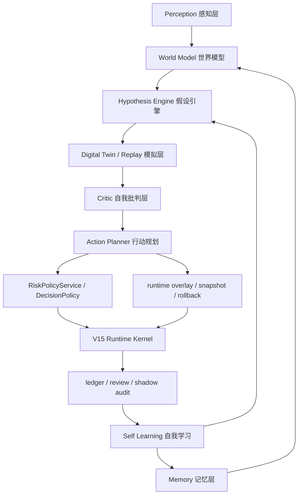

# V16 Autonomous Intelligence Brain

> Status: draft
> Last verified: 2026-07-06
> Scope: major-version design for the autonomous reasoning layer above V15 runtime/replay/control-plane foundations.

V16 的目标不是继续堆因子、堆模型或堆页面，而是把系统升级成一个有“交易大脑”的自治体。

这里说的“大脑”不是人格化承诺，也不是让单个大模型直接下单。它在工程上指一套可审计的认知闭环：

```text
感知市场
  -> 形成当前世界状态
  -> 调用记忆和历史经验
  -> 生成交易/治理假设
  -> 在数字孪生里模拟
  -> 自我批判和风控审查
  -> 选择动作或保持沉默
  -> 执行后复盘
  -> 更新记忆、规则、模型和自我约束
```

最终目的：

**完全自主进化智能交易系统：它能自己观察、理解、假设、验证、行动、复盘、修正，并知道什么时候不该行动。**

## 1. Relationship To V15

V15 是运行底座，V16 是认知层。

| 版本 | 核心问题 | 产物 |
|---|---|---|
| V15 | 系统能不能长期安全自治运行 | runtime kernel、config control plane、replay、autonomy health、release/rollback |
| V16 | 系统能不能像交易员一样形成判断并自我改进 | world model、memory、hypothesis engine、simulation critic、autonomous brain loop |

V16 不绕过 V15。V16 产生的任何计划、假设、调参、因子治理、模型治理和交易动作，都必须继续经过：

- `RiskPolicyService`
- `DecisionPolicy`
- runtime overlay / snapshot / rollback
- model permission guardrails
- replay / shadow evidence
- readiness / autonomy health

## 2. Why V16

当前系统已经具备：

- 37 个规则/模型/诊断智能单元的可审计总账；
- 因子 V2/V3 语义、Catalog、Orchestrator、overlay、snapshot、rollback；
- learning evidence contract、shadow/advisory 模型、policy suggestion、后验效果；
- live tick、risk、sizing、supervisor、ledger、review 的闭环。

但它现在仍偏“自治机器”，还不是“自治大脑”。

当前缺口：

- 规则和模型各自聪明，但没有统一的“当前市场理解”。
- 学习样本有证据等级，但治理动作还缺统一 evidence score。
- shadow 模型存在，但规则、风控、模板、因子的 shadow 总线还不统一。
- replay 还没有成为所有高影响动作的默认验证前置。
- 系统能执行自治动作，但还不能稳定解释“为什么现在最好什么都不做”。
- 经验散在 review、policy suggestion、factor cards、shadow audit、readiness 中，没有形成可检索长期记忆。

V16 要解决的是：

```text
从“自动执行治理动作”
升级到
“自动形成观点，并先证明自己的观点足够可靠”
```

## 3. Brain Architecture

V16 大脑按 8 个子系统设计：



### 3.1 Perception

目标：统一系统“看到什么”。

输入：

- bars / ticks / L2
- cTrader account / positions / deals
- factor values / normalized signals / context state
- event sizing context
- risk verdicts
- supervisor trace
- learning samples
- shadow/advisory model outputs
- readiness / freshness / health

输出：

- `MarketPerceptionSnapshot`
- `RuntimePerceptionSnapshot`
- `GovernancePerceptionSnapshot`

要求：

- 所有快照必须带 timestamp、source、freshness、schema version。
- 不能把 missing/stale 数据当作正常数据。
- 感知层只描述事实，不做交易结论。

### 3.2 World Model

目标：形成“当前世界状态”，相当于系统的盘感和状态理解。

输出：

- `market_regime`: trend / range / high_vol / low_vol / event_window / illiquid
- `strategy_posture`: normal / defensive / observation_only / no_new_risk
- `factor_posture`: healthy / concentrated / redundant / weak / unstable
- `execution_posture`: broker_ok / degraded / inconsistent / unsafe
- `learning_posture`: enough_evidence / warming_up / evidence_conflict / not_ready
- `autonomy_posture`: full / constrained / shadow_only / frozen

关键原则：

- world model 不直接下单。
- world model 是所有规则、模型和治理动作共享的状态解释。
- 状态必须可回放、可解释、可和历史相似场景检索。

### 3.3 Memory

目标：让系统有长期经验，而不是只看最近一次样本。

记忆类型：

| 记忆 | 来源 | 用途 |
|---|---|---|
| episodic memory | 单笔交易、单次治理动作、单次事故 | 回看具体案例 |
| semantic memory | 稳定规则、市场状态、因子角色、风控边界 | 形成长期知识 |
| procedural memory | 某类场景下应该如何处理 | 自动生成行动模板 |
| negative memory | 失败动作、错误模式、回滚原因 | 避免重复犯错 |

事实源：

- `decision_ledger`
- `trade_outcome_review`
- `position_supervisor_trace`
- `factor_contribution_review`
- `policy_suggestion`
- `learning_application_log/effect`
- `factor_catalog_snapshot`
- `*_shadow_audit`
- `runtime_config_snapshot`
- future `incident_memory`

要求：

- 记忆必须区分事实、推断、模型建议和人工覆盖。
- 历史降级样本只能弱使用，不能伪造成强经验。
- 记忆检索必须返回 evidence score 和相似度，不只返回文本解释。

### 3.4 Hypothesis Engine

目标：像人一样提出“可能发生了什么”和“应该试什么”，但不直接执行。

假设类型：

- market hypothesis: 市场进入新状态。
- factor hypothesis: 某因子失效、冗余、过拟合或只在特定 regime 有效。
- risk hypothesis: 当前执行风险高于信号收益。
- sizing hypothesis: 当前仓位应保守、正常或暂停。
- parameter hypothesis: 某模板在当前状态更合适。
- model hypothesis: 某 shadow model 有稳定边际价值。
- incident hypothesis: 当前系统状态可能异常。

统一输出：

```text
Hypothesis {
  hypothesis_id
  scope
  claim
  expected_effect
  evidence_refs
  counter_evidence_refs
  confidence
  evidence_score
  risk_class
  required_validation
  expires_at
}
```

要求：

- 每个假设必须带反证搜索。
- 没有反证搜索的假设不能进入行动规划。
- 高影响假设必须先 replay/shadow。

### 3.5 Digital Twin / Simulation

目标：让系统先在脑子里演一遍，再决定要不要做。

V16 replay 范围在 V15 基础上扩展：

- signal replay: 因子、context、gate、risk verdict。
- execution replay: requested volume、event/context sizing、risk block、order lifecycle。
- supervisor replay: hold/tighten/reduce/close 对结果影响。
- governance replay: 权重、模板、context policy、factor disable/retire。
- model replay: shadow model 介入前后决策差异。
- incident replay: 数据延迟、broker 异常、overlay 损坏、写库失败。

输出：

- `ReplayReport`
- `CounterfactualReport`
- `ActionSafetyReport`

要求：

- 高影响动作默认必须有 replay evidence。
- replay 不通过时，不允许靠单次 live 后验强行动作。
- replay 输出要能被 `RiskPolicyService` 和 autonomy health 使用。

### 3.6 Critic

目标：系统自己质疑自己。

Critic 检查：

- 证据是否太少。
- 样本是否过旧。
- 是否只在单一 regime 有效。
- 是否和硬风控冲突。
- 是否和已有失败记忆相似。
- 是否过度拟合最近几笔交易。
- 是否会增加集中度、频繁交易或执行风险。
- 是否只是模型高置信但证据等级不足。

输出：

```text
Critique {
  critique_id
  hypothesis_id
  verdict: pass | caution | reject | shadow_only
  objections
  missing_evidence
  required_replay
  max_allowed_action_scope
}
```

要求：

- Critic 默认保守。
- Critic 拥有把任何假设降级为 `shadow_only` 的权力。
- Critic 不能直接批准交易，只能限制行动范围。

### 3.7 Action Planner

目标：把假设转成受控动作。

动作类型：

- do nothing
- observe only
- start shadow
- run replay
- reduce autonomy scope
- update threshold
- update sizing multiplier
- update alpha weight
- switch online_light parameter template
- disable/retire factor
- tighten risk posture
- freeze autonomy
- propose release

输出：

```text
ActionPlan {
  plan_id
  hypothesis_id
  action_type
  scope
  max_impact
  risk_class
  validation_refs
  rollback_plan
  required_services
  execution_window
}
```

硬边界：

- 交易动作仍由 live chain 执行。
- 配置动作仍由 overlay/snapshot 执行。
- 权重动作仍由 DecisionPolicy 执行。
- 风险动作仍由 RiskPolicyService 裁决。
- 模型动作仍受 model permissions 限制。

### 3.8 Self Learning

目标：系统复盘自己的思考过程。

不只记录“动作赚没赚钱”，还要记录：

- 当初的假设是否成立。
- 反证是否被忽略。
- replay 是否预测正确。
- Critic 是否过严或过松。
- ActionPlan 是否执行一致。
- 失败来自市场、执行、风控、模型还是治理本身。

新增事实：

- `brain_decision`
- `hypothesis_review`
- `critic_review`
- `replay_prediction_error`
- `action_plan_effect`
- `memory_update_log`

## 4. Unified Evidence Score

V16 引入统一证据评分，不替代 `learning_evidence_contract.v1`，而是把它扩展到所有自治判断。

候选公式：

```text
evidence_score =
  sample_strength
  * integrity_weight
  * causal_weight
  * freshness_weight
  * regime_coverage_weight
  * replay_consistency_weight
  * execution_reliability_weight
  * anti_overfit_weight
```

证据等级：

| 等级 | 用途 |
|---|---|
| E0 | 只记录，不用于行动 |
| E1 | observe / explain |
| E2 | shadow / replay |
| E3 | low-impact autonomous action |
| E4 | medium-impact autonomous action |
| E5 | high-impact action candidate，但仍需 RiskPolicy 和 release discipline |

原则：

- 高置信模型输出如果证据等级低，只能 shadow。
- replay 一致性差会压低 evidence score。
- 近期样本多但 regime 单一，不能升到高等级。
- 事故记忆命中时，action scope 自动收紧。

## 5. Brain Loop

V16 的主循环：

```text
collect perceptions
  -> build world model
  -> retrieve similar memories
  -> generate hypotheses
  -> find counter-evidence
  -> run replay/shadow when required
  -> critic review
  -> build action plan
  -> risk/policy/config/model permission gates
  -> execute or observe
  -> review hypothesis and action effect
  -> update memory and constraints
```

建议服务：

- `BrainOrchestrator`
- `WorldModelService`
- `MemoryService`
- `HypothesisEngine`
- `SimulationService`
- `CriticService`
- `ActionPlanner`
- `BrainLedger`

第一版运行方式：

- 先只读，不改变交易。
- 然后允许生成 shadow/replay/action-plan。
- 再允许 low-impact autonomous actions。
- 最后才进入更高自治等级。

## 6. Live Trading Safety

V16 不是为了更激进，而是为了更可靠。

实盘前必须具备：

- live capability lock
- only-close mode
- no-new-risk mode
- autonomy freeze
- broker/local state divergence detector
- order idempotency audit
- abnormal slippage circuit breaker
- repeated amend failure breaker
- DB write failure breaker
- replay-required high-impact action gate
- incident memory writeback

任何“大脑”计划都不能绕过这些安全层。

## 7. Web Cockpit

Web 操作台不应该只是展示图表，而是展示系统的思考过程。

V16 页面：

- Brain State: 当前世界模型、姿态、自治等级。
- Hypotheses: 当前系统认为可能发生了什么。
- Evidence: 支持证据、反证、证据等级。
- Replay: 模拟结果、反事实差异、预测误差。
- Critic: 为什么通过、降级或拒绝。
- Action Plans: 准备做什么、影响范围、回滚点。
- Memory: 最近相似案例和失败记忆。
- Incidents: 事故、异常、冻结和恢复。
- Release: 大版本冻结、验证、发布、回滚。

小程序仍只做轻量状态面，不承载 V16 深度治理。

## 8. Phased Delivery

### Phase 0: V15 Completion Gate

详细启动门槛以 `docs/planning/v15-autonomous-runtime-platform.md` 的 `Pre-V16 Start Gate` 为准；V16 不应在大脑层绕过未完成的 V15 基础能力。

进入 V16 前，V15 至少需要：

- replay harness v1 可用；
- autonomy health v1 可读；
- runtime overlay/snapshot/recovery 稳定；
- high-impact action rollback 可审计；
- Web 能显示治理动作、replay 和 readiness。

### Phase 1: Read-Only Brain

目标：

- 构建 perception snapshots。
- 构建 world model。
- 读取 memory。
- 生成 hypothesis，但不行动。

成功标准：

- 每个 tick 或治理周期能输出 brain state。
- Web 能看到当前系统为什么偏防守/观察/正常。
- brain 输出不影响交易。

当前状态：`complete`。

- `Phase 1 minimal read-only loop done`: `backend.services.brain_state.BrainStateService` 已新增 `brain_state_snapshot` 审计表和 `/api/ops/brain/state` 入口，并接入 `/api/ops/backend-readiness` 的 `brain_state` / `v16.brain_state` 字段。当前后端版消费 V15 readiness、replay、incident control、autonomy health、governance freshness、release refs 和 brain memory retrieval，输出 `world_model`、observe-only `hypotheses`、`critic`、`evidence_refs` 和只读边界；`read_only=true`、`affects_trading=false`，不执行 action plan，不写 runtime overlay/snapshot，不改因子权重、订单、仓位或学习样本。
- `Phase 1 memory/counter-evidence done`: `backend.services.brain_memory.BrainMemoryService` 已新增 `brain_memory` 只读记忆索引和 `/api/ops/brain/memory` 入口，从 `experience_memory`、`trade_outcome_review`、`policy_suggestion`、model permission audit 和可选 shadow audit 表检索相似历史、negative memory 和 counter-evidence，并把 memory refs 写回 brain hypotheses、critic 和 evidence refs。negative memory 只能收紧 Critic scope，positive memory 只能作为反证展示，不生成训练标签或执行授权。
- `Phase 1 Web Brain State done`: Web `/v16` 已新增 V16 大脑状态页面，读取 `/api/ops/brain/state`、`/api/ops/brain/memory` 和 `/api/ops/backend-readiness`，展示 world model、memory retrieval、negative memory、counter-evidence、observe-only hypotheses、Critic 和只读边界；前端只展示后端事实和触发只读刷新，不重算策略/风控，不执行 action plan。
- Phase 1 剩余项：无阻断项。Phase 2 已在其上开始 shadow action plan ledger；仍应继续观察 brain state/memory source gaps、counter-evidence 质量和 `/v16` 页面可读性。

### Phase 2: Shadow Brain

目标：

- hypothesis 进入 replay/shadow。
- Critic 产出 pass/caution/reject。
- ActionPlan 只记录，不执行。

成功标准：

- 至少覆盖因子权重、参数模板、context policy、supervisor 模板。
- shadow action 与真实后验可比较。

当前状态：`complete`。

- `Phase 2 shadow action plan ledger done`: `backend.services.brain_action_planner.BrainActionPlannerService` 已新增 `brain_action_plan` 审计表和 `/api/ops/brain/action-plans` 入口，并接入 `/api/ops/backend-readiness` 的 `brain_action_plans` / `v16.action_plans` 字段。当前最小闭环从 Phase 1 brain state/hypotheses/memory/Critic 生成四类 record-only plans：factor weight、parameter template、context policy、supervisor template；每条 plan 记录 `critic_verdict`、`required_services`、`validation_refs`、`shadow_eval` contract、future rollback 要求和只读边界。
- `Phase 2 posterior comparison done`: `backend.services.brain_action_evaluator.BrainActionPlanEvaluatorService` 已新增 `brain_action_plan_eval` 审计表和 `/api/ops/brain/action-plan-evals` 入口，并接入 `/api/ops/backend-readiness` 的 `brain_action_plan_evals` / `v16.action_plan_evals` 字段。Evaluator 读取 `replay_report`、`trade_outcome_review`、`learning_application_effect`、`position_supervisor_trace`，对 shadow plans 输出 coverage、comparison verdict、comparison summary 和 evidence refs；该评价只读/record-only，不改变 plan 状态，不生成学习标签，不触发 governance/live mutation。
- `Phase 2 Web Shadow Plans/Evals done`: Web `/v16` 已展示 Shadow Action Plans 和 Shadow Evaluations，刷新按钮调用 `/api/ops/brain/state`、`/api/ops/brain/memory`、`/api/ops/brain/action-plans` 和 `/api/ops/brain/action-plan-evals`；前端只显示后端账本和后验比较，不重算策略/风控，不执行 action plan。
- Phase 2 剩余项：无阻断项。后续进入 Phase 3 前，应观察 posterior comparison 的 source gaps、coverage 分布和 verdict 稳定性；任何低影响执行仍必须新增显式 execution service，并重新经过 `RiskPolicyService`、`DecisionPolicy`（权重相关）、runtime overlay/snapshot 和 rollback evidence。

### Phase 3: Low-Impact Autonomous Brain

目标：

- 允许低影响动作自动执行。
- 例如 observe-only、shadow start、replay job、autonomy scope tighten、small threshold/sizing adjustment。

成功标准：

- 所有动作有 evidence score、Critic verdict、RiskPolicy verdict、rollback plan。
- 后验坏化能自动降级或回滚。

当前状态：`complete`。

- `Phase 3 low-impact executor done`: `backend.services.brain_low_impact_executor.BrainLowImpactExecutorService` 已新增 `brain_low_impact_execution` 审计表、`/api/ops/brain/low-impact-executions` 读取入口和 `/api/ops/brain/low-impact-executions/run` 显式执行入口，并接入 `/api/ops/backend-readiness` 的 `brain_low_impact_executions` / `v16.low_impact_executions` 字段。当前白名单只允许 read-only `run_replay_job`，执行前读取 P2 eval，记录 evidence score、Critic verdict、`RiskPolicyService.evaluate("run_replay_job")` verdict、rollback/downgrade plan；执行后记录 replay result 和 posterior monitor。
- `Phase 3 controlled downgrade done`: 当 posterior verdict/replay result 坏化且调用方显式设置 `allow_tighten=true` 时，executor 只能通过 `RuntimeIncidentControlService.set_mode("shadow_only")` 收紧自治范围；该路径继续走 `RiskPolicyService.evaluate("set_incident_control")` 和 runtime overlay/snapshot，不直接写配置。
- `Phase 3 Web Low-Impact Runs done`: Web `/v16` 已展示 P3 Runs / Low-Impact Executions，并提供受控 `运行 P3` 按钮；默认 `allow_tighten=false`，只触发后端白名单 replay job，不在前端计算策略/风控或执行未授权动作。
- Phase 3 剩余项：无阻断项。进入 Phase 4 前，应观察 replay job 成功率、P3 execution posterior monitor、bad-posterior downgrade 触发质量和 operator UX；任何 factor weight/template/context/supervisor 的实际变更仍属于 Phase 4+，必须重新经过 `DecisionPolicy`、`RiskPolicyService`、runtime snapshot/rollback 和 release evidence。

### Phase 4: Medium-Impact Governance

目标：

- 允许更高影响的治理动作，但不直接扩大交易风险。
- 例如 factor downweight/disable、online_light template switch、model shadow promotion。

成功标准：

- replay 和 live 后验都能解释。
- autonomy health 低时自动收紧权限。

当前状态：`complete`。

- `Phase 4 medium-impact governance done`: `backend.services.brain_medium_impact_governance.BrainMediumImpactGovernanceService` 已新增 `brain_medium_impact_governance` 审计表、`backend.services.brain_governance_candidates.BrainGovernanceCandidateService` 隔离候选层、`backend.services.brain_governance_candidate_review.BrainGovernanceCandidateReviewService` 候选审查层、`/api/ops/brain/medium-impact-governance` 读取入口、`/api/ops/brain/medium-impact-governance/materialize` 显式 materialize 入口、`/api/ops/brain/governance-candidates` 候选读取入口、`/api/ops/brain/governance-candidates/{candidate_id}/submit` 手动 bridge 入口、`/api/ops/brain/governance-candidate-reviews` 审查读取入口和 `/api/ops/brain/governance-candidates/review` 审查运行入口，并接入 `/api/ops/backend-readiness` 的 `brain_medium_impact_governance` / `brain_governance_candidates` / `brain_governance_candidate_reviews` / `v16.medium_impact_governance` / `v16.governance_candidates` / `v16.governance_candidate_reviews` 字段。
- 当前 P4 最小闭环基于 P2 posterior eval 和 P3 execution evidence，生成中等影响 `brain_governance_candidate` 隔离候选，覆盖 factor weight、parameter template、context policy、supervisor template 的 governance candidate；执行前记录 `RiskPolicyService` verdict，权重类候选记录 `DecisionPolicy` preview，所有候选记录 rollback/release requirements、source lineage 和 manual bridge boundary。
- P4 仍不直接应用权重、切模板、推广模型到 live、写 runtime overlay/snapshot、提交订单、写学习样本或直接写 `policy_suggestion`。候选如需进入旧自治建议队列，必须通过手动 bridge，且只有 `governance_ready/applyable`、RiskPolicy allowed、payload 被旧 `RuleEvolutionGovernor` 理解时才会写入 `policy_suggestion(status='proposed')`。
- 候选审查层会输出 `bridge_ready / needs_evidence / not_bridge_compatible / conflict_detected / expired / submitted`，复用现有 conflict surface、bridge preview 和可选 `LLMAdvisoryService`；审查只写 `brain_governance_candidate_review` 和可选 `llm_advisory_audit`，不提交候选、不执行 runtime mutation。
- Web `/v16` 已展示 Medium-Impact Governance Candidate 和 Candidate Review，并提供受控 `生成治理候选` / `审查候选` 按钮；按钮只调用后端 materialize/review API，不在前端计算策略/风控或执行 runtime mutation。
- Phase 4 剩余项：无阻断项。进入正式运行前，应观察 P4 candidate 命中质量、blocked_by_risk/blocked_by_evidence 分布、bridge rejection reason、后验解释稳定性和 release handoff 质量。

### Phase 5: Live-Ready Brain Guardrails

目标：

- 支持小资金实盘灰度前的工程门槛。

成功标准：

- live capability lock 全链路通过。
- broker/local divergence 可检测。
- only-close/no-new-risk/autonomy-freeze 可用。
- incident memory 和 release rollback 可用。

当前状态：`complete`。

- `Phase 5 live-ready guardrails done`: `backend.services.brain_live_ready_guardrail.BrainLiveReadyGuardrailService` 已新增 `brain_live_ready_guardrail` 审计表、`/api/ops/brain/live-ready-guardrails` 读取入口、`/api/ops/brain/live-ready-guardrails/evaluate` 显式评估入口和 `/api/ops/brain/live-ready-guardrails/tighten` 显式收紧入口，并接入 `/api/ops/backend-readiness` 的 `brain_live_ready_guardrails` / `v16.live_ready_guardrails` 字段。
- P5 评估 live capability lock、broker/local divergence、incident memory、release rollback 和 P3/P4 evidence，输出 action recommendation 与 `RiskPolicyService.evaluate("set_incident_control")` precheck；评估本身只写审计账本，不授权下单、不应用 P4 suggestion、不写学习样本。
- P5 tighten 只能把 incident mode 调得更严格，并通过 `RuntimeIncidentControlService.set_mode()` 继续走 `RiskPolicyService`、runtime overlay 和 snapshot；服务端拒绝任何放宽 incident mode 的请求，不提供 thaw/normal 入口。
- Web `/v16` 已展示 Live-Ready Guardrails，并提供受控 `评估 P5`、`no_new_risk`、`only_close`、`freeze` 按钮；按钮只调用后端 API，不在前端计算 live-ready、风控或 divergence。
- Phase 5 剩余项：无阻断项。进入后续 live-ready expansion 前，应观察 capability lock blockers、broker/local divergence 缺证据比例、incident memory 质量、release rollback ref 覆盖率和 tightening UX；任何交易权限扩大仍必须重新经过 release evidence、RiskPolicy、DecisionPolicy、runtime snapshot/rollback 和实盘人工/运维门禁。

## 9. Non-Goals

V16 不做：

- 让 LLM 直接下单。
- 让模型绕过 `RiskPolicyService`。
- 取消硬风控。
- 一次性重写 live loop。
- 在 replay 未成熟前扩大品种和仓位。
- 把“像人一样思考”解释成不可审计的黑箱。

## 10. Success Criteria

V16 完成时，系统必须能回答：

- 我现在看到的市场和系统状态是什么？
- 我为什么认为应该交易、治理、观察或停止？
- 哪些历史记忆支持这个判断？
- 有哪些反证？
- 我在 replay 里试过了吗？
- replay 和真实后验误差多大？
- Critic 为什么通过、降级或拒绝？
- 如果执行，最大影响是什么？
- 如果错了，怎么回滚？
- 这次经验如何更新我的记忆和未来判断？

最终标准：

```text
系统不是“自动交易脚本”
也不是“模型直接喊单”
而是一个能自我观察、自我怀疑、自我验证、自我修正的交易智能体。
```

## 11. First Implementation Candidates

建议第一批只做可回滚、只读或 shadow 的工程：

1. `BrainLedger` 表和 schema。
2. `WorldModelService` 只读生成 `brain_state`.
3. `MemoryService` 从 review/suggestion/shadow audit 检索相似历史。
4. `HypothesisEngine` 先生成 observe-only hypotheses。
5. `CriticService` 只做证据不足和风险冲突降级。
6. Web Brain State 页面。
7. replay report 接入 hypothesis evidence refs。

第一阶段绝不直接改变下单、仓位、权重或模板。

## 12. Technology Stack Standard

V16 的技术栈目标是：**至少支撑未来一年，不因为第一版实现简单而选择以后必换的临时方案。**

选择原则：

- 交易执行链保持简单、同步、可审计；复杂编排放到 brain/replay/governance 层。
- 优先扩展现有事实源：PostgreSQL、DuckDB、FastAPI、Pydantic、React。
- 对长期自治最关键的能力，直接选稳定的长期组件，不做短期降级。
- 新组件必须有明确边界、可停用、可降级，不得成为下单链路的隐形单点。
- live order path 不引入外部 workflow/vector/LLM 依赖。

### 12.1 Required V16 Stack

| 领域 | 标准选择 | 用途 | 为什么选它 |
|---|---|---|---|
| Backend API | Python 3.12+、FastAPI、Pydantic v2 | API、schema、brain service contract | 已在系统内稳定使用，适合快速迭代和强 schema |
| Runtime state | PostgreSQL `state_v1` | ledger、governance、brain ledger、memory metadata | 现有事实源，支持事务、审计、恢复 |
| Vector memory | PostgreSQL + `pgvector` | 相似案例、失败记忆、hypothesis evidence retrieval | 和 state 事实源共库，避免独立向量库同步/权限/备份复杂度 |
| Historical analytics | DuckDB + pandas；V16 replay 可补 `pyarrow` / `polars` | bars/ticks/replay/report 扫描 | DuckDB 已是行情事实源，适合本地高性能分析；Polars/Arrow 只用于 replay 批处理，不替代 live pandas |
| Durable workflow | Temporal Server + Python SDK | brain cycle、replay job、model/shadow job、governance workflow、rollback workflow | 需要 durable workflow、retry、timeout、versioning、worker；APScheduler 不适合承载长期自治状态机 |
| Lightweight scheduling | APScheduler | 触发周期任务或启动 Temporal workflow | 只做 clock trigger，不再保存复杂业务状态 |
| Observability | OpenTelemetry + OTLP Collector + Prometheus + Grafana + Loki | trace、metrics、logs、brain/action/replay 链路观测 | V16 必须能看到每个假设和动作从哪里来、在哪里失败 |
| Frontend | React + TypeScript + Vite + TanStack Query | Web cockpit | 当前栈可继续用，不需要换框架 |
| Visualization | Apache ECharts + React Flow (`@xyflow/react`) | replay 曲线、证据时间线、brain DAG、行动链路 | ECharts 做时间序列/统计图，React Flow 做可交互推理图和 action graph |
| DB migration | Alembic + raw SQL/SQLAlchemy Core | PostgreSQL schema migration | V16 表会增多，不能继续只靠散落 DDL；不要求重写为 ORM |
| Testing | pytest、pytest-asyncio、Playwright | backend contract、workflow tests、Web cockpit E2E | V16 需要跨服务 contract 和前端审计页面验证 |
| Artifact store | PostgreSQL metadata + filesystem artifact path + content hash | replay reports、model artifacts、brain snapshots | 先不引入对象存储；必须保证可追溯、可校验、可备份 |
| Secrets | systemd env + `.env` server-local；长期补 `sops`/age 管理备份 | cTrader、JWT、LLM/embedding provider key | 不把密钥放进仓库；需要可恢复但不泄露 |

### 12.2 Temporal As The V16 Workflow Backbone

V16 不建议继续用 APScheduler 承载复杂自治主循环。

Temporal 应负责：

- `BrainCycleWorkflow`
- `ReplayValidationWorkflow`
- `HypothesisReviewWorkflow`
- `ActionPlanWorkflow`
- `ModelShadowWorkflow`
- `GovernanceRollbackWorkflow`
- `IncidentReviewWorkflow`

Temporal 不负责：

- live tick 内的同步下单路径；
- cTrader market order 的最终执行；
- `RiskPolicyService` 的裁决权；
- `DecisionPolicy` 的权重写入权；
- PostgreSQL 事实源本身。

边界：

```text
APScheduler / systemd timer
  -> start Temporal workflow
  -> workflow calls activities
  -> activities read/write PostgreSQL/DuckDB
  -> high-impact plan still goes through RiskPolicyService
  -> runtime mutation still goes through overlay/snapshot
```

这样做的原因：

- brain/replay/governance 是多步骤、可重试、可取消、可恢复的长期工作流。
- 如果后端或 worker 重启，workflow 状态不能丢。
- rollback、replay、模型 shadow 需要明确 timeout、retry、versioning。
- 后续一年内不希望从 APScheduler/RQ/Celery 再迁一次。

### 12.3 Memory And Embedding Stack

MemoryService 第一版使用 PostgreSQL + pgvector。

表设计方向：

```text
brain_memory
  memory_id
  memory_type
  source_table
  source_id
  symbol
  timeframe
  regime
  text_summary
  structured_json
  embedding vector(...)
  embedding_model
  evidence_score
  created_at
  last_used_at
```

Embedding 策略：

- 使用 provider abstraction，不把某个模型供应商写死进业务逻辑。
- 每条 embedding 必须记录 `embedding_model`、维度、生成时间和 source hash。
- 中文/英文混合场景优先选择多语言 embedding 模型。
- 第一版可以用 OpenAI-compatible 或本地 embedding service，但 storage 和 retrieval 固定在 pgvector。
- 不在第一年默认引入 Chroma/Qdrant/Milvus；只有 pgvector 在数据规模或延迟上实测无法满足时才升级。

检索要求：

- 必须支持 metadata filter：symbol、timeframe、regime、memory_type、evidence_score。
- 不能只按向量相似度返回；必须结合证据等级和时间新鲜度。
- negative memory 的命中应降低 action scope。

### 12.4 Replay Data Stack

Replay 以 DuckDB 为主，PostgreSQL 为审计事实源。

| 数据 | 存储 |
|---|---|
| bars/ticks/L2/events/external PIT data | DuckDB |
| decision/review/trace/governance/effect | PostgreSQL |
| replay run metadata | PostgreSQL |
| replay report artifact | filesystem + hash + PostgreSQL metadata |

V16 可新增：

- `pyarrow`: DuckDB/Polars/pandas 之间的高效数据交换。
- `polars`: 大批量 replay 特征整理和 report aggregation。

约束：

- live tick 不因为 replay 引入 Polars 依赖。
- replay runner 必须 deterministic。
- replay report 必须带 input dataset hash、config hash、code version、run id。

### 12.5 Observability Stack

V16 的 brain 不能只写日志，必须有 trace。

标准：

- OpenTelemetry trace id 贯穿：
  - perception snapshot
  - hypothesis
  - replay
  - critic
  - action plan
  - risk verdict
  - overlay mutation
  - ledger/review
- Prometheus 暴露 metrics。
- Grafana 展示 autonomy health、workflow latency、rollback rate、replay error。
- Loki 保存结构化 JSON logs。

最低字段：

```text
trace_id
brain_cycle_id
hypothesis_id
replay_run_id
action_plan_id
evolution_run_id
decision_id
position_id
config_hash
```

### 12.6 Frontend Stack

保持当前 React/Vite/TypeScript，不换 Next.js。

新增：

- `echarts`: 时间线、PnL、replay curve、evidence distribution、health trend。
- `@xyflow/react`: brain DAG、hypothesis -> replay -> critic -> action plan 图。
- `@playwright/test`: Web cockpit 的端到端 contract。

页面数据规则：

- 前端只展示后端事实，不重新推断 brain verdict。
- brain graph 的节点必须能跳回后端事实源：ledger、snapshot、policy suggestion、replay report。
- 对不可用/过期/缺证据状态必须明确显示，不能渲染成正常。

### 12.7 Dependencies To Add When Implementing V16

Python:

```text
temporalio
pgvector
alembic
sqlalchemy
opentelemetry-api
opentelemetry-sdk
opentelemetry-exporter-otlp
opentelemetry-instrumentation-fastapi
prometheus-client
pyarrow
polars
```

Frontend:

```text
echarts
@xyflow/react
@playwright/test
```

Infrastructure services:

```text
temporal-server
otel-collector
prometheus
grafana
loki
postgresql extension: vector
```

These are not all Phase 1 requirements. They are the V16 target stack so the design does not choose a dead-end first implementation.

### 12.8 Explicit Non-Choices

Do not choose these as V16 defaults:

- Celery/RQ as the main brain workflow engine: useful queues, but not enough durable workflow semantics for rollback/replay chains.
- Chroma/Qdrant/Milvus as first memory store: too much sync/ops overhead before pgvector is proven insufficient.
- Kubernetes as a V16 requirement: systemd is still appropriate for the current server; K8s can be revisited only after service count and deployment complexity justify it.
- Spark/Ray as replay defaults: too heavy before DuckDB/Polars limits are measured.
- Full ORM rewrite: Alembic/SQLAlchemy Core can manage migrations without replacing current psycopg access.
- LLM as action authority: LLM may assist explanation/critic/advisory, but never owns trading or governance execution rights.

### 12.9 Source References Checked

- Temporal Python SDK documentation: `https://docs.temporal.io/develop/python`
- pgvector project: `https://github.com/pgvector/pgvector`
- OpenTelemetry Python documentation: `https://opentelemetry.io/docs/languages/python/`
- Apache ECharts official site: `https://echarts.apache.org`
