# Current Runtime Architecture

> Status: active
> Last verified: 2026-07-10
> Scope: code-verified runtime map for backend startup, live trading, learning, shadow models, factor scoring, autonomous governance, state stores, and operator entry points.
> Primary code anchors: `backend/app.py`, `backend/services/live_service.py`, `alpha/portfolio_compositor.py`, `backend/services/autonomous_learning.py`, `research/features/evidence_contract.py`, `research/*_lightgbm.py`, `backend/runtime/factor_governance_orchestrator.py`, `backend/services/factor_catalog.py`, `scripts/learning_worker.py`.

这份文档是“读一遍就知道当前系统怎么跑”的运行地图。长期蓝图放在 `architecture.md`，近期任务放在 `TODO.md`；这里只描述当前代码实际执行链路。

规则驱动智能、影子模型、每一步审计数据和精度字段的完整总账见 `rule-driven-intelligence-inventory.md`。

## 1. 一句话总览

当前系统是两条主进程线加一套操作面：

```text
quant-backend.service
  -> FastAPI / WebSocket / cTrader bridge / live loop / 轻量调度 / readiness

quant-learning-worker.service
  -> 学习调度 / evolution / factor governance / AWE / 特征工程 / 盘外训练

Caddy + web_frontend + miniprogram_v2
  -> Web 完整操作台（含 /v15、/v16）/ 小程序轻量状态面 / API 和审计入口
```

核心闭环是：

```text
行情与外部数据
  -> FactorFrame / StreamingFactorEngine
  -> SignalNormalizer
  -> PortfolioCompositor
  -> ContextPolicyService
  -> ExecutionGate(signal/cooldown) + RiskPolicyService(risk/event/governance)
  -> cTrader demo 执行
  -> ledger / review / attribution / learning
  -> FactorGovernanceOrchestrator
  -> runtime_config_overlay + runtime_config_snapshot
  -> replay_report + autonomy_health readiness + autonomy_scope_approval_event + release_run + release_approval_event + incident_playbook_run/event + v15_phase0 gate
  -> V16 brain_state_snapshot + brain_memory + brain_action_plan + brain_action_plan_eval + brain_low_impact_execution + brain_medium_impact_governance + brain_governance_candidate + brain_live_ready_guardrail + proposal_registry + live_autonomy_unlock_event world model / memory / hypotheses / critic / shadow plans / posterior comparisons / low-impact runs / isolated governance candidates / live-ready guardrails / unified proposal bus with reliability/freshness / governed live-autonomous unlock
  -> 下一轮交易
```

## 1.1 当前系统拓扑图

这张图是当前代码事实下的全系统拓扑，不是规划图：

```mermaid
flowchart TD
    subgraph EXT["外部世界"]
        Market["行情 / bars / cTrader spot"]
        Events["经济事件日历"]
        ExternalData["COT / ETF / FRED / 宏观"]
        CTrader["cTrader broker"]
    end

    subgraph DATA["数据事实源"]
        Bars["DuckDB bars 月库"]
        ExternalDB["DuckDB external_data"]
        EventsDB["DuckDB events"]
        StatePG["PostgreSQL state_v1"]
    end

    subgraph BACKEND["quant-backend.service"]
        API["FastAPI / WebSocket"]
        LiveLoop["live loop"]
        Bridge["cTrader bridge"]
        Readiness["backend readiness"]
        PositionSupervisor["PositionSupervisor"]
    end

    subgraph LIVE["live tick 决策链"]
        FactorEngine["StreamingFactorEngine"]
        Normalizer["SignalNormalizer"]
        Compositor["PortfolioCompositor"]
        ContextPolicy["ContextPolicyService"]
        DecisionFrame["LiveDecisionPipeline / LiveDecisionFrame"]
        Gate["ExecutionGate"]
        Sizing["Kelly + event + context sizing"]
        RiskPolicy["RiskPolicyService / RiskLimitSnapshot / RiskGovernor"]
        IncidentControl["runtime incident control"]
        Execution["OpenTradePipeline / amend / reduce / close"]
    end

    subgraph LEDGER["交易审计与复盘"]
        DecisionLedger["decision_ledger"]
        FactorSnapshot["decision_factor_snapshot"]
        Lifecycle["order / position lifecycle"]
        SupervisorTrace["position_supervisor_trace"]
        TradeReview["trade_outcome_review"]
        FactorReview["factor_contribution_review"]
        Counterfactual["supervisor_counterfactual_review"]
        ReplayReport["replay_report"]
        AutonomyScopeApproval["autonomy_scope_approval_event"]
        ReleaseRun["release_run"]
        ReleaseApproval["release_approval_event"]
        IncidentPlaybook["incident_playbook_run"]
        IncidentPlaybookEvent["incident_playbook_event"]
        Phase0Gate["v15_phase0 completion"]
        BrainState["brain_state_snapshot"]
        BrainMemory["brain_memory"]
        ProposalRegistry["proposal_registry"]
        LiveAutonomyUnlock["live_autonomy_unlock_event"]
    end

    subgraph WORKER["quant-learning-worker.service"]
        LearningBackfill["learning backfill"]
        AutonomousLearning["autonomous learning materializers"]
        EvidenceContract["learning_evidence_contract"]
        Evolution["RuleEvolutionGovernor"]
        FactorGov["FactorGovernanceOrchestrator"]
        AWE["AdaptiveWeightEngine"]
        FeatureEng["feature engineering"]
        OffmarketModels["offmarket LightGBM jobs"]
    end

    subgraph MODELS["shadow / advisory 模型层"]
        ModelPerm["model_permissions"]
        ShadowQueue["ModelShadowQueue / runner"]
        Canary["canary review / trial"]
        OpenQuality["open_quality_lightgbm"]
        PositionQuality["position_quality_lightgbm"]
        FactorWeakness["factor_governance_lightgbm"]
        MetaModel["meta_model_lightgbm / sidecar"]
        LLM["LLM advisory"]
    end

    subgraph GOV["自治配置与治理事实"]
        Catalog["Factor Catalog"]
        CatalogSnapshot["factor_catalog_snapshot"]
        PolicySuggestion["policy_suggestion"]
        EvolutionDecision["evolution_decision / evolution_run"]
        AppLog["learning_application_log / effect"]
        Overlay["runtime_config_overlay"]
        Snapshot["runtime_config_snapshot"]
        ParamTemplates["parameter templates"]
        AutonomyHealth["autonomy health"]
        LiveAutonomy["LiveAutonomyService"]
    end

    subgraph UI["展示与操作入口"]
        Caddy["Caddy"]
        Web["web_frontend"]
        MiniProgram["miniprogram_v2"]
    end

    Market --> Bars
    ExternalData --> ExternalDB
    Events --> EventsDB
    CTrader <--> Bridge

    Bars --> LiveLoop
    Bridge --> LiveLoop
    ExternalDB --> FactorEngine
    EventsDB --> Sizing
    StatePG <--> API
    StatePG <--> Readiness

    API --> LiveLoop
    LiveLoop --> FactorEngine --> Normalizer --> Compositor --> ContextPolicy --> DecisionFrame --> Gate --> Sizing --> RiskPolicy --> Execution --> Bridge
    Overlay --> IncidentControl --> RiskPolicy
    RiskPolicy --> StatePG
    Execution --> DecisionLedger
    Compositor --> FactorSnapshot
    Execution --> Lifecycle
    LiveLoop --> PositionSupervisor --> SupervisorTrace
    PositionSupervisor --> RiskPolicy

    Lifecycle --> TradeReview
    DecisionLedger --> ReplayReport
    FactorSnapshot --> ReplayReport
    DecisionLedger --> LearningBackfill
    SupervisorTrace --> LearningBackfill
    TradeReview --> LearningBackfill
    FactorReview --> LearningBackfill
    Counterfactual --> LearningBackfill
    LearningBackfill --> AutonomousLearning --> EvidenceContract

    EvidenceContract --> OpenQuality
    EvidenceContract --> PositionQuality
    FactorReview --> FactorWeakness
    TradeReview --> MetaModel
    ModelPerm --> ShadowQueue --> Canary
    OpenQuality --> StatePG
    PositionQuality --> StatePG
    FactorWeakness --> StatePG
    MetaModel --> StatePG
    LLM --> StatePG

    AutonomousLearning --> PolicySuggestion
    Evolution --> PolicySuggestion
    PolicySuggestion --> AppLog
    AppLog --> FactorGov
    Catalog --> FactorGov
    FactorGov --> EvolutionDecision
    FactorGov --> CatalogSnapshot
    FactorGov --> Overlay
    FactorGov --> Snapshot
    FactorGov --> ParamTemplates
    AWE --> FactorGov
    OffmarketModels --> StatePG
    FeatureEng --> StatePG

    Overlay --> LiveLoop
    Overlay --> WORKER
    Snapshot --> FactorGov
    CatalogSnapshot --> Catalog
    ReplayReport --> AutonomyHealth
    AppLog --> AutonomyHealth
    CatalogSnapshot --> AutonomyHealth
    Snapshot --> ReleaseRun
    ReplayReport --> ReleaseRun
    IncidentControl --> ReleaseRun
    Readiness --> ReleaseRun
    IncidentPlaybook --> IncidentPlaybookEvent
    Readiness --> IncidentPlaybookEvent
    ReplayReport --> IncidentPlaybookEvent
    ReleaseRun --> IncidentPlaybookEvent
    Readiness --> Phase0Gate
    ReplayReport --> Phase0Gate
    ReleaseRun --> Phase0Gate
    Readiness --> BrainState
    ReplayReport --> BrainState
    AutonomyHealth --> BrainState
    IncidentControl --> BrainState
    TradeReview --> BrainMemory
    PolicySuggestion --> BrainMemory
    StatePG --> BrainMemory
    BrainMemory --> BrainState
    PolicySuggestion --> ProposalRegistry
    EvolutionDecision --> ProposalRegistry
    AppLog --> ProposalRegistry
    BrainMemory --> ProposalRegistry
    BrainState --> ProposalRegistry
    ProposalRegistry --> LiveAutonomy
    ReleaseRun --> LiveAutonomy
    ReplayReport --> LiveAutonomy
    Readiness --> LiveAutonomy
    LiveAutonomy --> Overlay
    LiveAutonomy --> Snapshot
    LiveAutonomy --> LiveAutonomyUnlock

    API --> Caddy --> Web
    API --> MiniProgram
    Readiness --> API
    Catalog --> API
    StatePG --> API
```



读图时记住三个权威边界：

- cTrader 是 broker 实时真相，PostgreSQL 是运行审计和自治配置事实源。
- backend 负责 live loop 和执行入口，worker 负责学习、治理和盘外模型任务。
- shadow/advisory 模型只写审计和建议，不能直接越过 `RiskPolicyService`、`DecisionPolicy` 或 runtime overlay 写入口。

## 2. 当前运行进程

| 进程/入口 | 当前职责 | 不该承担的事 |
|---|---|---|
| `quant-backend.service` | FastAPI、JWT auth、WebSocket、cTrader 连接、live loop、持仓监督、轻量健康检查、数据同步入口 | 重训练和高 CPU 学习任务 |
| `quant-learning-worker.service` | watermark-gated 学习 backfill、固定 UTC 相位的 supervisor/autonomous learning、hourly evolution + factor-health governance handoff、factor governance、feature engineering、盘外 LightGBM 任务 | cTrader live loop、broker 状态权威、依赖 live attribution 内存态的 AWE |
| `caddy.service` | 公网 TLS、`/api/*` 和 `/ws/state` 反代到 `127.0.0.1:8000` | 策略逻辑、静态旧 Web Console 维护 |
| `web_frontend` | 完整操作台：overview、risk、learning、models、ops、factor governance 等 | 替代后端事实源 |
| `miniprogram_v2` | 手机轻量状态面：live、position、risk、PnL 简表 | 承载复杂治理和调试视图 |

学习 worker 的 systemd unit 在 `deployment/quant-learning-worker.service`，默认 `CPUAffinity=2 3`，启动脚本是 `scripts/learning_worker.py`。unit 采用 `RestartSec=30`、五分钟内最多五次启动，避免 RuntimeConfig/overlay 权威故障时形成 10 秒重启风暴；故障仍保持 fail-closed。

## 3. 后端启动顺序

`./.venv/bin/python -m backend` 最终启动 `backend.app:app`。`backend.app.lifespan` 的实际顺序是：

1. 初始化日志与启动状态。
2. 校验认证配置，缺失或不安全时 fail closed。
3. 从 `config/settings.yaml` 加载 `RuntimeConfig`。
4. 校验执行语义，确认 `ctrader.send_orders` 与 runtime config 的有效下单语义。
5. 调用 `restore_runtime_config_on_startup()`：读取 DB overlay，应用到内存 `RuntimeConfig`，写 startup `runtime_config_snapshot`。
6. overlay 恢复失败时，如果有效下单已开启则阻断启动；dry-run 或降级路径只记录 startup issue。
7. 初始化 PostgreSQL state 与 DuckDB 连接契约。
8. `ParameterTemplateService().sync_runtime_config()` 把 active 参数模板同步进 runtime config，并保留已有 overlay 键。
9. position supervisor active template 由 `runtime_config_overlay.position_supervisor_template_id` 恢复；`runtime_config_snapshot` 只做审计和回滚证据，不能作为启动恢复事实源。
10. 绑定 job manager event loop。
11. 从 lifecycle log 恢复 shadow/discovered 动态因子。
12. 预热 `DataStore`。
13. 预热 cTrader bridge，并按持久化 desired state 调度 live loop auto-resume。
14. 如果 `QUANT_BACKEND_LEARNING_SCHEDULERS=1`，在 backend 内启动轻量 learning/supervisor/autonomous 调度；默认建议由独立 worker 承担。
15. 预热 db-health cache。

其中第 12-15 步的非致命 warmup、可选 backend learning scheduler 和 shutdown stop 由 `BackendRuntimeLifecycle` 统一编排；认证、配置/overlay、数据库 fail-closed、模板恢复和 factor registry 恢复继续保留在 `backend.app.lifespan`。正常或异常 lifespan 退出都会先调用 `stop_loop_for_process_shutdown(timeout_sec=30)`：保留 persisted desired state，设置当前 loop stop event 并同步等待当前 tick drain；完成后按 thread identity 释放 ownership，超时则保留 ownership 并写 `recovery_required=true`。随后才停止 learning 和 live scheduler。该路径不平仓、不主动断开 cTrader，也不替代手工 `/api/live/stop`。

这意味着真实配置顺序不是“只读 YAML”：

```text
settings.yaml base
  -> PostgreSQL runtime_config_overlay
  -> in-memory RuntimeConfig
  -> runtime_config_snapshot
```

## 4. 学习 Worker 启动顺序

`scripts/learning_worker.py` 独立启动后会：

1. 可选设置 CPU affinity。
2. 初始化日志和数据库。
3. 加载 YAML base config。
4. 同样恢复 `runtime_config_overlay`，写 `learning_worker_startup` snapshot。
5. 注册重任务：
   - `evolution_hourly`: 每小时
   - `factor_governance_autonomous`: 默认 `*/15 * * * *`，可由 `factor_governance_cron` 配置
   - `awe_adapt`: 每 30 分钟
   - `feature_eng`: 每日 03:00
   - `offmarket_position_quality_lightgbm`: 每小时 20 分
6. 如果未关闭 learning schedulers，启动：
   - learning backfill
   - supervisor learning
   - autonomous learning

所以自治治理的主控制面在 worker，backend 只保留可选轻量调度和 API/readiness。

## 5. 学习、影子模型和数据精度控制面

学习系统不是单独的一套“模型系统”，而是交易闭环后的证据层：

```text
decision_ledger / position_supervisor_trace / trade_outcome_review
  -> autonomous_learning_sample
  -> evidence_contract
  -> dataset readiness / dataset snapshot
  -> shadow/advisory model training
  -> shadow audit / advisory ledger
  -> policy_suggestion / Factor Catalog / backend-readiness
  -> FactorGovernanceOrchestrator 或人工覆盖审计
```

当前主要样本来源：

| 来源 | 进入哪里 | 当前用途 |
|---|---|---|
| `decision_ledger(open/skip/supervisor_*)` | `autonomous_learning_sample` | 开仓质量、风控拒绝、supervisor 轨迹 |
| `position_supervisor_trace` | `autonomous_learning_sample(sample_type=supervisor_execution_trace)` | 持仓监督动作轨迹，初始多为 pending |
| `trade_outcome_review` | `autonomous_learning_sample`、position/meta 模型 | 成熟交易结果、开仓质量标签、全局姿态窗口 |
| `supervisor_counterfactual_review` | `autonomous_learning_sample(sample_type=post_close_counterfactual)` | 退出反事实，按证据等级进入训练或审计 |
| `factor_contribution_review` | `factor_governance_lightgbm` | 因子贡献弱化 shadow audit |
| `learning_application_log/effect` | 后验回滚检查 | 判断自治动作是否变差 |

交易复盘现在显式记录 `entry_timing_context.v1`、`decision_freshness_context` 和 `system_issue_context.v1`：

- `entry_ts` 以实际成交 `fill_ts` 优先；信号 K 线时间保留为 `signal_bar_ts`。
- 若数据时效、决策 K 线或信号到成交延迟污染样本，`trade_review_outcome` / `shadow_open_decision` 降为 partial/低权重，`factor_contribution_review` 只保留审计，不进入高置信因子治理训练。
- `backfill_trade_review_timing_and_system_markers()` 只从现有 ledger/order/review 事实回填，不伪造 broker 事实。

学习数据精度由 `learning_evidence_contract.v1` 控制。每条样本必须有：

```text
integrity: full / recovered / partial / missing
causal_level: observational / counterfactual / replay_validated / intervention_observed
label_status: pending / matured / invalid
train_weight: quality_score * integrity_weight * causal_weight * label_weight
allowed_uses: audit / explainability / weak_supervision / counterfactual_training / supervised_training / strong_governance
```

强监督训练只允许 `model_ready=true` 且 `allowed_uses` 包含 `supervised_training` 的样本。历史缺字段样本保留 degraded 或低权重，不能伪造实时上下文。

当前影子/建议模型关系：

| 模型 | 数据来源 | 输出 | 权限边界 |
|---|---|---|---|
| `open_quality_lightgbm` | matured `shadow_open_decision` + open outcome | `open_quality_shadow_audit` | 只评估开仓质量，不下单 |
| `position_quality_lightgbm` | `trade_outcome_review` | `position_quality_shadow_audit` | 只给持仓质量/退出风险 shadow 分 |
| `factor_governance_lightgbm` | `factor_contribution_review` + review | `factor_governance_shadow_audit` / 可选 `policy_suggestion` | 只能生成因子治理 advisory |
| `meta_model_lightgbm` | rolling `trade_outcome_review` + shadow weak rates | `meta_model_shadow_audit` / 可选 advisory ledger | 只给全局 posture，不改风控 |
| 通用 `ModelShadowQueue` | dataset snapshot artifact | shadow report / canary-ready advisory | promotion gate 只给 shadow candidate |
| LLM advisory | 结构化上下文 | 审计说明、治理解释 | 不进入执行层 |

模型权限由 `model_permissions` 审计，并由 `RiskPolicyService` 的 model stage gate 复用：artifact 必须声明 `live_trading=false`、`advisory_only=true`、`shadow_only=true`，并且不能声明下单、平仓、改硬风控、绕过 `RiskPolicyService` 或直接改权重的能力。

关键 API：

```text
GET  /api/learning/dataset/readiness
GET  /api/learning/dataset/quality-health
POST /api/learning/dataset/export
POST /api/learning/model/*/train
POST /api/learning/model/*/shadow-run
GET  /api/learning/model/*/audits
POST /api/learning/model/promotion-gate
POST /api/learning/model/shadow-queue
POST /api/learning/model/shadow-run
POST /api/learning/model/inference
GET  /api/learning/model/permissions/audits
```

`backend-readiness` 会汇总 governance、model permission、shadow audit freshness、dataset quality 等状态；Web 前端应展示这些状态，不要自己重新判断模型是否可用。

当前按智能单元总账口径统计：规则/策略执行单元 30 个，影子/建议模型与模型护栏单元 9 个，诊断汇总单元 12 个，合计纳入总账 51 个。数量和边界以 `rule-driven-intelligence-inventory.md` 为准。

## 6. Live Loop 主链路

`backend.services.live_service.start_loop()` 启动交易循环，当前只支持 `ctrader` broker。启动动作包括：

1. 写入持久化 desired loop state。
2. prime live state。
3. 启动 live scheduler。
4. 启动 `_run_loop` 背景线程。

每个 tick 的外层由 `_run_live_loop_tick_body()` 执行：

```text
市场时段检查
  -> cTrader bridge 获取与订阅检查
  -> 异步 account refresh
  -> 首次 position recovery
  -> 从本地 bars 月库 warmup 最近 bar window
  -> decision bar freshness repair: 只保留最新已闭合 bar；缺已闭合 bar 时用主 cTrader bridge 即时回补月库并重载
  -> spot quote 注入最新 bar
  -> circuit breaker / daily drawdown 检查
  -> _process_tick(...)
```

`_process_tick_factor_pipeline()` 现在只编排 live tick 外层；交易信号决策由 `backend.services.live_decision_pipeline.run_live_decision_pipeline()` 产出 `LiveDecisionFrame`：

```text
run_live_decision_pipeline(...)
  -> StreamingFactorEngine.refresh_factor_list()
  -> engine.append_bar(bar)
  -> SignalNormalizer.normalize(...)
  -> PortfolioCompositor.compose(...)
  -> ContextPolicyService.evaluate(context_state)
  -> apply context threshold effect to ExecutionGate
  -> ExecutionGate.filter(...)
  -> ExecutionGate.tick(...)
  -> LiveDecisionFrame
_process_tick_factor_pipeline(...)
  -> live_factor_state 提交 decision bar 进度、last_factor_values 和 factor vote snapshot
  -> 写 signal ledger
  -> position close 检测与 deal sync
  -> _run_open_trade_pipeline(...)
       prepare candidate:
         SL/TP preflight
         Kelly sizing
         event sizing
         context position_multiplier
       risk verdict:
         event risk filter context
         decision_freshness
         RiskPolicyService.evaluate("open_trade")
         market-session/order block
       broker execution:
         cTrader market_buy / market_sell
         resolve fill / position id / actual API volume
       post-fill audit:
         pending recovery state
         SL/TP amend
         open/order_failed/skip ledger
  -> position protection cycle
```

重点边界：

- live `ExecutionGate` 处理信号阈值和策略冷却；NFP/GVZ legacy event filter 只生成 `event_filter` 风控输入，最终阻断由 `RiskPolicyService` 裁决。
- process shutdown 进入 `loop_draining` 后，live open pipeline 在 candidate 前和 market RPC admission lock 内各检查一次，阻止新 `market_buy/sell`；已经获准的 market RPC 仍必须完成 fill、entry protection、SL/TP 和 ledger/recovery post-fill。close/reduce/tighten 不受该生命周期闸门阻断。
- live 决策只使用最新已闭合 K 线。`_run_live_loop_tick_body()` 在因子计算前会过滤当前未闭合 bar，并在缺少应有闭合 bar 时通过主 cTrader bridge 回补 `data/bars_monthly/bars_YYYY_MM.duckdb` 后重载；修复失败只阻断 open_trade，不停止持仓监督和平仓链路。
- `LiveDecisionFrame` 是交易信号决策输出，不读取账户、不做仓位 sizing、不调用 `RiskPolicyService`、不触达 broker。
- `RiskPolicyService` 是动作级裁决入口，开仓、模板切换、自治动作和 rollback 都不能绕过它；账户/运行态阈值通过 `RiskLimitSnapshot` 输入 `RiskGovernor`。live 数据层写入 `decision_freshness` 后，`RiskPolicyService.evaluate("open_trade")` 可用 `decision_bar_stale` 阻断新增风险；close/reduce/tighten 仍走降风险路径。
- live loop 的日内 circuit breaker 是执行快停保护，阈值来自 `RiskLimitSnapshot.max_daily_loss_pct`，不是第二套风控事实源。
- demo 真实采样上限由 `RiskLimitSnapshot` 输入 `RiskPolicyService`；`demo_autonomous` 与 `demo_nursery` 都使用 `max(risk_max_daily_trades, demo_learning_max_daily_trades)` 的明确上限，不再用 0 表示无限制，其它硬风控仍由 `RiskPolicyService` 裁决。
- context policy 只改有效阈值和仓位乘数，不改多空方向。

## 7. 因子评分真实语义

因子角色由 `alpha.portfolio_compositor.resolve_factor_role()` 解释，未配置时默认 `alpha` 以兼容旧因子。

| role | 是否进入方向评分 | 当前用途 |
|---|---:|---|
| `alpha` | 是 | 多空方向、组合分数、AWE/DecisionPolicy 权重治理 |
| `context` | 否 | 波动、趋势强度、session、事件窗口等状态观察，供阈值和仓位策略使用 |
| `gate` | 否 | 是否允许交易的闸门语义 |
| `sizing` | 否 | 仓位调整语义 |

`PortfolioCompositor.compose()` 的真实规则：

- 只用 enabled、weight > 0、role=`alpha` 的因子计算方向。
- `bb_width/adx/atr_ratio/keltner_width` 是 context，不再做 BB 硬过滤，也不投方向票。
- 战术 alpha 和宏观 alpha 都存在时按配置比例混合。
- 只有战术 alpha 时 tactical layer 权重为 1。
- 只有宏观 alpha 时 macro layer 权重为 1。
- 两边都没有 alpha 时返回无信号。
- 输出保留旧 `n_active_factors`（仅作“本轮非空输出数”兼容别名），同时新增 `n_available_factors/n_scoring_factors/n_contributing_factors`，分别表达本轮可用、实际带权 alpha 和产生非零贡献的因子数；另保留 `alpha_score/context_signals/factor_roles/n_active_alpha_factors/context_state/redundancy_groups/effective_alpha_factor_count`。

## 8. 因子自治治理主循环

`FactorGovernanceOrchestrator.run_cycle()` 是唯一自治决策中枢。实际顺序是：

```text
检查 factor_governance_enabled
  -> start_evolution_run(run_type="factor_governance_autonomous")
  -> build_factor_catalog()
  -> rollback failed actions
  -> persist_factor_catalog_snapshot()
  -> restore eligible quarantined builtin alpha
  -> activate healthy builtin structure/K-line/Fibonacci SHADOW candidates (max 1/cycle)
  -> RedundancyDetector.build_report()
  -> apply redundancy report
  -> refresh catalog
  -> promote shadow candidates
  -> apply parameter template actions
  -> downweight weak alpha
  -> disable weak live alpha
  -> retire quarantined discovered
  -> finish_evolution_run()
```

治理写入的事实表和审计面：

| 对象 | 用途 |
|---|---|
| `factor_catalog_snapshot` | 每轮治理 Catalog 留痕与回放 |
| `evolution_run` | 治理周期和学习周期总账 |
| `evolution_decision` | 每个自治动作、阻断、回滚的决策记录 |
| `policy_suggestion` | 自治建议和执行审计，不再理解为必须人工审批 |
| `learning_application_log/effect` | 应用动作与后验效果 |
| `runtime_config_overlay` | 自治配置持久化事实源 |
| `runtime_config_snapshot` | 每次配置变更和启动恢复的回滚点 |

配置写入口边界：

- 自动治理改 runtime config 走 `RuntimeConfigMutationService` / `RuntimeConfigOverlayService`。
- `DecisionPolicy` 仍是权重写入的权威路径。
- position supervisor 模板切换和回滚必须走 `RiskPolicyService.evaluate("switch_position_supervisor_template")` + `RuntimeConfigMutationService`，并写入 `runtime_config_overlay`、`runtime_config_snapshot`、`evolution_decision`、`learning_application_log/effect`。
- API 手工 patch 仍存在于 `/api/config/runtime`，但不应替代自治主循环。

## 8.1 V15 Phase 0 Replay And Autonomy Health

V15 Phase 0 已新增两个只读/审计入口：

- `backend.services.replay_harness.ReplayHarnessService`：读取 `decision_ledger`、`decision_factor_snapshot`、gate payload 和 `RiskPolicyService` 已写入的 `policy_verdict`，生成 `replay_report`，并写 `data/replay_reports/*.json` artifact。v1 目标是检查 factor/gate/risk verdict 是否有可回放锚点和内部对齐误差，不重放 broker 执行，也不改 runtime config。
- P1 已新增 `run_bar_replay_evidence()` / `POST /api/ops/replay/bar-run`：围绕 decision timestamp 读取历史 bar window，输出 `bar_replay_metrics.v1`，包括 `aligned_decision_count`、`bar_window_coverage`、`bar_window_hash` 和缺口样例；随后通过 `FactorFrameBuilder.enrich_bars()` 输出 `factor_frame_replay_metrics.v1`、`factor_frame_coverage` 和 `factor_frame_hash`；再通过只读 `ExecutionGate.filter()` 和 `RiskPolicyService.evaluate("open_trade")` 输出 `execution_gate_recompute_metrics.v1` 与 `risk_policy_recompute_metrics.v1`，记录 coverage、agreement/disagreement 和 input gap；最后读取 `order_lifecycle_event`、`position_lifecycle_event`、`position_supervisor_trace`、`ctrader_deals` 和 `supervisor_counterfactual_review` 输出 `order_lifecycle_replay_metrics.v1`、`position_lifecycle_replay_metrics.v1`、`supervisor_action_replay_metrics.v1`、`order_outcome_causality_metrics.v1`、`broker_fill_slippage_metrics.v1`、`supervisor_counterfactual_replay_metrics.v1`、`risk_policy_subaction_replay_metrics.v1`。`list_bar_preview_decisions()` / `GET /api/ops/replay/bar-decisions` 提供可选历史单；`run_bar_window_preview()` / `POST /api/ops/replay/bar-preview` 是 Web 快速预览入口，支持默认最近真实交易或按 `decision_id` 精确选择历史决策，并只读输出 `trade_outcome_learning_preview.v1`（盈亏、平仓原因、学习样本状态）。它们不直接改交易、权重或 runtime config，也不重放 broker，不喂 circuit breaker，不写学习样本。
- `backend.services.autonomy_health.AutonomyHealthService`：汇总治理动作成功率、rollback/risk block、后验 reward delta、overlay/snapshot、Catalog freshness、replay freshness、shadow freshness、evidence integrity 和 live loop stability，输出 `score` 与 `posture=full/constrained/shadow_only/frozen`；P1 已写 `autonomy_health_snapshot` 并在 readiness 暴露 `autonomy_health_trend.v1`，通过 `autonomy_scope_approval_event` 记录 health scope recommendation 审批审计，并通过 `autonomy_scope_enforcement_event` 记录显式收紧执行。approval 仍 `applied=false`；enforcement 只能调用 incident-control 服务把 runtime incident mode 收紧，不能放宽权限。

readiness 现在通过 `/api/ops/backend-readiness` 暴露 `v15`、`replay` 和 `autonomy_health` 字段；手动 replay 入口是 `POST /api/ops/replay/run` 和 `POST /api/ops/replay/bar-run`，Web 历史选择入口是 `GET /api/ops/replay/bar-decisions`，快速预览入口是 `POST /api/ops/replay/bar-preview`，最近报告入口是 `GET /api/ops/replay/latest`。

Web `/v15` cockpit 读取这些只读证据和受控动作入口来展示 Runtime、Replay、Risk、Learning、Incidents、Release 状态；前端只触发后端 API，不重新实现 `RiskPolicyService`、`DecisionPolicy` 或 runtime overlay/snapshot 判断。

## 8.2 V15 Incident Controls

V15 已新增 runtime incident controls v1：

- 配置字段：`runtime_incident_mode=normal|shadow_only|no_new_risk|only_close|frozen`。
- 设置入口：`POST /api/ops/incident-control`，先调用 `RiskPolicyService.evaluate("set_incident_control")`，通过后由 `RuntimeConfigMutationService` 写入 `runtime_config_overlay` 和 `runtime_config_snapshot`。
- 裁决入口：`RiskPolicyService.evaluate(...)` 对 open/governance/model/live-control 动作统一读取 incident mode 并拦截，不要求调用方各自实现判断。
- `no_new_risk` 阻断开新风险，允许 close/reduce/tighten/rollback；`only_close` 只允许 close；`frozen` 允许 close 和 rollback；`shadow_only` 允许风险降低动作和 shadow/canary 审计动作。

该能力是 release/incident control 的初版；release approval trail v1 已作为只读审批事件流落地，incident playbook plan automation v1 和 event binding v1 已作为只读计划/事件账本落地。

## 8.2.1 V15 Incident Playbook Plan

P1 已新增 incident playbook plan automation v1：

- 表：`incident_playbook_run`。
- 事件表：`incident_playbook_event`。
- 服务：`backend.services.incident_controls.RuntimeIncidentControlService.build_playbook()`。
- 事件服务：`RuntimeIncidentControlService.record_playbook_event()` / `playbook_events()`。
- 入口：`GET /api/ops/incident-playbook/latest`、`POST /api/ops/incident-playbook/run`、`GET/POST /api/ops/incident-playbook/{playbook_id}/events`。
- 记录内容：scenario、severity、current/target incident mode、playbook steps、`RiskPolicyService.evaluate("set_incident_control")` 预检、release ref、边界声明。
- 事件内容：event_type、actor、status、evidence refs、notes、audit-only boundary，用来把 readiness、replay、release、operator note 等证据绑定到 playbook。

该 playbook 只生成和持久化应急计划/事件，不直接应用 incident mode，不写 runtime overlay/snapshot，不改订单或仓位。真正切换 incident mode 仍必须走 `/api/ops/incident-control`，并由 `RiskPolicyService`、`RuntimeConfigMutationService` 和 runtime overlay/snapshot 控制。

## 8.3 V15 Release Run Ledger

V15 已新增 release run ledger v1 和 approval trail v1：

- 表：`release_run`、`release_approval_event`。
- 服务：`backend.services.release_control.ReleaseControlService`。
- 入口：`GET /api/ops/release/latest`、`POST /api/ops/release/start`、`POST /api/ops/release/{run_id}/finish`、`GET/POST /api/ops/release/{run_id}/approvals`。
- 记录内容：release class、status、summary、checklist、`runtime_config_snapshot.config_hash`、最近 `replay_report`、incident mode、readiness/autonomy posture、tests、rollback ref、approval actor/decision/reason/evidence refs。

该账本和审批事件流只做 release 证据汇总和审计，不直接修改 release status、runtime config、factor weight、position control 或 broker 状态；真实风险/配置动作仍由 `RiskPolicyService`、`DecisionPolicy` 和 runtime overlay/snapshot 写入口控制。

## 8.4 V15 Phase 0 Completion Gate

V15 Phase 0 已新增只读完成门：

- 服务：`backend.services.v15_phase0.V15Phase0CompletionService`。
- 入口：`GET /api/ops/v15/phase0`。
- readiness 字段：`v15.phase0` 和顶层 `v15_phase0`。
- 输出：`implementation_complete`、`operationally_ready`、`gates`、`blockers`、`evidence_gaps`。

该 gate 用来区分“代码能力已落地”和“现场证据已齐全”。缺少最新 replay 或 release run 会进入 `operational_status=needs_evidence`，但不代表 Phase 0 代码能力缺失。

## 8.5 V16 Phase 1 Read-Only Brain State

V16 Phase 1 已新增只读大脑状态最小闭环，Phase 2 已完成最小影子 ActionPlan 和后验可比性闭环，Phase 3 已完成低影响执行最小闭环，Phase 4 已完成中等影响治理候选最小闭环，Phase 5 已完成实盘前护栏最小闭环：

- 表：`brain_state_snapshot`、`brain_memory`、`brain_action_plan`、`brain_action_plan_eval`、`brain_low_impact_execution`、`brain_medium_impact_governance`、`brain_governance_candidate`、`brain_governance_candidate_review`、`brain_live_ready_guardrail`、`proposal_registry`、`live_autonomy_unlock_event`。
- 服务：`backend.services.brain_state.BrainStateService`、`backend.services.brain_memory.BrainMemoryService`、`backend.services.brain_action_planner.BrainActionPlannerService`、`backend.services.brain_action_evaluator.BrainActionPlanEvaluatorService`、`backend.services.brain_low_impact_executor.BrainLowImpactExecutorService`、`backend.services.brain_medium_impact_governance.BrainMediumImpactGovernanceService`、`backend.services.brain_governance_candidates.BrainGovernanceCandidateService`、`backend.services.brain_governance_candidate_review.BrainGovernanceCandidateReviewService`、`backend.services.brain_live_ready_guardrail.BrainLiveReadyGuardrailService`、`backend.services.proposal_registry.ProposalRegistryService`、`backend.services.live_autonomy.LiveAutonomyService`。
- 入口：`GET /api/ops/brain/state`、`GET /api/ops/brain/memory`、`GET /api/ops/brain/action-plans`、`GET /api/ops/brain/action-plan-evals`、`GET /api/ops/brain/low-impact-executions`、`POST /api/ops/brain/low-impact-executions/run`、`GET /api/ops/brain/medium-impact-governance`、`POST /api/ops/brain/medium-impact-governance/materialize`、`GET /api/ops/brain/governance-candidates`、`POST /api/ops/brain/governance-candidates/{candidate_id}/submit`、`GET /api/ops/brain/governance-candidate-reviews`、`POST /api/ops/brain/governance-candidates/review`、`GET /api/ops/brain/live-ready-guardrails`、`POST /api/ops/brain/live-ready-guardrails/evaluate`、`POST /api/ops/brain/live-ready-guardrails/tighten`。
- readiness 字段：`brain_state`、`brain_action_plans`、`brain_action_plan_evals`、`brain_low_impact_executions`、`brain_medium_impact_governance`、`brain_governance_candidates`、`brain_governance_candidate_reviews`、`brain_live_ready_guardrails`、`v16.brain_state`、`v16.action_plans`、`v16.action_plan_evals`、`v16.low_impact_executions`、`v16.medium_impact_governance`、`v16.governance_candidates`、`v16.governance_candidate_reviews` 和 `v16.live_ready_guardrails`。
- 输出：`world_model`、`perceptions`、`memory`、observe-only `hypotheses`、`critic`、`evidence_refs` 和只读边界。
- Shadow plans：覆盖 factor weight、parameter template、context policy、supervisor template，记录 Critic verdict、validation refs、required services、shadow eval contract 和 future rollback 要求。
- Shadow evals：读取 `replay_report`、`trade_outcome_review`、`learning_application_effect`、`position_supervisor_trace`，输出 coverage、comparison verdict 和 evidence refs。
- Low-impact executions：当前白名单只允许 read-only `run_replay_job`；执行前记录 evidence score、Critic verdict、`RiskPolicyService` verdict、rollback/downgrade plan，执行后写 replay result 和 posterior monitor。坏化后可选收紧到 `shadow_only`，但必须显式允许并走 incident-control/RiskPolicy/overlay。
- Medium-impact governance：基于 P2/P3 evidence、`RiskPolicyService` verdict 和 `DecisionPolicy` preview 生成隔离 `brain_governance_candidate` 候选，写 `brain_medium_impact_governance`；候选来源不直接写 `policy_suggestion`，不直接应用 factor weight、template、model promotion 或 runtime overlay。`demo_nursery` 由 `AutonomousEvolutionNurseryRunner` 自动调用既有 bridge service，非 demo 才由显式 bridge 入口触发；两者都必须满足旧 governor evidence。
- Governance candidate review：读取隔离候选池、现有 active `policy_suggestion` 和 source reliability，复用 `research.learning.governance_conflicts.control_surface` 输出冲突面，调用 bridge preview 判断旧 governor 兼容性，并可选复用 `LLMAdvisoryService` 生成 advisory audit；demo runner 自动执行 review，并只提交 `bridge_ready=true` 的候选，review service 本身不执行 runtime mutation。
- Live-ready guardrails：评估 capability lock、broker/local divergence、incident memory、release rollback 和 P3/P4 evidence，写 `brain_live_ready_guardrail`；显式 `tighten` 只能通过 incident-control/RiskPolicy/overlay 进入更严格模式，不能放宽权限。
- Proposal Registry：归一化 policy suggestion、brain candidate/action plan、learning application、evolution decision、live autonomy event、shadow/advisory 和 LLM audit，输出 source reliability、evidence freshness、conflict 和 route；review 不授权、不应用、不改来源状态。
- Live autonomy：评估 readiness、release rollback、replay、broker alignment、proposal conflict、evidence freshness 和 RiskPolicy budget；成功解锁/撤销只通过 `RuntimeConfigMutationService` 写 overlay/snapshot。GET/evaluate 不自动改 incident mode；live 开仓路径若被 `RiskPolicyService` 判定为 `live_autonomy_budget_breach`，会通过 `RuntimeIncidentControlService` 自动请求 `no_new_risk`，并保留 incident/proposal/overlay 审计。
- Web：`web_frontend/src/pages/V16BrainPage.tsx` + `/v16` 展示 world model、memory、hypotheses、Critic、evidence refs、proposal registry、live autonomy、shadow action plans/evaluations、P3 executions、P4 governance、P5 guardrails 和边界。

该闭环只把 V15 readiness、replay、incident control、autonomy health、治理新鲜度、经验记忆、交易复盘、policy suggestion、model permission audit 和可选 shadow audit 翻译成认知层审计事实。negative memory 只能收紧 Critic scope，positive memory 只能作为 counter-evidence 展示。Phase 2 action plan/eval 只是账本记录和后验比较。Phase 3 只允许低影响白名单动作。Phase 4 只 materialize 中等影响治理候选并隔离在 `brain_governance_candidate`。Phase 5 只评估实盘前护栏和执行 tightening-only incident-control；真正提交/应用权重、模板、模型 promotion 仍必须回到 `RiskPolicyService`、`DecisionPolicy`、runtime snapshot/rollback、release evidence 和 V15 control plane。

## 9. Factor Catalog 是因子事实视图

`backend.services.factor_catalog.build_factor_catalog()` 汇总：

- registry 和 lifecycle status
- runtime `factor_signal_config`
- runtime `factor_portfolio_weights`
- health
- shadow performance
- AWE / learning / factor cards
- redundancy group / leader
- latest governance action
- rollback state
- selected/excluded reason
- latest catalog snapshot

前端和 readiness 读取它，而不是各自拼一份因子状态。

API：

```text
GET /api/v4/catalog
GET /api/v4/catalog?snapshot=latest
```

## 10. 状态与数据事实源

| 类别 | 当前事实源 |
|---|---|
| 运行状态、学习、审计 | PostgreSQL `state_v1` |
| runtime base config | `config/settings.yaml` |
| runtime autonomous overlay | PostgreSQL `runtime_config_overlay` |
| runtime rollback point | PostgreSQL `runtime_config_snapshot` |
| runtime incident control | `runtime_incident_mode` in RuntimeConfig overlay/snapshot |
| autonomy scope approval | PostgreSQL `autonomy_scope_approval_event` |
| autonomy scope enforcement | PostgreSQL `autonomy_scope_enforcement_event` |
| incident playbook plan | PostgreSQL `incident_playbook_run` |
| incident playbook event trail | PostgreSQL `incident_playbook_event` |
| replay evidence | PostgreSQL `replay_report` + `data/replay_reports/*.json` |
| release run ledger | PostgreSQL `release_run` |
| release approval trail | PostgreSQL `release_approval_event` |
| V15 Phase 0 completion | `/api/ops/v15/phase0` + readiness `v15.phase0` |
| V16 read-only brain state | PostgreSQL `brain_state_snapshot` + `/api/ops/brain/state` + readiness `v16.brain_state` |
| V16 memory retrieval | PostgreSQL `brain_memory` + `/api/ops/brain/memory` |
| V16 shadow action plans | PostgreSQL `brain_action_plan` + `/api/ops/brain/action-plans` + readiness `v16.action_plans` |
| V16 shadow action evaluations | PostgreSQL `brain_action_plan_eval` + `/api/ops/brain/action-plan-evals` + readiness `v16.action_plan_evals` |
| V16 low-impact executions | PostgreSQL `brain_low_impact_execution` + `/api/ops/brain/low-impact-executions` + readiness `v16.low_impact_executions` |
| V16 medium-impact governance | PostgreSQL `brain_medium_impact_governance` + `brain_governance_candidate` + `brain_governance_candidate_review` + `/api/ops/brain/medium-impact-governance` + `/api/ops/brain/governance-candidates` + readiness `v16.medium_impact_governance` / `v16.governance_candidates` / `v16.governance_candidate_reviews` |
| V16 live-ready guardrails | PostgreSQL `brain_live_ready_guardrail` + `/api/ops/brain/live-ready-guardrails` + readiness `v16.live_ready_guardrails` |
| bars | `data/bars_monthly/bars_YYYY_MM.duckdb`，`data/bars.duckdb` 为当前月兼容链接 |
| 外部研究数据 | `data/external_data.duckdb`，按 `release_at` PIT 使用 |
| 经济事件 | `data/events.duckdb` |
| broker 实时真相 | cTrader spot/account/positions/execution/deals |

`data/state.db` 不再是 live state，也不应再被文档或排障流程当成运行态入口。

## 11. API 和前端入口

| 入口 | 当前用途 |
|---|---|
| `GET /api/health` | 最小存活检查 |
| `GET /api/ops/backend-readiness` | Web 前端统一后端状态合约，带 10 秒 cache 和 last-good fallback |
| `GET /api/ops/autonomy-health/scope-approvals/latest` / `POST /api/ops/autonomy-health/scope-approvals` | 查看/记录 V15 autonomy health scope approval audit event |
| `GET /api/ops/autonomy-health/scope-enforcements/latest` / `POST /api/ops/autonomy-health/scope-enforcements` | 查看/执行 V15 autonomy health tightening-only enforcement event；执行走 incident-control、RiskPolicyService 和 overlay/snapshot |
| `GET /api/ops/replay/latest` | 最近一次 V15 replay report metadata |
| `POST /api/ops/replay/run` | 手动触发 factor/gate/risk replay harness v1 |
| `POST /api/ops/replay/bar-run` | 手动触发 P1 decision/bar-window/factor-frame replay evidence |
| `GET /api/ops/replay/bar-decisions` | Web 快速回放候选历史单，带盈亏和学习状态摘要 |
| `POST /api/ops/replay/bar-preview` | Web 快速生成 1 个决策窗口，展示 K线、实际盈亏、平仓归因和学习样本状态；不持久化 replay_report |
| `GET /api/ops/incident-control` / `POST /api/ops/incident-control` | 查看/设置 V15 runtime incident mode |
| `GET /api/ops/incident-playbook/latest` / `POST /api/ops/incident-playbook/run` | 查看/生成 V15 incident playbook plan |
| `GET /api/ops/incident-playbook/{playbook_id}/events` / `POST /api/ops/incident-playbook/{playbook_id}/events` | 查看/记录 V15 incident playbook evidence event trail |
| `GET /api/ops/v15/phase0` | V15 Phase 0 completion/evidence gate |
| `GET /api/ops/release/latest` | 最近一次 V15 release run ledger |
| `POST /api/ops/release/start` / `POST /api/ops/release/{run_id}/finish` | 开始/收尾 V15 release run ledger |
| `GET /api/ops/release/{run_id}/approvals` / `POST /api/ops/release/{run_id}/approvals` | 查看/记录 V15 release approval audit event |
| `GET /api/ops/brain/state` | 查看或刷新 V16 Phase 1 只读 brain state；不执行 action plan |
| `GET /api/ops/brain/memory` | 查看或刷新 V16 Phase 1 只读 memory retrieval/index；不生成学习标签、不授权动作 |
| `GET /api/ops/brain/action-plans` | 查看或刷新 V16 Phase 2 shadow action plan ledger；只记录计划，不执行、不改 overlay/snapshot/权重/模板/学习样本 |
| `GET /api/ops/brain/action-plan-evals` | 查看或刷新 V16 Phase 2 shadow action posterior comparisons；只记录 coverage/verdict/evidence refs，不授权执行 |
| `GET /api/ops/brain/low-impact-executions` / `POST /api/ops/brain/low-impact-executions/run` | 查看或显式运行 V16 Phase 3 低影响白名单动作；当前只允许 read-only replay job，执行前必须有 RiskPolicy verdict |
| `GET /api/ops/brain/medium-impact-governance` / `POST /api/ops/brain/medium-impact-governance/materialize` | 查看或显式生成 V16 Phase 4 中等影响治理候选；只写 `brain_governance_candidate` 和审计账本，不应用 runtime mutation，不直接写 `policy_suggestion` |
| `GET /api/ops/brain/governance-candidates` / `POST /api/ops/brain/governance-candidates/{candidate_id}/submit` | 查看 V16 隔离候选池；demo 由 nursery 自动 submit，非 demo 的显式 submit 仅在 stage、RiskPolicy verdict、旧 governor evidence 兼容时桥接到 `policy_suggestion` review |
| `GET /api/ops/brain/governance-candidate-reviews` / `POST /api/ops/brain/governance-candidates/review` | 查看或运行 V16 候选审查；demo runner 自动运行并输出 bridge preview、证据缺口、冲突面、source reliability 和可选 LLM advisory，只提交 bridge-ready 候选 |
| `GET /api/ops/brain/live-ready-guardrails` / `POST /api/ops/brain/live-ready-guardrails/evaluate` / `POST /api/ops/brain/live-ready-guardrails/tighten` | 查看或显式评估 V16 Phase 5 实盘前护栏；tighten 只能通过 incident-control 收紧权限，不能恢复 normal 或放宽 incident mode |
| `GET/POST /api/ops/autonomy/proposals*` | 查看、刷新和记录 Proposal Registry review；包含 source reliability、evidence freshness、conflict 和 route，不能授权或应用 |
| `GET /api/ops/autonomy/live-status` / `POST /api/ops/autonomy/live-unlock*` | 查看、评估、一次性解锁或撤销 `live_autonomous`；评估包含 evidence freshness、operational posture 和 budget response，mutation 必须走 overlay/snapshot |
| `GET /api/live/*` | account、positions、loop status、strategy status、PnL 等 live 状态 |
| `GET /api/v4/catalog` | 因子治理实时 Catalog |
| `GET /api/v4/catalog?snapshot=latest` | 最近一次治理 Catalog snapshot |
| `GET /api/learning/evolution/runs` | 进化和自治治理周期 |
| `GET /api/learning/dataset/readiness` | 学习数据集就绪度 |
| `GET /api/learning/dataset/quality-health` | evidence contract 和开仓上下文质量 |
| `GET /api/learning/model/*/audits` | shadow/advisory 模型审计 |
| `GET /api/risk/*` | 风控、trace、summary |
| `PATCH /api/config/runtime` | 受控 runtime patch，保留为人工/接口覆盖入口 |
| `/ws/state` | 实时状态推送 |
| Web `/v15` | V15 cockpit：Runtime、Factors、Governance、Replay、Risk、Learning、Incidents、Release 汇总与受控操作入口 |
| Web `/v16` | V16 Brain State：World Model、Memory、Hypotheses、Critic、Evidence、Shadow Action Plans、Posterior Evaluations、P3 Low-Impact Executions、P4 Medium-Impact Governance 和边界展示入口 |

Web 前端应优先读 `/api/ops/backend-readiness`、`/api/ops/v15/phase0`、`/api/ops/brain/state`、`/api/ops/brain/memory`、`/api/ops/brain/action-plans`、`/api/ops/brain/action-plan-evals`、`/api/ops/brain/low-impact-executions`、`/api/ops/brain/medium-impact-governance` 和 `/api/v4/catalog`，再进入专项页面读取 learning/risk/live/replay/release 细节。

## 12. 不能再按旧理解解释的点

- BB 不是过滤器，`bb_width` 是 context 因子。
- `adx/atr_ratio/keltner_width` 不参与多空方向投票。
- 事件、日历、session 不应伪装成方向 alpha。
- 组合层不是固定 70/30，只有一侧 alpha 存在时不打固定折扣。
- `policy_suggestion` 不是必须等待人工审批的队列，而是自治建议和执行审计。
- SQLite `data/state.db` 不是运行状态库。
- 旧 Web Console / Nginx H5 / 小程序 web-view 路线不再维护。
- 影子模型不是执行模型，不能下单、平仓、改硬风控或绕过治理写配置。
- `model_ready` 不等于“任何模型都能训练”；必须同时满足 evidence contract 的 `supervised_training` 准入。

## 13. 排障第一路线

```text
先看 systemd/journal 日志
  -> 再看 /api/health
  -> 再看 /api/ops/backend-readiness
  -> 再看 /api/v4/catalog 或 learning/risk/live 专项接口
  -> 再决定是否改代码
  -> 改后重启并验证 readiness、日志和关键接口
```

常用服务：

```text
quant-backend.service
quant-learning-worker.service
caddy.service
```

当前最短心智模型：

```text
backend 负责交易和状态入口
worker 负责学习和自治治理
PostgreSQL 保存运行事实和自治配置
DuckDB 保存行情和研究数据
cTrader 是 broker 实时真相
Web 是操作台，小程序是轻状态面
```
