# Current Runtime Architecture

> Status: active
> Last verified: 2026-07-06
> Scope: code-verified runtime map for backend startup, live trading, learning, shadow models, factor scoring, autonomous governance, state stores, and operator entry points.
> Primary code anchors: `backend/app.py`, `backend/services/live_service.py`, `alpha/portfolio_compositor.py`, `backend/services/autonomous_learning.py`, `research/features/evidence_contract.py`, `research/*_lightgbm.py`, `backend/runtime/factor_governance_orchestrator.py`, `backend/services/factor_catalog.py`, `scripts/learning_worker.py`.

这份文档是“读一遍就知道当前系统怎么跑”的运行地图。长期蓝图放在 `architecture.md`，近期任务放在 `TODO.md`；这里只描述当前代码实际执行链路。

规则驱动智能、影子模型、每一步审计数据和精度字段的完整总账见 `rule-driven-intelligence-inventory.md`。

## 1. 一句话总览

当前系统是两条主进程线加一套操作面：

```text
quant-backend.service
  -> FastAPI / WebSocket / cTrader bridge / live loop / 轻量调度 / readiness

quant-learning-worker.service
  -> 学习调度 / evolution / factor governance / AWE / 特征工程 / 盘外训练

Caddy + web_frontend + miniprogram_v2
  -> Web 完整操作台 / 小程序轻量状态面 / API 和审计入口
```

核心闭环是：

```text
行情与外部数据
  -> FactorFrame / StreamingFactorEngine
  -> SignalNormalizer
  -> PortfolioCompositor
  -> ContextPolicyService
  -> ExecutionGate + RiskPolicyService
  -> cTrader demo 执行
  -> ledger / review / attribution / learning
  -> FactorGovernanceOrchestrator
  -> runtime_config_overlay + runtime_config_snapshot
  -> 下一轮交易
```

## 1.1 当前系统拓扑图

这张图是当前代码事实下的全系统拓扑，不是规划图：

```mermaid
flowchart TD
    subgraph EXT["外部世界"]
        Market["行情 / bars / ticks / spot"]
        Events["经济事件日历"]
        ExternalData["COT / ETF / FRED / 宏观"]
        CTrader["cTrader broker"]
    end

    subgraph DATA["数据事实源"]
        Bars["DuckDB bars 月库"]
        Ticks["DuckDB ticks 月库"]
        L2["DuckDB L2 月库"]
        ExternalDB["DuckDB external_data"]
        EventsDB["DuckDB events"]
        StatePG["PostgreSQL state_v1"]
    end

    subgraph BACKEND["quant-backend.service"]
        API["FastAPI / WebSocket"]
        LiveLoop["live loop"]
        Bridge["cTrader bridge"]
        Readiness["backend readiness"]
        PositionSupervisor["PositionSupervisor"]
    end

    subgraph LIVE["live tick 决策链"]
        FactorEngine["StreamingFactorEngine"]
        Normalizer["SignalNormalizer"]
        Compositor["PortfolioCompositor"]
        ContextPolicy["ContextPolicyService"]
        Gate["ExecutionGate"]
        Sizing["Kelly + event + context sizing"]
        RiskPolicy["RiskPolicyService / RiskGovernor"]
        Execution["open / amend / reduce / close"]
    end

    subgraph LEDGER["交易审计与复盘"]
        DecisionLedger["decision_ledger"]
        FactorSnapshot["decision_factor_snapshot"]
        Lifecycle["order / position lifecycle"]
        SupervisorTrace["position_supervisor_trace"]
        TradeReview["trade_outcome_review"]
        FactorReview["factor_contribution_review"]
        Counterfactual["supervisor_counterfactual_review"]
    end

    subgraph WORKER["quant-learning-worker.service"]
        LearningBackfill["learning backfill"]
        AutonomousLearning["autonomous learning materializers"]
        EvidenceContract["learning_evidence_contract"]
        Evolution["RuleEvolutionGovernor"]
        FactorGov["FactorGovernanceOrchestrator"]
        AWE["AdaptiveWeightEngine"]
        FeatureEng["feature engineering"]
        OffmarketModels["offmarket LightGBM jobs"]
    end

    subgraph MODELS["shadow / advisory 模型层"]
        ModelPerm["model_permissions"]
        ShadowQueue["ModelShadowQueue / runner"]
        Canary["canary review / trial"]
        OpenQuality["open_quality_lightgbm"]
        PositionQuality["position_quality_lightgbm"]
        FactorWeakness["factor_governance_lightgbm"]
        MetaModel["meta_model_lightgbm / sidecar"]
        LLM["LLM advisory"]
    end

    subgraph GOV["自治配置与治理事实"]
        Catalog["Factor Catalog"]
        CatalogSnapshot["factor_catalog_snapshot"]
        PolicySuggestion["policy_suggestion"]
        EvolutionDecision["evolution_decision / evolution_run"]
        AppLog["learning_application_log / effect"]
        Overlay["runtime_config_overlay"]
        Snapshot["runtime_config_snapshot"]
        ParamTemplates["parameter templates"]
    end

    subgraph UI["展示与操作入口"]
        Caddy["Caddy"]
        Web["web_frontend"]
        MiniProgram["miniprogram_v2"]
    end

    Market --> Bars
    Market --> Ticks
    Market --> L2
    ExternalData --> ExternalDB
    Events --> EventsDB
    CTrader <--> Bridge

    Bars --> LiveLoop
    Ticks --> LiveLoop
    L2 --> LiveLoop
    ExternalDB --> FactorEngine
    EventsDB --> Sizing
    StatePG <--> API
    StatePG <--> Readiness

    API --> LiveLoop
    LiveLoop --> FactorEngine --> Normalizer --> Compositor --> ContextPolicy --> Gate --> Sizing --> RiskPolicy --> Execution --> Bridge
    RiskPolicy --> StatePG
    Execution --> DecisionLedger
    Compositor --> FactorSnapshot
    Execution --> Lifecycle
    LiveLoop --> PositionSupervisor --> SupervisorTrace
    PositionSupervisor --> RiskPolicy

    Lifecycle --> TradeReview
    DecisionLedger --> LearningBackfill
    SupervisorTrace --> LearningBackfill
    TradeReview --> LearningBackfill
    FactorReview --> LearningBackfill
    Counterfactual --> LearningBackfill
    LearningBackfill --> AutonomousLearning --> EvidenceContract

    EvidenceContract --> OpenQuality
    EvidenceContract --> PositionQuality
    FactorReview --> FactorWeakness
    TradeReview --> MetaModel
    ModelPerm --> ShadowQueue --> Canary
    OpenQuality --> StatePG
    PositionQuality --> StatePG
    FactorWeakness --> StatePG
    MetaModel --> StatePG
    LLM --> StatePG

    AutonomousLearning --> PolicySuggestion
    Evolution --> PolicySuggestion
    PolicySuggestion --> AppLog
    AppLog --> FactorGov
    Catalog --> FactorGov
    FactorGov --> EvolutionDecision
    FactorGov --> CatalogSnapshot
    FactorGov --> Overlay
    FactorGov --> Snapshot
    FactorGov --> ParamTemplates
    AWE --> FactorGov
    OffmarketModels --> StatePG
    FeatureEng --> StatePG

    Overlay --> LiveLoop
    Overlay --> WORKER
    Snapshot --> FactorGov
    CatalogSnapshot --> Catalog

    API --> Caddy --> Web
    API --> MiniProgram
    Readiness --> API
    Catalog --> API
    StatePG --> API
```



读图时记住三个权威边界：

- cTrader 是 broker 实时真相，PostgreSQL 是运行审计和自治配置事实源。
- backend 负责 live loop 和执行入口，worker 负责学习、治理和盘外模型任务。
- shadow/advisory 模型只写审计和建议，不能直接越过 `RiskPolicyService`、`DecisionPolicy` 或 runtime overlay 写入口。

## 2. 当前运行进程

| 进程/入口 | 当前职责 | 不该承担的事 |
|---|---|---|
| `quant-backend.service` | FastAPI、JWT auth、WebSocket、cTrader 连接、live loop、持仓监督、轻量健康检查、数据同步入口 | 重训练和高 CPU 学习任务 |
| `quant-learning-worker.service` | 学习 backfill、supervisor 学习、autonomous learning、hourly evolution、factor governance、AWE、feature engineering、盘外 LightGBM 任务 | cTrader live loop、broker 状态权威 |
| `caddy.service` | 公网 TLS、`/api/*` 和 `/ws/state` 反代到 `127.0.0.1:8000` | 策略逻辑、静态旧 Web Console 维护 |
| `web_frontend` | 完整操作台：overview、risk、learning、models、ops、factor governance 等 | 替代后端事实源 |
| `miniprogram_v2` | 手机轻量状态面：live、position、risk、PnL 简表 | 承载复杂治理和调试视图 |

学习 worker 的 systemd unit 在 `deployment/quant-learning-worker.service`，默认 `CPUAffinity=2 3`，启动脚本是 `scripts/learning_worker.py`。

## 3. 后端启动顺序

`./.venv/bin/python -m backend` 最终启动 `backend.app:app`。`backend.app.lifespan` 的实际顺序是：

1. 初始化日志与启动状态。
2. 校验认证配置，缺失或不安全时 fail closed。
3. 从 `config/settings.yaml` 加载 `RuntimeConfig`。
4. 校验执行语义，确认 `ctrader.send_orders` 与 runtime config 的有效下单语义。
5. 调用 `restore_runtime_config_on_startup()`：读取 DB overlay，应用到内存 `RuntimeConfig`，写 startup `runtime_config_snapshot`。
6. overlay 恢复失败时，如果有效下单已开启则阻断启动；dry-run 或降级路径只记录 startup issue。
7. 初始化 PostgreSQL state 与 DuckDB 连接契约。
8. `ParameterTemplateService().sync_runtime_config()` 把 active 参数模板同步进 runtime config。
9. 从 DB 恢复 position supervisor active template，必要时写 snapshot。
10. 绑定 job manager event loop。
11. 从 lifecycle log 恢复 shadow/discovered 动态因子。
12. 预热 `DataStore`。
13. 预热 cTrader bridge，并按持久化 desired state 调度 live loop auto-resume。
14. 如果 `QUANT_BACKEND_LEARNING_SCHEDULERS=1`，在 backend 内启动轻量 learning/supervisor/autonomous 调度；默认建议由独立 worker 承担。
15. 预热 db-health cache。

这意味着真实配置顺序不是“只读 YAML”：

```text
settings.yaml base
  -> PostgreSQL runtime_config_overlay
  -> in-memory RuntimeConfig
  -> runtime_config_snapshot
```

## 4. 学习 Worker 启动顺序

`scripts/learning_worker.py` 独立启动后会：

1. 可选设置 CPU affinity。
2. 初始化日志和数据库。
3. 加载 YAML base config。
4. 同样恢复 `runtime_config_overlay`，写 `learning_worker_startup` snapshot。
5. 注册重任务：
   - `evolution_hourly`: 每小时
   - `factor_governance_autonomous`: 默认 `*/15 * * * *`，可由 `factor_governance_cron` 配置
   - `awe_adapt`: 每 30 分钟
   - `feature_eng`: 每日 03:00
   - `offmarket_position_quality_lightgbm`: 每小时 20 分
6. 如果未关闭 learning schedulers，启动：
   - learning backfill
   - supervisor learning
   - autonomous learning

所以自治治理的主控制面在 worker，backend 只保留可选轻量调度和 API/readiness。

## 5. 学习、影子模型和数据精度控制面

学习系统不是单独的一套“模型系统”，而是交易闭环后的证据层：

```text
decision_ledger / position_supervisor_trace / trade_outcome_review
  -> autonomous_learning_sample
  -> evidence_contract
  -> dataset readiness / dataset snapshot
  -> shadow/advisory model training
  -> shadow audit / advisory ledger
  -> policy_suggestion / Factor Catalog / backend-readiness
  -> FactorGovernanceOrchestrator 或人工覆盖审计
```

当前主要样本来源：

| 来源 | 进入哪里 | 当前用途 |
|---|---|---|
| `decision_ledger(open/skip/supervisor_*)` | `autonomous_learning_sample` | 开仓质量、风控拒绝、supervisor 轨迹 |
| `position_supervisor_trace` | `autonomous_learning_sample(sample_type=supervisor_execution_trace)` | 持仓监督动作轨迹，初始多为 pending |
| `trade_outcome_review` | `autonomous_learning_sample`、position/meta 模型 | 成熟交易结果、开仓质量标签、全局姿态窗口 |
| `supervisor_counterfactual_review` | `autonomous_learning_sample(sample_type=post_close_counterfactual)` | 退出反事实，按证据等级进入训练或审计 |
| `factor_contribution_review` | `factor_governance_lightgbm` | 因子贡献弱化 shadow audit |
| `learning_application_log/effect` | 后验回滚检查 | 判断自治动作是否变差 |

学习数据精度由 `learning_evidence_contract.v1` 控制。每条样本必须有：

```text
integrity: full / recovered / partial / missing
causal_level: observational / counterfactual / replay_validated / intervention_observed
label_status: pending / matured / invalid
train_weight: quality_score * integrity_weight * causal_weight * label_weight
allowed_uses: audit / explainability / weak_supervision / counterfactual_training / supervised_training / strong_governance
```

强监督训练只允许 `model_ready=true` 且 `allowed_uses` 包含 `supervised_training` 的样本。历史缺字段样本保留 degraded 或低权重，不能伪造实时上下文。

当前影子/建议模型关系：

| 模型 | 数据来源 | 输出 | 权限边界 |
|---|---|---|---|
| `open_quality_lightgbm` | matured `shadow_open_decision` + open outcome | `open_quality_shadow_audit` | 只评估开仓质量，不下单 |
| `position_quality_lightgbm` | `trade_outcome_review` | `position_quality_shadow_audit` | 只给持仓质量/退出风险 shadow 分 |
| `factor_governance_lightgbm` | `factor_contribution_review` + review | `factor_governance_shadow_audit` / 可选 `policy_suggestion` | 只能生成因子治理 advisory |
| `meta_model_lightgbm` | rolling `trade_outcome_review` + shadow weak rates | `meta_model_shadow_audit` / 可选 advisory ledger | 只给全局 posture，不改风控 |
| 通用 `ModelShadowQueue` | dataset snapshot artifact | shadow report / canary-ready advisory | promotion gate 只给 shadow candidate |
| LLM advisory | 结构化上下文 | 审计说明、治理解释 | 不进入执行层 |

模型权限由 `model_permissions` 审计：artifact 必须声明 `live_trading=false`、`advisory_only=true`、`shadow_only=true`，并且不能声明下单、平仓、改硬风控、绕过 `RiskPolicyService` 或直接改权重的能力。

关键 API：

```text
GET  /api/learning/dataset/readiness
GET  /api/learning/dataset/quality-health
POST /api/learning/dataset/export
POST /api/learning/model/*/train
POST /api/learning/model/*/shadow-run
GET  /api/learning/model/*/audits
POST /api/learning/model/promotion-gate
POST /api/learning/model/shadow-queue
POST /api/learning/model/shadow-run
POST /api/learning/model/inference
GET  /api/learning/model/permissions/audits
```

`backend-readiness` 会汇总 governance、model permission、shadow audit freshness、dataset quality 等状态；Web 前端应展示这些状态，不要自己重新判断模型是否可用。

当前按智能单元总账口径统计：规则/策略执行单元 27 个，影子/建议模型与模型护栏单元 9 个，诊断汇总单元 1 个，合计纳入总账 37 个。数量和边界以 `rule-driven-intelligence-inventory.md` 为准。

## 6. Live Loop 主链路

`backend.services.live_service.start_loop()` 启动交易循环，当前只支持 `ctrader` broker。启动动作包括：

1. 写入持久化 desired loop state。
2. prime live state。
3. 启动 live scheduler。
4. 启动 `_run_loop` 背景线程。

每个 tick 的外层由 `_run_live_loop_tick_body()` 执行：

```text
市场时段检查
  -> cTrader bridge 获取与订阅检查
  -> 异步 account refresh
  -> 首次 position recovery
  -> 从本地 bars 月库 warmup 最近 bar window
  -> spot quote 注入最新 bar
  -> circuit breaker / daily drawdown 检查
  -> _process_tick(...)
```

`_process_tick_factor_pipeline()` 是当前开仓决策核心：

```text
StreamingFactorEngine.refresh_factor_list()
  -> engine.append_bar(bar)
  -> SignalNormalizer.normalize(...)
  -> PortfolioCompositor.compose(...)
  -> ContextPolicyService.evaluate(context_state)
  -> 临时调整 ExecutionGate threshold
  -> ExecutionGate.filter(...)
  -> ExecutionGate.tick(...)
  -> 写 factor vote snapshot / signal ledger
  -> position close 检测与 deal sync
  -> 如果允许开仓:
       SL/TP preflight
       Kelly sizing
       event sizing
       context position_multiplier
       RiskPolicyService.evaluate("open_trade")
       cTrader market_buy / market_sell
       写 open/order_failed/skip ledger
       持仓恢复状态与 SL/TP amend
  -> position protection cycle
```

重点边界：

- `ExecutionGate` 处理信号阈值、冷却、NFP/GVZ 等执行门禁。
- `RiskPolicyService` 是动作级裁决入口，开仓、模板切换、自治动作和 rollback 都不能绕过它。
- context policy 只改有效阈值和仓位乘数，不改多空方向。

## 7. 因子评分真实语义

因子角色由 `alpha.portfolio_compositor.resolve_factor_role()` 解释，未配置时默认 `alpha` 以兼容旧因子。

| role | 是否进入方向评分 | 当前用途 |
|---|---:|---|
| `alpha` | 是 | 多空方向、组合分数、AWE/DecisionPolicy 权重治理 |
| `context` | 否 | 波动、趋势强度、session、事件窗口等状态观察，供阈值和仓位策略使用 |
| `gate` | 否 | 是否允许交易的闸门语义 |
| `sizing` | 否 | 仓位调整语义 |

`PortfolioCompositor.compose()` 的真实规则：

- 只用 enabled、weight > 0、role=`alpha` 的因子计算方向。
- `bb_width/adx/atr_ratio/keltner_width` 是 context，不再做 BB 硬过滤，也不投方向票。
- 战术 alpha 和宏观 alpha 都存在时按配置比例混合。
- 只有战术 alpha 时 tactical layer 权重为 1。
- 只有宏观 alpha 时 macro layer 权重为 1。
- 两边都没有 alpha 时返回无信号。
- 输出保留旧字段，同时新增 `alpha_score/context_signals/factor_roles/n_active_alpha_factors/context_state/redundancy_groups/effective_alpha_factor_count`。

## 8. 因子自治治理主循环

`FactorGovernanceOrchestrator.run_cycle()` 是唯一自治决策中枢。实际顺序是：

```text
检查 factor_governance_enabled
  -> start_evolution_run(run_type="factor_governance_autonomous")
  -> build_factor_catalog()
  -> rollback failed actions
  -> persist_factor_catalog_snapshot()
  -> RedundancyDetector.build_report()
  -> apply redundancy report
  -> refresh catalog
  -> promote shadow candidates
  -> apply parameter template actions
  -> downweight weak alpha
  -> disable weak live alpha
  -> retire quarantined discovered
  -> finish_evolution_run()
```

治理写入的事实表和审计面：

| 对象 | 用途 |
|---|---|
| `factor_catalog_snapshot` | 每轮治理 Catalog 留痕与回放 |
| `evolution_run` | 治理周期和学习周期总账 |
| `evolution_decision` | 每个自治动作、阻断、回滚的决策记录 |
| `policy_suggestion` | 自治建议和执行审计，不再理解为必须人工审批 |
| `learning_application_log/effect` | 应用动作与后验效果 |
| `runtime_config_overlay` | 自治配置持久化事实源 |
| `runtime_config_snapshot` | 每次配置变更和启动恢复的回滚点 |

配置写入口边界：

- 自动治理改 runtime config 走 `RuntimeConfigMutationService` / `RuntimeConfigOverlayService`。
- `DecisionPolicy` 仍是权重写入的权威路径。
- API 手工 patch 仍存在于 `/api/config/runtime`，但不应替代自治主循环。

## 9. Factor Catalog 是因子事实视图

`backend.services.factor_catalog.build_factor_catalog()` 汇总：

- registry 和 lifecycle status
- runtime `factor_signal_config`
- runtime `factor_portfolio_weights`
- health
- shadow performance
- AWE / learning / factor cards
- redundancy group / leader
- latest governance action
- rollback state
- selected/excluded reason
- latest catalog snapshot

前端和 readiness 读取它，而不是各自拼一份因子状态。

API：

```text
GET /api/v4/catalog
GET /api/v4/catalog?snapshot=latest
```

## 10. 状态与数据事实源

| 类别 | 当前事实源 |
|---|---|
| 运行状态、学习、审计 | PostgreSQL `state_v1` |
| runtime base config | `config/settings.yaml` |
| runtime autonomous overlay | PostgreSQL `runtime_config_overlay` |
| runtime rollback point | PostgreSQL `runtime_config_snapshot` |
| bars | `data/bars_monthly/bars_YYYY_MM.duckdb`，`data/bars.duckdb` 为当前月兼容链接 |
| ticks | `data/ticks_monthly/ticks_YYYY_MM.duckdb`，`data/ticks.duckdb` 为当前月兼容链接 |
| L2 | `data/l2_monthly/l2_YYYY_MM.duckdb`，由 backend 内 cTrader 主连接采集 |
| 外部研究数据 | `data/external_data.duckdb`，按 `release_at` PIT 使用 |
| 经济事件 | `data/events.duckdb` |
| broker 实时真相 | cTrader spot/account/positions/execution/deals |

`data/state.db` 不再是 live state，也不应再被文档或排障流程当成运行态入口。

## 11. API 和前端入口

| 入口 | 当前用途 |
|---|---|
| `GET /api/health` | 最小存活检查 |
| `GET /api/ops/backend-readiness` | Web 前端统一后端状态合约，带 10 秒 cache 和 last-good fallback |
| `GET /api/live/*` | account、positions、loop status、strategy status、PnL 等 live 状态 |
| `GET /api/v4/catalog` | 因子治理实时 Catalog |
| `GET /api/v4/catalog?snapshot=latest` | 最近一次治理 Catalog snapshot |
| `GET /api/learning/evolution/runs` | 进化和自治治理周期 |
| `GET /api/learning/dataset/readiness` | 学习数据集就绪度 |
| `GET /api/learning/dataset/quality-health` | evidence contract 和开仓上下文质量 |
| `GET /api/learning/model/*/audits` | shadow/advisory 模型审计 |
| `GET /api/risk/*` | 风控、trace、summary |
| `PATCH /api/config/runtime` | 受控 runtime patch，保留为人工/接口覆盖入口 |
| `/ws/state` | 实时状态推送 |

Web 前端应优先读 `/api/ops/backend-readiness` 和 `/api/v4/catalog`，再进入专项页面读取 learning/risk/live 细节。

## 12. 不能再按旧理解解释的点

- BB 不是过滤器，`bb_width` 是 context 因子。
- `adx/atr_ratio/keltner_width` 不参与多空方向投票。
- 事件、日历、session 不应伪装成方向 alpha。
- 组合层不是固定 70/30，只有一侧 alpha 存在时不打固定折扣。
- `policy_suggestion` 不是必须等待人工审批的队列，而是自治建议和执行审计。
- SQLite `data/state.db` 不是运行状态库。
- 旧 Web Console / Nginx H5 / 小程序 web-view 路线不再维护。
- L2 不再通过独立 cTrader Open API collector 采集。
- 影子模型不是执行模型，不能下单、平仓、改硬风控或绕过治理写配置。
- `model_ready` 不等于“任何模型都能训练”；必须同时满足 evidence contract 的 `supervised_training` 准入。

## 13. 排障第一路线

```text
先看 systemd/journal 日志
  -> 再看 /api/health
  -> 再看 /api/ops/backend-readiness
  -> 再看 /api/v4/catalog 或 learning/risk/live 专项接口
  -> 再决定是否改代码
  -> 改后重启并验证 readiness、日志和关键接口
```

常用服务：

```text
quant-backend.service
quant-learning-worker.service
caddy.service
```

当前最短心智模型：

```text
backend 负责交易和状态入口
worker 负责学习和自治治理
PostgreSQL 保存运行事实和自治配置
DuckDB 保存行情和研究数据
cTrader 是 broker 实时真相
Web 是操作台，小程序是轻状态面
```
