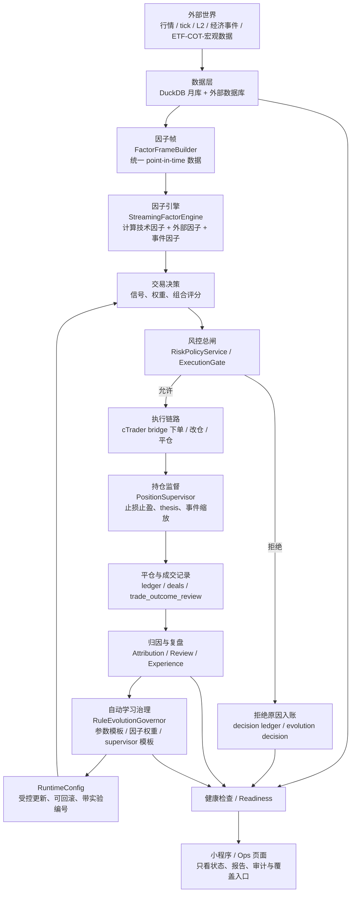
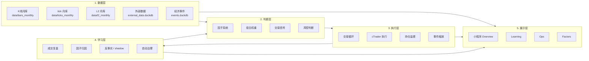
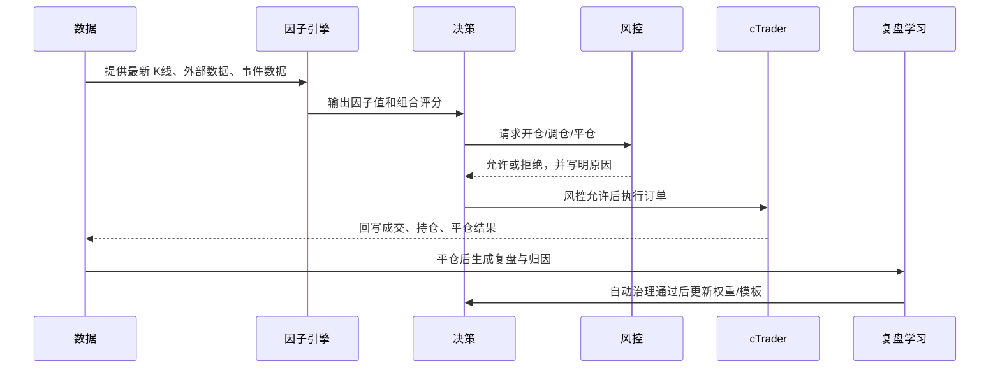
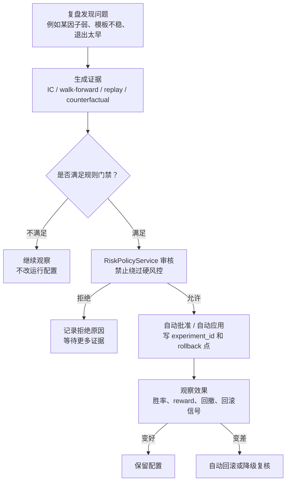
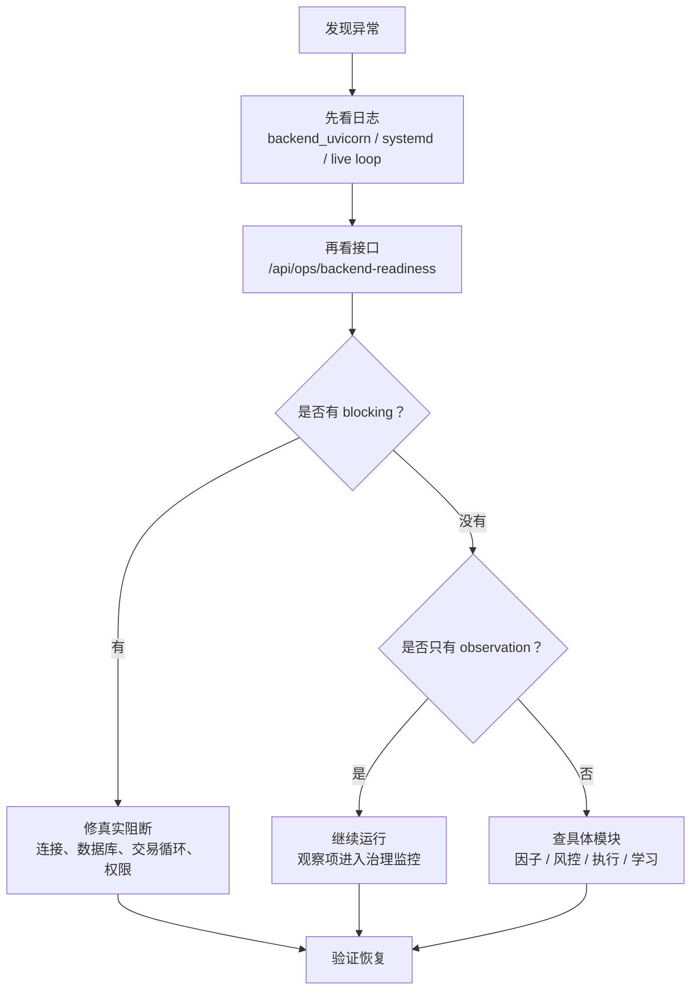

# 系统运转逻辑图

> 目标：用一眼能看懂的方式说明系统如何从“行情数据”走到“自动交易”，再把结果变成下一轮学习和治理。

## 一句话总览

系统的主线是：

```text
采集数据 -> 生成因子 -> 做交易决策 -> 风控拦截 -> 执行下单 -> 记录结果 -> 自动复盘学习 -> 调整治理配置 -> 下一轮继续交易
```

## 总流程图



## 核心分层



## 一笔交易怎么走



## 自动治理不是人工接管

当前 demo 主路径是自动治理：



要点：

- 小程序里看到“待治理 / 待审候选”，表示系统治理队列里有对象，不等于要你手动接管。
- 用户主要看实验报告、运行状态、风控阻断和回滚记录。
- 审批按钮保留为运维覆盖和追责入口，不是 demo 主路径。
- 核心风控阈值、模型 live 权限、大幅改变开平仓行为仍不能自动放开。

## 出问题时先看哪里



## 你可以这样理解系统角色

| 模块 | 像什么 | 主要职责 |
|---|---|---|
| 数据层 | 仪表盘传感器 | 收集行情、tick、L2、事件和外部研究数据 |
| 因子系统 | 分析员 | 把原始数据变成可比较的信号 |
| 决策层 | 交易员 | 根据因子和权重提出交易动作 |
| 风控层 | 总闸 | 决定动作能不能执行 |
| 执行层 | 下单员 | 和 cTrader 交互，真正开仓/平仓 |
| 复盘学习 | 研究员 | 总结交易结果，发现可改进点 |
| 自动治理 | 配置管理员 | 在规则允许内自动调整权重和模板 |
| 小程序 | 驾驶舱 | 展示状态、报告、审计和覆盖入口 |

## 最短心智模型

```text
系统不是“自动乱改”，而是：

有证据 -> 过风控 -> 小步改 -> 留回滚点 -> 看效果 -> 不好就退回
```

